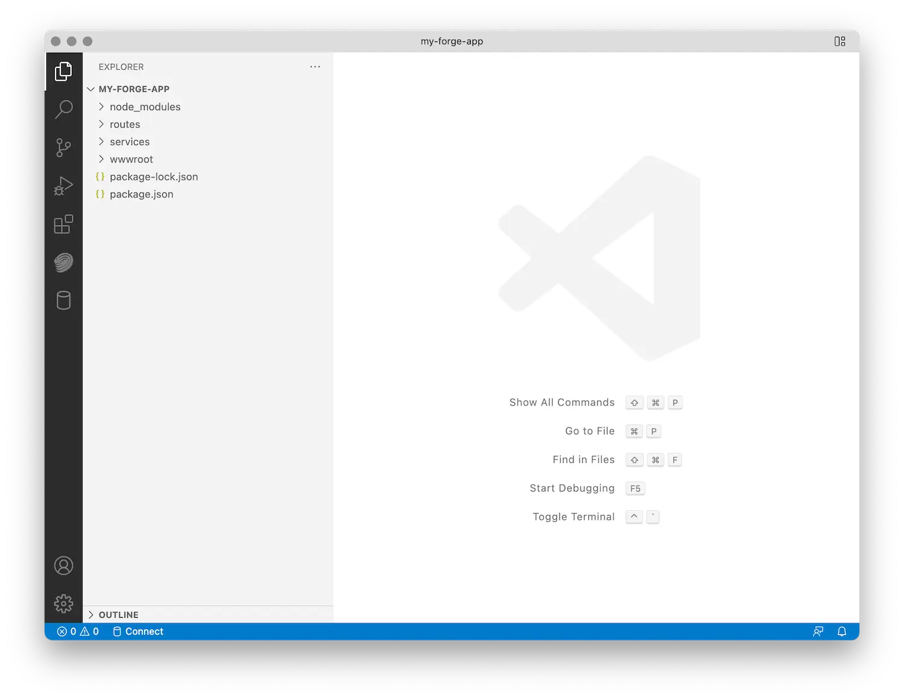

Create a new folder for your project, navigate to it in the command line, and initialize a new
Node.js project:

```bash
npm init -y
```

Next, install all the Node.js dependencies we're going to use. In this case it will be
[dotenv](https://www.npmjs.com/package/dotenv) (utility for initializing environment variables from a file),
[Express.js](https://expressjs.com) (web framework), an Express.js [middleware](https://expressjs.com/en/guide/using-middleware.html)
for handling `multipart/form-data` requests, and finally the various packages of the official APS SDK:

```bash
npm install --save dotenv express express-formidable @aps_sdk/autodesk-sdkmanager @aps_sdk/authentication @aps_sdk/oss @aps_sdk/model-derivative
```

The `"dependencies"` in your `package.json` file should now look something like this
(potentially with slightly different version numbers):

```json
// ...
  "dependencies": {
    "@aps_sdk/authentication": "^0.1.0-beta.1",
    "@aps_sdk/autodesk-sdkmanager": "^0.0.7-beta.1",
    "@aps_sdk/model-derivative": "^0.1.0-beta.1",
    "@aps_sdk/oss": "^0.1.0-beta.1",
    "dotenv": "^16.4.1",
    "express": "^4.18.2",
    "express-formidable": "^1.2.0"
  },
// ...
```

Finally, let's create a couple more subfolders in the project folder that we're going
to need later:

- `wwwroot` - this is where we're going to put all the client side assets (HTML, CSS, JavaScript, images, etc.)
- `routes` - this is where we're going to implement all the server endpoints
- `services` - here we're going to keep all the server-side logic that can be shared by different endpoints

Now, when you open your project folder in Visual Studio Code for the first time, the folder structure
should look similar to this:


