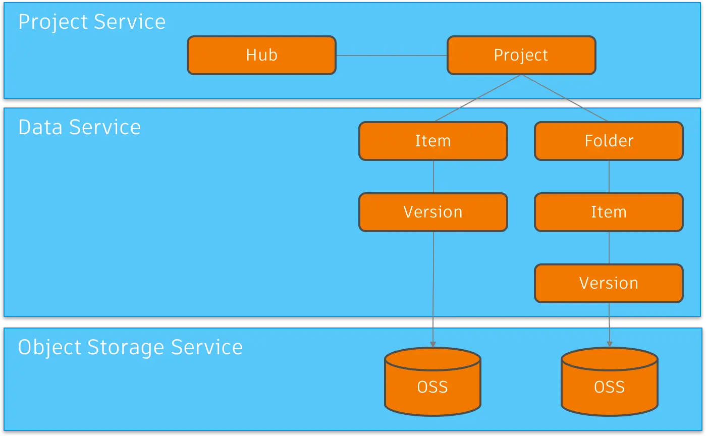

import EnvTabs from '@site/src/components/EnvTabs.js';

import NodeJsVsCodeHubs from './_shared/nodejs-vscode/data/hubs.mdx';
import NodeJsVsCodeEndpoints from './_shared/nodejs-vscode/data/endpoints.mdx';

import DotNetHubs from './_shared/dotnet/data/hubs.mdx';
import DotNetEndpoints from './_shared/dotnet/data/endpoints.mdx';

# Data Browsing

In this step we'll extend our server so that we can browse the content of other APS-based
applications such as BIM 360 Docs or Autodesk Docs. We will basically follow the Data Management
service's hierarchy of hubs, projects, folders, items, and versions:

## Browsing hubs

First, let's add a couple of helper methods for browsing through the hubs, projects,
folders, items, and versions:

<EnvTabs NodeJsVsCode={NodeJsVsCodeHubs} DotNetVsCode={DotNetHubs} DotNetVs2022={DotNetHubs} />

## Server endpoints

Next, let's expose the new functionality to the client-side code through another
set of endpoints.

<EnvTabs NodeJsVsCode={NodeJsVsCodeEndpoints} DotNetVsCode={DotNetEndpoints} DotNetVs2022={DotNetEndpoints} />

## Try it out

And that's it for the server side. Time to try it out!

Start (or restart) the app from Visual Studio Code as usual, and navigate to
[http://localhost:8080/api/hubs](http://localhost:8080/api/hubs) in the browser.
The server should respond with a JSON list of all the hubs you have access to.
Try copying the ID of one of the hubs, and use it in another address: http://localhost:8080/api/hubs/your-hub-id/projects.
In this case the server application should respond with a JSON list of all projects
available under the specified hub.

:::info
If you skipped the login procedure in the previous step, or restarted your server application,
you may need to go to [http://localhost:8080/api/auth/login](http://localhost:8080/api/auth/login)
again to make sure that all the authentication data is available in cookies before testing
the `/api/hubs` endpoint.
:::

:::tip
If you are using Google Chrome, consider installing [JSON Formatter](https://chrome.google.com/webstore/detail/json-formatter/bcjindcccaagfpapjjmafapmmgkkhgoa?hl=en)
or a similar extension to automatically format JSON responses.
:::

