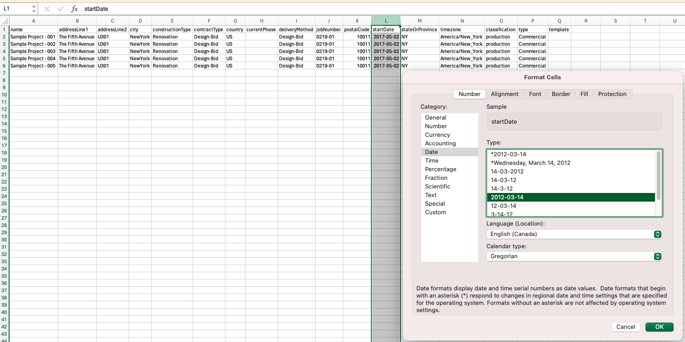

import EnvTabs from '@site/src/components/EnvTabs.js';

import NodeJsVsCodeTable from './_shared/nodejs-vscode/table/tablecontent.mdx';
import DotNetVs2022Table from './_shared/dotnet/table/tablecontent.mdx';
import DotNetVsCodeTable from './_shared/dotnet/table/tablecontent.mdx';

# Table

Finally, we're ready to implement all the remaining logic of the class `Table`.
The class `Table` is responsible to handle different type of data, including project list,
user list, and provide the functions including:
- Get the data list from ACC Admin App based on the current input information.
- Draw the current data list into a bootstrap table.
- Export the current data list into a csv file.
- Import the data from a csv file into the ACC Admin.

## Table

Let's start by implementing the Table functionality.
Open `table.js` file under the `wwwroot` subfolder, add the implementation code into Class `Table`:
Here are the explanation of the main function:
- `resetData`: Fetch and setup the data based on the input accountId, projectId, and tabKey. 
- `drawTable`: Draw the bootstrap table with the current data. 
- `exportToCSV`: Export the current data into CSV file.
- `importFromCSV`: Import the information into ACC Admin system from the prepared CSV file.

<EnvTabs NodeJsVsCode={NodeJsVsCodeTable} DotNetVsCode={DotNetVsCodeTable} DotNetVs2022={DotNetVs2022Table} />


:::note
Please note that some complicated properties are just marked as "N/A" to simplify the tutorial, 
and during import, the code will parse the propery information from a CSV file into the request 
body.
:::

## Load Table Data
Now, let's complete the logic to load the data within the following 2 functions:
- initTableTabs
- refreshTable

Update the code within the above 2 functions by modifying `table.js`:

```js title="wwwroot/table.js"
export async function refreshTable( accountId = null, projectId=null ) {
    $("#loadingoverlay").fadeIn()
    if( TABLE_TABS[g_accDataTable.tabKey].CATEGORY_NAME=='hub' && projectId ){
        for (let key in TABLE_TABS) {
            if( TABLE_TABS[key].CATEGORY_NAME == 'hub' ){
                $("#" + key).addClass("hidden");
                $("#" + key).removeClass("active");
            }
            else{
                if( TABLE_TABS[key].CATEGORY_DEFAULT )
                    $("#" + key).addClass("active");
                $("#" + key).removeClass("hidden");
            }
        } 
    }
    if (TABLE_TABS[g_accDataTable.tabKey].CATEGORY_NAME == 'project' && !projectId) {
        for (let key in TABLE_TABS) {
            if (TABLE_TABS[key].CATEGORY_NAME == 'hub') {
                $("#" + key).removeClass("hidden");
                if (TABLE_TABS[key].CATEGORY_DEFAULT)
                    $("#" + key).addClass("active");
            }
            else {
                $("#" + key).addClass("hidden");
                $("#" + key).removeClass("active");
            }
        }
    }
    const activeTab = $("ul#adminTableTabs li.active")[0].id;
// highlight-start
    try{
        await g_accDataTable.resetData( activeTab, accountId, projectId );
        g_accDataTable.drawTable();
    }catch(err){
        console.warn(err);
    }
// highlight-end
    $("#loadingoverlay").fadeOut()
}

export async function initTableTabs(){
    // add all tabs
    for (let key in TABLE_TABS) {
        $('<li id=' + key + '><a href="accTable" data-toggle="tab">' + TABLE_TABS[key].TAB_NAME + '</a></li>').appendTo('#adminTableTabs');
        $("#" + key).addClass((TABLE_TABS[key].CATEGORY_NAME == 'hub' && TABLE_TABS[key].CATEGORY_DEFAULT) ? "active" : "hidden");
    } 
    // event on the tabs
    $('a[data-toggle="tab"]').on('shown.bs.tab', async function (e) {
        $("#loadingoverlay").fadeIn()
        const activeTab = e.target.parentElement.id;
// highlight-start
        try {
            await g_accDataTable.resetData(activeTab);
            g_accDataTable.drawTable();
        } catch (err) {
            console.warn(err);
        }    
// highlight-end
        $("#loadingoverlay").fadeOut()
    });  
}
```

## CSV File Prepare
Finally, the most important feature is batch import projects/users, this is achieved by using a CSV file,
we provided 2 template files for projects and users, you can add/modify your information based on the template, 
then import these data from CSV file into ACC account.

- [ProjectsTemplate.csv](https://github.com/autodesk-platform-services/aps-acc-admin-tutorial-nodejs/blob/main/template%20files/ProjectsTemplate.csv) 
- [UsersTemplate.csv](https://github.com/autodesk-platform-services/aps-acc-admin-tutorial-nodejs/blob/main/template%20files/UsersTemplate.csv) 

:::caution
- When import projects to the hub, make sure the **Project Name** prepared in the CSV file
is not existing in the hub, otherwise, the project can not created due to the name conflicts.

- When import users to the project, the column **`roleIds`** of CSV file supports multiple roles for the project user,
please use **"|"** as separator.

- If you open the CSV file with Microsoft Excel, some data type will be automatically changed by the setting, for example, the column of
**startDate** might be changed to the type as **"2012/03/14"**, please make sure to select another type like **"2012-03-14"** without **"/"** as shown in the screenshot, 
otherwise the date will not be recognized correctly after exporting to CSV file.
:::


:::tip
- When importing projects, you can always open the **Developer Tools** and check the console
for the status of these projects as picture shown below, be noted this only work for importing 
projects, not work for importing users.
:::


## Try it out

And that's it! Your application is now ready for action. Start it as usual, and when you go to
[http://localhost:8080](http://localhost:8080), you should be presented with a simple UI, with
a tree-view on the left side, you can do the following operation:
- Select an ACC Hub: The table will list all the ACC Projects, you can export all the projects to a CSV file by click
the `Export` button, or import the prepared projects by a CSV file with Projects information.
- Select an ACC Project: There are 2 tabs, `PROJECT` and `USERS`, `PROJECT` tab will list the detail information about this 
project, only export is available, `USERS` tab will list all the project users, you can click the `Export` button to export all
the project users to a csv file, or click `Import` button to import users into the selected project with a prepare CSV file of User information.

:::caution
Please note that you can only import the certain type of data based on the active Tab, here 
are the details:
- `PROJECTS` Tab: You can only import project list into the selected account, the csv file needs to follow
the Projects template, the csv file of Users template can not be imported. You can check the console to see 
if any projects failed.
- `PROJECT` Tab: Nothing can be imported when this tab is active.
- `USERS` Tab: You can only import user list into the selected project, the csv file needs to follow the Users 
template, Projects template can not be imported. Due to the limitation of Import Project Users API, No information to 
tell if any users are failed to be imported.
:::


