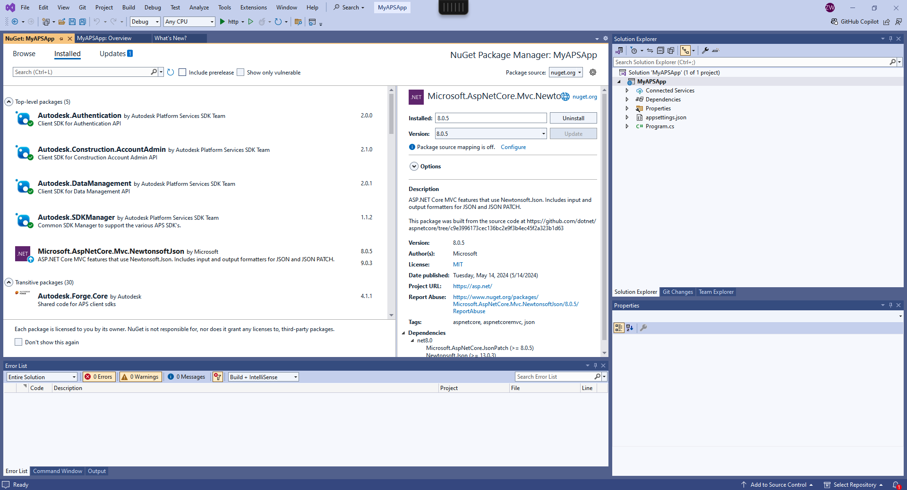

- Launch Visual Studio 2022, select `Create New Project`
- Enter `ASP.NET Core Empty` in templates search bar. Select and Next.
- On the next dialog, let's name it `MyAPSApp`, Next.
- On the next dialog, ensure .NET 8.0 (Long Term Support) is selected, uncheck `Configure for HTTPS`.
- Disable use of top level-statements by checking the `Do not use top-level statements` box, then click `create`.
- In the NuGet Package Manager, switch to the Browse tab, and search for and install the following packages:


:::note
At the writing of this documentation, the tutorial is using the specified version next to the package name.
:::

```bash
Autodesk.SDKManager v1.1.2
Autodesk.Authentication v2.0.0
Autodesk.Construction.AccountAdmin v2.1.0
Autodesk.DataManagement v2.0.1
Microsoft.AspNetCore.Mvc.NewtonsoftJson v8.0.5
```




Finally, let's create a couple more subfolders in your project folder that we're going to need later:

- `wwwroot` - this is where we're going to put all the client side assets (HTML, CSS, JavaScript, images, etc.)
- `Controllers` - this is where we're going to implement all the server endpoints
- `Models` - here we're going to keep all the server-side logic that can be shared by different endpoints
