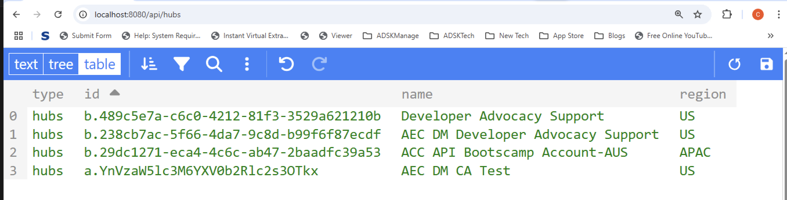

import NodeJsVsCodeHubs from './_shared/nodejs-vscode/data/hubs.mdx';
import NodeJsVsCodeEndpoints from './_shared/nodejs-vscode/data/endpoints.mdx';

# Project Browsing

In this step we'll extend our server so that we can browse the projects of Autodesk Construction Cloud. 
We will basically get the hierarchy of hubs, projects using Data Management APIs:

## Browsing hubs

First, let's add a couple of helper methods for browsing through the hubs, projects:

<NodeJsVsCodeHubs />

## Server endpoints

Next, let's expose the new functionality to the client-side code through another
set of endpoints.

<NodeJsVsCodeEndpoints />

## Try it out

Start (or restart) the app from Visual Studio Code as usual, and navigate to
[http://localhost:8080/api/hubs](http://localhost:8080/api/hubs) in the browser.
The server should respond with a JSON list of all the hubs you have access to.
Try copying the ID of one of the hubs, and use it in another address: http://localhost:8080/api/hubs/your-hub-id/projects.
In this case the server application should respond with a JSON list of all projects
available under the specified hub.

:::info
If you skipped the login procedure in the previous step, or restarted your server application,
you may need to go to [http://localhost:8080/api/auth/login](http://localhost:8080/api/auth/login)
again to make sure that all the authentication data is available in cookies before testing
the `/api/hubs` endpoint.
:::

:::tip
If you are using Google Chrome, consider installing [JSON Formatter](https://chrome.google.com/webstore/detail/json-formatter/bcjindcccaagfpapjjmafapmmgkkhgoa?hl=en)
or a similar extension to automatically format JSON responses.
:::

