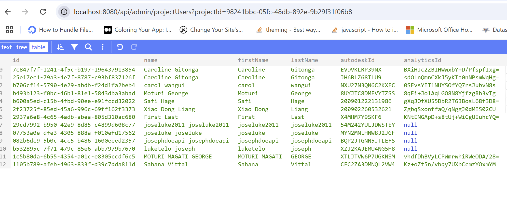
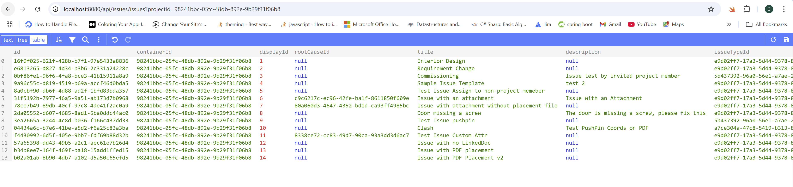

import NodeJsVsCodeHubs from './_shared/nodejs-vscode/admin/account-admin.mdx';
import NodeJsVsCodeEndpoints from './_shared/nodejs-vscode/issue/endpoints.mdx';
import NodeJsVsCodeIssues from './_shared/nodejs-vscode/issue/acc-issue.mdx';

# Project Users & Issues

Now, we will implement our server to consume [ACC Issues APIs](https://aps.autodesk.com/en/docs/acc/v1/overview/field-guide/issues/) to FETCH project issues, RETRIEVE issue project settings, 
such as custom attribute (field) definitions and mappings, issue types/subtypes, and root cause categories. 
We will also leverage [Account Admin APIs](https://aps.autodesk.com/en/docs/acc/v1/overview/field-guide/admin/) to retrieve project users. 

## Project Users

We will use a helper fuction from the Account Admin SDK to fetch project users.

<NodeJsVsCodeHubs />

## Project Issues
Now, we will go ahead to add  couple of helper functions for getting and importing issues:

<NodeJsVsCodeIssues />

## Server endpoints

Next, let's expose the new project users, issues and issue settings  to the client-side code through another
set of endpoints.
:::info
We are going to combine the project users and issues endoint on one file: `issue.js`
:::

<NodeJsVsCodeEndpoints />

## Try it out

And that's it for the server side. Time to try it out!

- Use one project ID from previous step: GET hub projets : http://localhost:8080/api/hubs/your-hub-id/projects, and try to call the address: 
http://localhost:8080/api/admin/projectUsers?projectId={your-project-id}, the server application should
respond with a JSON list of all the users from this project. 
- Use same project ID as step above (remove b.) and try to call the address: 
http://localhost:8080/api/issues/issues?projectId={your-project-id}, the server application should
respond with a JSON list of all the issues from this project. 

