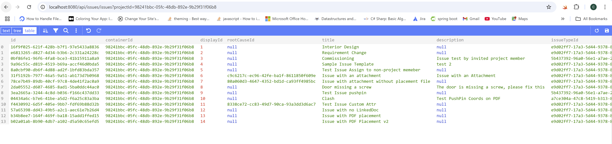

import EnvTabs from '@site/src/components/EnvTabs.js';

import NodeJsVsCodeEndpoints from './_shared/nodejs-vscode/issue/endpoints.mdx';
import NodeJsVsCodeSDK from './_shared/nodejs-vscode/issue/issue-sdk.mdx';
import NodeJsVsCodeExtractIssues from './_shared/nodejs-vscode/issue/export-issues.mdx';
import NodeJsVsCodeImportIssues from './_shared/nodejs-vscode/issue/import-issues.mdx';

import DotNetEndpoints from './_shared/dotnet/issue/endpoints.mdx';
import DotNetSDK from './_shared/dotnet/issue/issue-sdk.mdx';
import DotNetExtractIssues from './_shared/dotnet/issue/export-issues.mdx';
import DotNetImportIssues from './_shared/dotnet/issue/import-issues.mdx';

# Project Issues

Now, we will implement our server to consume [ACC Issues APIs](https://aps.autodesk.com/en/docs/acc/v1/overview/field-guide/issues/) to fetch project issues and create/modify issues.

## Work with Issues
First, let's include the ACC Issue SDK:
<EnvTabs NodeJsVsCode={NodeJsVsCodeSDK} DotNetVsCode={DotNetSDK} DotNetVs2022={DotNetSDK} />

:::tip
The 'Issues' collection is managed in the APS cloud database. To ensure optimal performance, the API follows the web standard of **pagination** meaning each HTTP request returns only a portion of the records in the collection.
With current design, ACC Issue API returns 1-100 issues in one call by default. We also have chance to specify the **limit** parameter which indicates how many records in one page. The other parameter **offset** specifies from which index of issue to extract the records.
Check API reference of [GET:Issues](https://aps.autodesk.com/en/docs/acc/v1/reference/http/issues-issues-GET/) for more information.
:::

## Import Issues
Moving forward, we will add helper functions to create and modify issues. [POST Issues](https://aps.autodesk.com/en/docs/acc/v1/reference/http/issues-issues-POST/) for creating a new issue. 
[PATCH Issues/:IssueId](https://aps.autodesk.com/en/docs/acc/v1/reference/http/issues-issues-issueId-PATCH/) for modifying an existing issue. 
When the server receives records imported from the client (via CSV), it checks whether a record contains an ID value. If not, it creates a new issue. If an ID exists, it updates the corresponding issue with the new data.

To track status, a JSON array logs the successfully created or modified issues, along with any failed API calls and their corresponding CSV row numbers.

<EnvTabs NodeJsVsCode={NodeJsVsCodeImportIssues} DotNetVsCode={DotNetImportIssues} DotNetVs2022={DotNetImportIssues} />

:::info
The issue creation and modification APIs only accept a limited set of fields in the request payload. This sample demonstrates how to just use some required fields from the CSV data.

- title
- description
- issueSubtypeId
- status
- dueDate
- assignedTo
- assignedToType
- rootCauseId
- published
:::
 

## Server endpoints

Next, let's expose the routings to extract issues and import issue to the client-side code through another
set of endpoints. 

<EnvTabs NodeJsVsCode={NodeJsVsCodeEndpoints} DotNetVsCode={DotNetEndpoints} DotNetVs2022={DotNetEndpoints} />

## Try it out

And that's it for the server side. Time to try it out!

- Use same project ID in previous step (remove b.) and try to call the endpoint: 
[http://localhost:8080/api/issues/issues?projectId={your-project-id}](http://localhost:8080/api/issues/issues?projectId={your-project-id}), the server application should
respond with a JSON list of all the issues from this project. 

:::info
- It would take a bit long time if the volume of the issue records is large.
This sample extracts raw data of issue. 
- Some fields are json object or array object. Their value will be dumped as string in this sample.
- To test creating or modifying issues, use HTTP test tools or commandline scripts to perform the test with access token and request payload.Recommended HTTP test tools: [Postman](https://www.postman.com/downloads/), [Insomnia](https://insomnia.rest/)
:::
 