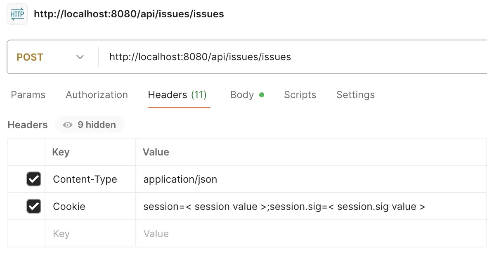

import EnvTabs from '@site/src/components/EnvTabs.js';

import NodeJsVsCodeEndpoints from './_shared/nodejs-vscode/issue/endpoints.mdx';
import NodeJsVsCodeSDK from './_shared/nodejs-vscode/issue/issue-sdk.mdx';
import NodeJsVsCodeExtractIssues from './_shared/nodejs-vscode/issue/export-issues.mdx';
import NodeJsVsCodeImportIssues from './_shared/nodejs-vscode/issue/import-issues.mdx';
 
import DotNetEndpoints from './_shared/dotnet/issue/endpoints.mdx';
import DotNetSDK from './_shared/dotnet/issue/issue-sdk.mdx';
import DotNetExtractIssues from './_shared/dotnet/issue/export-issues.mdx';
import DotNetImportIssues from './_shared/dotnet/issue/import-issues.mdx';

# Project Issues

Now, we will implement our server to consume [Forma for Construction Issues APIs](https://aps.autodesk.com/en/docs/acc/v1/overview/field-guide/issues/) to fetch project issues and create/modify issues.

## Work with Issues
We shall be utilizing Forma for Construction Issue SDK in both NodeJs and .NET samples
<EnvTabs NodeJsVsCode={NodeJsVsCodeSDK} DotNetVsCode={DotNetSDK} DotNetVs2022={DotNetSDK} />


## Pagination

The 'Issues' collection is managed in the APS cloud database. To ensure optimal performance, the API follows the web standard of **pagination** meaning each HTTP request returns only a portion of the records in the collection.
With current design, **Forma for Construction** Issue API returns 1-100 issues in one call by default. We also have chance to specify the **limit** parameter which indicates how many records in one page. The other parameter **offset** specifies from which index of issue to extract the records.
Check API reference of [GET:Issues](https://aps.autodesk.com/en/docs/acc/v1/reference/http/issues-issues-GET/) for more information.

:::tip
- If the number of issue records is large, the process may take some time. In your production application, consider adding a progress bar that displays the current offset and limit, or use query parameters **filter** to request only specific issues from the API.
- This sample retrieves all issue data. In a real application, you can request only specific fields by using the **fields** query parameter.
:::

## Import Issues
Moving forward, we will add helper functions to create and modify issues. [POST Issues](https://aps.autodesk.com/en/docs/acc/v1/reference/http/issues-issues-POST/) for creating a new issue, 
[PATCH Issues/:IssueId](https://aps.autodesk.com/en/docs/acc/v1/reference/http/issues-issues-issueId-PATCH/) for modifying an existing issue. 
When the server receives records imported from the client (via CSV), it checks whether a record contains an ID value. If not, it creates a new issue. If an ID exists, it updates the corresponding issue with the new data.

To track status, a JSON array is logged on console with the successfully created or modified issues, along with any failed API calls and their corresponding CSV row numbers.

<EnvTabs NodeJsVsCode={NodeJsVsCodeImportIssues} DotNetVsCode={DotNetImportIssues} DotNetVs2022={DotNetImportIssues} />

:::info
The issue creation and modification APIs only accept a limited set of fields in the request payload. This sample demonstrates how to just use some required fields from the CSV data.
- title
- description
- issueSubtypeId
- status
- dueDate
- assignedTo
- assignedToType
- rootCauseId
- published
:::
 
 

## Server endpoints

Next, let's expose the routings to extract issues and import issue to the client-side code through another
set of endpoints. 


<EnvTabs NodeJsVsCode={NodeJsVsCodeEndpoints} DotNetVsCode={DotNetEndpoints} DotNetVs2022={DotNetEndpoints} />


## Try it out

And that's it for the server side. Time to try it out!

- **GET Issues**: Use same project ID in previous step (remove b.) and try to call the endpoint in the browser: 
[http://localhost:8080/api/issues/issues?projectId={your-project-id}](http://localhost:8080/api/issues/issues?projectId={your-project-id}), the server application should
respond with a JSON list of all the issues from this project. 


- **POST Issues**: Browsers by default do not provide built-in tools to test endpoints that modify data, such as POST, PATCH, DELETE, etc. To test the creation or modification of issues, use other HTTP tools or command-line scripts. Below is a demo using [Postman](https://www.postman.com/downloads/).
    - endpoint of this call  `POST: http://localhost:8080/api/issues/issues`
    
    - Input headers Content-Type and Cookie. Check [Try it Out of Authentication](/tutorials/acc-issues/auth#try-it-out) to get Cookie value
        
        - Content-Type:application/json
        - NodeJS: Cookie:session=< value >;session.sig=< value >
        - NET:  Cookie:internal_token=< value >;refresh_token=< value >;expires_at=< value>

        

    - Input request payload. If new issue, no **id**. The **issueSubtypeId** can be copied to any of the records of GET Issues. If with **id**, that means to update existing issue. 

    ``` json
        {
            "projectId":"854c194f-05b3-4117-b926-69fa36c33c0c",
            "data":[
                {
                    "title":"create new issue by my application",
                    "issueSubtypeId":"a1637225-d69c-4afc-ad02-1c73a92ee3c1",
                    "status":"open"
                },
                {
                    "id": "b4f6e2f7-7bda-4e87-b139-7d94bc9c2a8d"
                    "title":"modify an existing issue by my application", 
                    "status":"close"
                }
            ]
        }
    ```
 