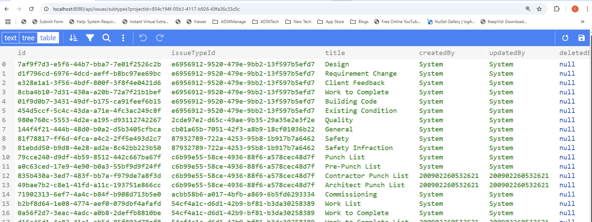

import EnvTabs from '@site/src/components/EnvTabs.js';

import NodeJsVsCodeEndpoints from './_shared/nodejs-vscode/issue-settings/endpoints.mdx';
import NodeJsVsCodeIssuesSettings from './_shared/nodejs-vscode/issue-settings/settings.mdx';

import DotnetEndpoints from './_shared/dotnet/issue-settings/endpoints.mdx';
import DotNetIssuesSettings from './_shared/dotnet/issue-settings/settings.mdx';

# Issue Settings

In the previous step, we extracted raw issue data. Some fields contain specific IDs like `Issue Sub Type` and `Root Cause`, 
while `Custom Attributes` follow an id-value pair pattern. These are all part of the Issue Settings. To retrieve their full details, we'll need to make additional API calls to the Issues endpoints.
 
In addition, the APIs permissions follows the user permission setting of the logged user, who authorizes this sample to manipulate the issues. We will also add one more help function to get the user permissions.

<EnvTabs NodeJsVsCode={NodeJsVsCodeIssuesSettings} DotNetVsCode={DotNetIssuesSettings} DotNetVs2022={DotNetIssuesSettings} />

:::info
**Issue Sub Type** is a child of **Issue Type** . This sample iterates each type, 
extracts its sub types to build the collection. Similarly, **Issue Root Cause** is a child of **Issue Root Cause Caregory**. 
This sample iterates each category , extracts its root causes to build the collection. The corresponding APIs also return types or categories in **pagination**.

No API yet to get [Issues Permission](https://help.autodesk.com/view/BUILD/ENU/?guid=Issues_Permissions) table like ACC UI does. Current API supports to fetch the logged user permission only.

:::

## Server endpoints

Next, let's expose the routes to retrieve issue settings to the client-side code through another
set of endpoints. 
 
<EnvTabs NodeJsVsCode={NodeJsVsCodeEndpoints} DotNetVsCode={DotnetEndpoints} DotNetVs2022={DotnetEndpoints} />

## Try it out

And that's it for the server side. Time to try it out!

- Use same project ID in previous step (remove b.) and try to call the endpoint: 
[http://localhost:8080/api/issues/subtypes?projectId={your-project-id}](http://localhost:8080/api/issues/subtypes?projectId={your-project-id}), the server application should
respond with a JSON list of all the issue sub types from this project. 

