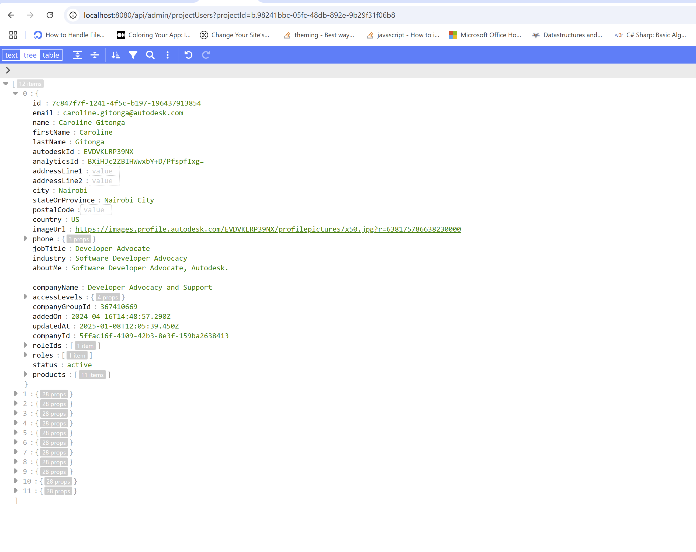

import EnvTabs from '@site/src/components/EnvTabs.js';

import NodeJsVsCodeEndpoints from './_shared/nodejs-vscode/admin/endpoints.mdx';
import NodeJsVsCodeSDK from './_shared/nodejs-vscode/admin/admin-sdk.mdx';
import NodeJsVsCodeAdmin from './_shared/nodejs-vscode/admin/admin.mdx';

import DotNetEndpoints from './_shared/dotnet/admin/endpoints.mdx';
import DotNetSDK from './_shared/dotnet/admin/admin-sdk.mdx';
import DotNetAdmin from './_shared/dotnet/admin/admin.mdx';

# Project Admin

Some issue attributes are related to project members, we will use Forma for Construction Admin API to get the information. This sample demos how to fetch project users.

## Forma for Construction Admin SDK
First, let's include the Forma for Construction Admin SDK:
<EnvTabs NodeJsVsCode={NodeJsVsCodeSDK} DotNetVsCode={DotNetSDK} DotNetVs2022={DotNetSDK} />

## Server endpoints

Next, let's expose the routings to get project users to the client-side code through another
set of endpoints. 

<EnvTabs NodeJsVsCode={NodeJsVsCodeEndpoints} DotNetVsCode={DotNetEndpoints} DotNetVs2022={DotNetEndpoints} />

## Try it out

And that's it for the server side. Time to try it out!

- Use same project ID in previous step (remove b.) and try to call the endpoint: 
[http://localhost:8080/api/admin/projectUsers?projectId={your-project-id}](http://localhost:8080/api/issues/subtypes?projectId={your-project-id}), the server application should
respond with a JSON list of all the users from this project. 

:::info
Admin API has not exposed endpoint to get project roles. The workaround is to use [Data Connector API](https://aps.autodesk.com/apis-and-services/data-connector-api).

Admin API exposes endpoint to [get project companies](https://aps.autodesk.com/en/docs/acc/v1/reference/http/projects-:project_id-companies-GET/), but it supports App context authentication only. While this tutorial sample builds the skeleton of user context authentication. 
if you want to fetch, you could add code to get 2-legged token to call this API.

Or by [Data Connector API](https://aps.autodesk.com/apis-and-services/data-connector-api)to get list of roles, companies and even users.
:::