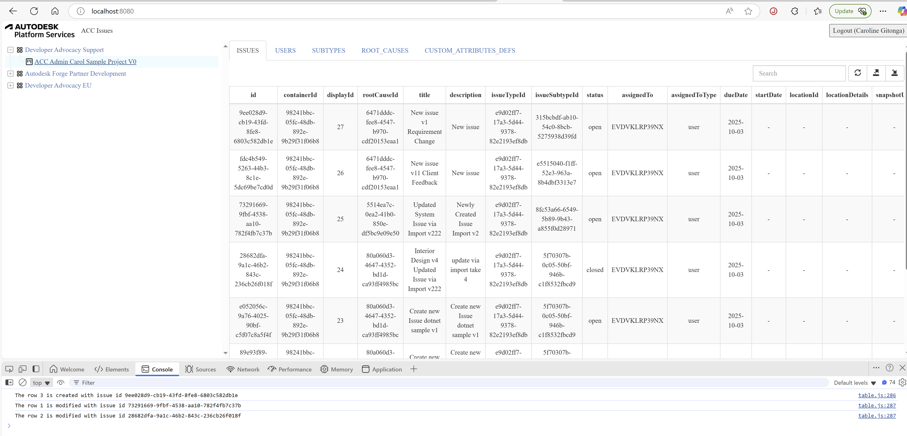
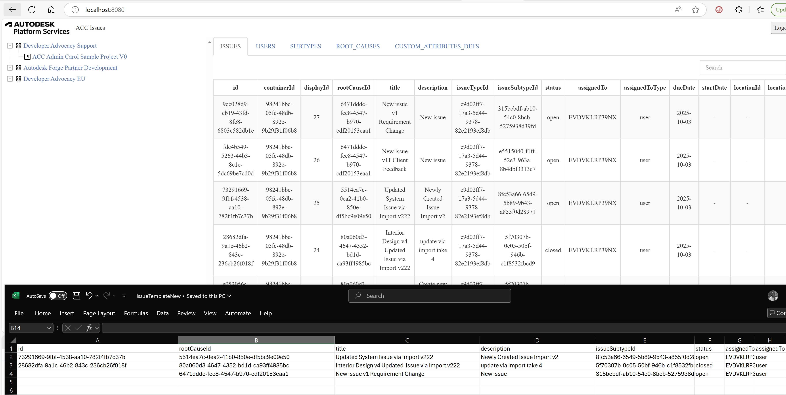

# Table

Finally, we're ready to implement all the remaining logic of the class `Table`.
The class `Table` is responsible to handle different type of data, including project issues and issue settings 
(custom attribute (field) definitions and mappings, issue types/subtypes, and root cause categories),
user list, and provide the functions including:
- Get the data list from ACC Issues based on the current input information.
- Draw the current data list into a bootstrap table.
- Export the current data list into a csv file.
- Import the data (issue list) from a csv file into the ACC Project.

## Table

Let's start by implementing the Table functionality.
Open `table.js` file under the `wwwroot` subfolder, add the implementation code into Class `Table`:
Here are the explanation of the main function:
- `resetData`: Fetch and setup the data based on the input accountId, projectId, and tabKey. 
- `drawTable`: Draw the bootstrap table with the current data. 
- `exportToCSV`: Export the current data into CSV file.
- `importFromCSV`: Import the information into ACC Issue sample from the prepared CSV file.

```js title="wwwroot/table.js"
//////////////////////////////////////////////////////////////////////////////////////////////////////////
//Table class wraps the specific data info
class Table {
    #tableId;
    #accountId;
    #projectId;
    #tabKey;
    #dataSet;
    #maxItem;

    constructor(tableId, accountId = null, projectId = null, tabKey = 'PROJECTS') {
        this.#tableId = tableId;
        this.#accountId = accountId;
        this.#projectId = projectId;
        this.#tabKey = tabKey;
        this.#dataSet = null;
        this.#maxItem = 5;
    };

    get tabKey(){
        return this.#tabKey;
    }

    set tabKey( tabKey){
        this.#tabKey = tabKey;
    }

// highlight-start
    
    resetData = async (tabKey = null, accountId = null, projectId = null) => {
        this.#tabKey = tabKey ? tabKey : this.#tabKey;
        this.#accountId = accountId ? accountId : this.#accountId;
        this.#projectId = accountId || projectId ? projectId : this.#projectId;
        const url = TABLE_TABS[this.#tabKey].REQUEST_URL;
        const data = {
            'accountId': this.#accountId,
            'projectId': this.#projectId
        }
        try {
            const response = await axios.get(url, { params: data });
            this.#dataSet = response.data;
        } catch (err) {
            console.error(err);
            return;
        }
    }

    drawTable = () => {
        if (this.#dataSet == null || this.#dataSet.length == 0) {
            console.warn('DataSet is not ready, please fetch your data first.');
            return;
        }

        let columns = [];
        for (var key in this.#dataSet[0]) {

            if (Array.isArray(this.#dataSet[0][key] && this.#dataSet[0][key] != null)) {
                //value is array 
                columns.push({
                    field: key,
                    title: key,
                    align: "center",
                    formatter: function (value) {
                        return value.toString();
                    }
                })
            } else if (typeof this.#dataSet[0][key] === 'object' && this.#dataSet[0][key] != null) {
                //value is JSON object 

                columns.push({
                    field: key,
                    title: key,
                    align: "center",
                    formatter: function (value) {
                        return JSON.stringify(value)
                    }
                })
            } else {
                //common value
                columns.push({
                    field: key,
                    title: key,
                    align: "center"
                })
            }
        }
        $(this.#tableId).bootstrapTable('destroy');
        $(this.#tableId).bootstrapTable({
            data: this.#dataSet,
            customToolbarButtons: [
                {
                    name: "grid-export",
                    title: "Export",
                    icon: "glyphicon-export",
                    callback: this.exportToCSV
                },
                {
                    name: "grid-import",
                    title: "Import",
                    icon: "glyphicon-import",
                    callback: this.importFromCSV
                }
            ],
            editable: true,
            clickToSelect: true,
            cache: false,
            showToggle: false,
            pagination: true,
            pageList: [5],
            pageSize: 5,
            pageNumber: 1,
            uniqueId: 'id',
            striped: true,
            search: true,
            showRefresh: true,
            minimumCountColumns: 2,
            smartDisplay: true,
            columns: columns,
            sortName:'displayId',
            sortOrder:'desc'
        });
    }


    exportToCSV = () => {
        const separatorForColumns = ',';
        const headers = Object.keys(this.#dataSet[0]).join(separatorForColumns);
        const rows = this.#dataSet.map(row =>
            Object.values(row)
                .map(value => {
                    if (value === null || value === undefined) {
                        value = "";
                    } else {
                        //because array or json value includes comma
                        //hard to parse the values from csv (for import workflow)
                        //so set the value='Complicated Object' to csv.
                        if (typeof value === 'object') {
                            value = '<Complicated Object>';
                        } else if (Array.isArray(value)) {
                            value = '<Complicated Object>';
                        }
                    }
                    return `"${String(value).replace(/"/g, '""')}"`
                }) // Escape quotes
                .join(separatorForColumns)
        ).join('\n');

        const csvContent = `${headers}\n${rows}`;
        // Create a Blob and trigger download
        const blob = new Blob([csvContent], { type: 'text/csv;charset=utf-8;' });
        const link = document.createElement('a');
        link.href = URL.createObjectURL(blob);
        link.download = this.#tabKey + (new Date()).getTime() + '.csv';
        link.click();
    } 
 
    formatDate(date, format = 'YYYY-MM-DD') {
        const pad = (num) => String(num).padStart(2, '0');
      
        const replacements = {
          YYYY: date.getFullYear(),
          MM: pad(date.getMonth() + 1),
          DD: pad(date.getDate()) 
        };
      
        return format.replace(/YYYY|MM|DD/g, (match) => replacements[match]);
      }

    importFromCSV = async () => {
        if (TABLE_TABS[this.#tabKey].TAB_NAME != 'ISSUES') {
            alert('only issue is supported to be created/modified!Please active ISSUES table firstly!');
            return;
        }
        let input = document.createElement('input');
        input.type = 'file';
        input.onchange = _ => {
            let fileUpload = Array.from(input.files);
            var regex = /^([a-zA-Z0-9\s_\\.\-:\(\)])+(.csv|.txt)$/;
            if (regex.test(fileUpload[0].name.toLowerCase())) {
                if (typeof (FileReader) != "undefined") {
                    var reader = new FileReader();
                    reader.onload = async (e) => {
                        function sleep(ms = 0) {
                            return new Promise(resolve => setTimeout(resolve, ms));
                        }
                        $("#loadingoverlay").fadeIn()
                        const rows = e.target.result.replace(/\r\n/g, '\n').split('\n'); // First replace \r\n with \n, then split by \n
                        const keys = rows[0].split(',');
                        const import_attributes_keys = TABLE_TABS[this.#tabKey].IMPORT_ATTRIBUTES_KEYS;
                        let requestDataList = []; 
                       
                        for(let i=1;i<rows.length;i++){
                            // Split each row by commas to get each cell
                            const cells = rows[i].split(',');
                            let jsonItem = {};
                            for(let k=0;k<cells.length;k++){
                                let value =  cells[k].replace(/^"(.*)"$/, '$1')
                                //only import those fields that are supported with create/modify
                                if (import_attributes_keys.includes(keys[k]) && value != null && value != undefined) {
                                    
                                    //some special fields
                                    switch(keys[k]){
                                        case 'dueDate':
                                            value = this.formatDate(new Date(value));
                                            break;
                                        case 'published':
                                            value = value.toLowerCase() === "true";
                                            break; 
                                    }
  
                                    jsonItem[keys[k]] = value;
                                }
                            }
                            //record the csv row number for tracking error when
                            //creating/modifying issues.
                            jsonItem.csvRowNum = i;

                            requestDataList.push(jsonItem);
                        }
                       

                        const data = {
                            'accountId': this.#accountId,
                            'projectId': this.#projectId,
                            'data': requestDataList
                        }
                        const url = TABLE_TABS[this.#tabKey].REQUEST_URL;
                        try {
                            const resp = await axios.post(url, data);
                            resp.data.created && resp.data.created.forEach(item => console.log(`The row ${item.csvRowNum} is created with issue id ${item.id} `));
                            resp.data.modified && resp.data.modified.forEach(item => console.log(`The row ${item.csvRowNum} is modified with issue id ${item.id} `));
                            resp.data.failed && resp.data.failed.forEach(item => console.log(`The row ${item.csvRowNum} failed to be created/modified for the reason: ${item.reason} `));
                            await sleep(3000);
                            await this.resetData();
                        } catch (err) {
                            console.error(err);
                        }
                        this.drawTable();
                        $("#loadingoverlay").fadeOut()
                    }
                    reader.readAsText(fileUpload[0]);
                } else {
                    alert("This browser does not support HTML5.");
                }
            } else {
                alert("Please upload a valid CSV file.");
            }
        };
        input.click();
    }
// highlight-end
}
```
:::note
Please note that some complicated properties are just marked as "N/A" to simplify the tutorial, 
and during import, the code will parse the propery information from a CSV file into the request 
body.
:::


## CSV File Prepare
Finally, the most important feature is batch import projects issues for creating new or modifying exiting issue, this is achieved by using a CSV file,
we provided a sample template files for projects issues, you can add/modify your information based on the template, 
then import the data from CSV file into ACC account.

- [IssueTemplate.csv](https://github.com/xiaodongliang/aps-acc-issues-tutorial-nodejs/blob/main/template/IssueTemplate.csv) 

:::caution

- It is strongly recommended to use the same pattern of the csv that is exported in the previous function (Export Issue Records).

- To add new issue, leave the column id empty

- To modify the existing issue, keep the column id with the issue id, update other fields with new values.

- A few fields are required when working with creating issues(POST). A few fields are supported when working with modifying issues (PATCH). Please check API references for more details.
 > to make it clearer, this application narrow down with some supported fields.

- The row number of the CSV records is not used with these scenarios, but will be used when tracking the status.

- The status of created/modified/failed are tracked and will be printed out in the browser console after the process.

- If you open the CSV file with Microsoft Excel, some data type will be automatically changed by the setting, for example, the column of
**startDate** and **duDate** might be changed to the type as **"2012/03/14"**, please make sure to select another type like **"2012-03-14"** without **"/"** as shown in the screenshot, 
otherwise the date will not be recognized correctly after exporting to CSV file.
:::


:::tip
- When importing issues, you can always open the **Developer Tools** and check the console
for the status ofcreation/modifying the issue as picture shown below, be noted this only work for importing 
issues.
:::


## Try it out

And that's it! Your application is now ready for action. Start it as usual, and when you go to
[http://localhost:8080](http://localhost:8080), you should be presented with a simple UI, with
a tree-view on the left side, you can do the following operation:
- Select an ACC Hub: 
    - The tree will list all the ACC Projects within the hub that the logged in user has access to.
    - The table will show 5 tabs
- Select an ACC Project: There are 5 tabs, `ISSUES`, `USERS`, `SUBTYPES`, `ROOT_CAUSES`, and `CUSTOM_ATTRIBUTES_DEFS`. `ISSUES` tab will list all the project issues, 
`USERS` tab will list all the project users, `SUBTYPES`, `ROOT_CAUSES`, and `CUSTOM_ATTRIBUTES_DEFS` tabs will list the project subtypes, rootcauses and custom sttributes respectively.
 You can click the `Export` button to export all the project issues, users, subtypes, rootcauses and custom attributes to a csv file
- or click `Import` button to import issues into the selected project with a prepare CSV file of issue information.

:::caution
Please note that you can only import the issue data  while the `ISSUES` tab is active.
:::



