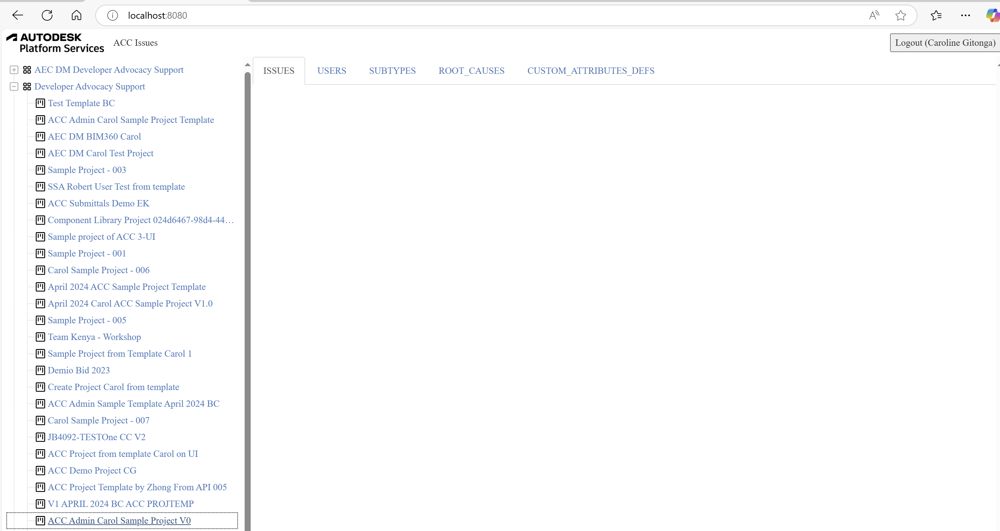

import NodeJsVsCodeStructure from './_shared/nodejs-vscode/final-folder-structure.mdx';

import YouTubeVideo from '@site/src/components/YouTubeVideo';

# UI Framework

Ok, we will build the client-side piece of our application now.

<details>
    <summary>
        <b>See the video walkthrough for .NET</b>
    </summary>
    <YouTubeVideo id="SETMRe7L198" si="uzV2YYfOueWtL5VB" title="ACC Issues for .NET: Project Admin & UI Framework & Table" />
</details>

<details>
    <summary>
        <b>See the video walkthrough for Node.js</b>
    </summary>
    <YouTubeVideo id="IaxR3EkF6eE" si="R1Khjm9LIwNHfqKV" title="ACC Issues for Node.js: Project Admin & UI Framework & Table" />
</details>

## Table place holder

Let's start by implementing a place holder functions of Table,
Create a `table.js` file under the `wwwroot` subfolder with the following code:

```js title="wwwroot/table.js"
const TABLE_TABS = {
    ISSUES: {
        REQUEST_URL: '/api/issues/issues',
        TAB_NAME: 'ISSUES',
        VISIBILITY: true,
        IMPORT_ATTRIBUTES_KEYS: [
            'id',
            'title',
            'description',
            'issueSubtypeId',
            'status',
            'dueDate',
            'assignedTo',
            'assignedToType',
            'rootCauseId',
            'published'
        ]
    },

    'USERS': {
        'REQUEST_URL': '/api/admin/projectUsers',
        'TAB_NAME': 'USERS',
        'VISIBILITY': false
    },
    'ISSUE_SUBTYPES': {
        'REQUEST_URL': '/api/issues/subtypes',
        'TAB_NAME': 'SUBTYPES',
        'VISIBILITY': false
    },
    'ISSUE_ROOTCAUSES': {
        'REQUEST_URL': '/api/issues/rootcauses',
        'TAB_NAME': 'ROOT_CAUSES',
        'VISIBILITY': false
    },
    'ISSUE_CUSTOM_ATTRIBUTES_DEFS': {
        'REQUEST_URL': '/api/issues/customAttDefs',
        'TAB_NAME': 'CUSTOM_ATTRIBUTES_DEFS',
        'VISIBILITY': false
    },
    'ISSUE_USER_PROFILE': {
        'REQUEST_URL': '/api/issues/issueUserProfile',
        'TAB_NAME': 'USER_PROFILE',
        'VISIBILITY': false
    }
}

//////////////////////////////////////////////////////////////////////////////////////////////////////////
//Table class wraps the specific data info
class Table {
    #tableId;
    #accountId;
    #projectId;
    #tabKey;
    #dataSet;
    #maxItem;

    constructor(tableId, accountId = null, projectId = null, tabKey = 'PROJECTS') {
        this.#tableId = tableId;
        this.#accountId = accountId;
        this.#projectId = projectId;
        this.#tabKey = tabKey;
        this.#dataSet = null;
        this.#maxItem = 5;
    };

    get tabKey(){
        return this.#tabKey;
    }

    set tabKey( tabKey){
        this.#tabKey = tabKey;
    }

    resetData = async( tabKey=null, accountId=null, projectId=null ) =>{
        //TBD
    }

    drawTable = () => {
        //TBD
    }

    exportToCSV = ()=>{
        //TBD
    }

    importFromCSV = async() => {
        //TBD
    }    
}


export async function refreshTable(accountId = null, projectId = null) {
    $("#loadingoverlay").fadeIn()

    const activeTab = $("ul#issueTableTabs li.active")[0].id;
    // highlight-start
    try {
        await g_accDataTable.resetData(activeTab, accountId, projectId);
        g_accDataTable.drawTable();
    } catch (err) {
        console.warn(err);
    }
    // highlight-end
    $("#loadingoverlay").fadeOut()
}

export async function initTableTabs() {
    // add all tabs
    for (let key in TABLE_TABS) {
        $('<li id=' + key + '><a href="accTable" data-toggle="tab">' + TABLE_TABS[key].TAB_NAME + '</a></li>').appendTo('#issueTableTabs');
    }
    $("#ISSUES").addClass("active");
    // event on the tabs
    $('a[data-toggle="tab"]').on('shown.bs.tab', async function (e) {
        $("#loadingoverlay").fadeIn()
        const activeTab = e.target.parentElement.id;
        // highlight-start
        try {
            await g_accDataTable.resetData(activeTab);
            g_accDataTable.drawTable();
        } catch (err) {
            console.warn(err);
        }
        // highlight-end
        $("#loadingoverlay").fadeOut()
    });
}

var g_accDataTable = new Table('#accTable');
```

The script is an [ES6 module](https://developer.mozilla.org/en-US/docs/Web/JavaScript/Guide/Modules)
that define a class `Table` which is used to list the information of Projects and Users, the module also
exports two functions:

- `initTableTabs` will create the Tabs and also register the function when active tab is changed.
- `refreshTable` for loading the data of selected tab into the table.

## Sidebar logic

Next we'll implement the behavior of a sidebar where we're going to display
all the ACC hubs and projects in a 3rd party tree-view component.
Create a `sidebar.js` file under the `wwwroot` subfolder with the following code:

```js title="wwwroot/sidebar.js"
async function getJSON(url) {
    const resp = await fetch(url);
    if (!resp.ok) {
        alert('Could not load tree data. See console for more details.');
        console.error(await resp.text());
        return [];
    }
    return resp.json();
}

function createTreeNode(id, text, icon, children = false) {
    return { id, text, children, itree: { icon } };
}

async function getHubs() {
    const hubs = await getJSON('/api/hubs');
    return hubs.map(hub => createTreeNode(`hub|${hub.id}`, hub.name, 'icon-hub', true));
}

async function getProjects(hubId) {
    const projects = await getJSON(`/api/hubs/${hubId}/projects`);
    return projects.map(project => createTreeNode(`project|${hubId}|${project.id}`, project.name, 'icon-project', false));
}


export function initTree(selector, onSelectionChanged) {
    // See http://inspire-tree.com
    const tree = new InspireTree({
        data: function (node) {
            if (!node || !node.id) {
                return getHubs();
            } else {
                const tokens = node.id.split('|');
                switch (tokens[0]) {
                    case 'hub': return getProjects(tokens[1]);
                    default: return [];
                }
            }
        }
    });
    tree.on('node.click', function (event, node) {
        event.preventTreeDefault();
        const tokens = node.id.split('|');
        if (tokens[0] === 'project') {
            onSelectionChanged( tokens[1],tokens[2]);
        }
    });
    return new InspireTreeDOM(tree, { target: selector });
}

```

## Application logic

Now let's wire all the UI components together. Create a `main.js` file under
the `wwwroot` folder, and populate it with the following code:

```js title="wwwroot/main.js"
import { refreshTable, initTableTabs } from './table.js';
import { initTree } from './sidebar.js';

const login = document.getElementById('login');
try {
    const resp = await fetch('/api/auth/profile');
    if (resp.ok) {
        const user = await resp.json();
        login.innerText = `Logout (${user.name})`;
        login.onclick = () => {
            const iframe = document.createElement('iframe');
            iframe.style.visibility = 'hidden';
            iframe.src = 'https://accounts.autodesk.com/Authentication/LogOut';
            document.body.appendChild(iframe);
            iframe.onload = () => {
                window.location.replace('/api/auth/logout');
                document.body.removeChild(iframe);
            };
        }
        initTree('#tree', (accountId, projectId) => refreshTable(accountId,projectId.replace('b.','')));
        await initTableTabs();
    } else {
        login.innerText = 'Login';
        login.onclick = () => window.location.replace('/api/auth/login');
    }
    login.style.visibility = 'visible';
} catch (err) {
    alert('Could not initialize the application. See console for more details.');
    console.error(err);
}

```

The script will first try and obtain user details to check whether we're logged in or not.
If we are, the code can then initialize the table as well as the tree-view component.
The callback function passed to `initTree` makes sure that when we click on a leaf node
in the tree, the table will start loading the corresponding data.

## User interface

And finally, let's build the UI of our application.

Create a `main.css` file under the `wwwroot` subfolder, and populate it with the following CSS rules:

```css title="wwwroot/main.css"
body, html {
    margin: 0;
    padding: 0;
    height: 100vh;
    font-family: ArtifaktElement;
}

#header, #sidebar, #table, #loadingoverlay {
    position: absolute;
}

#header {
    height: 3em;
    width: 100%;
    display: flex;
    flex-flow: row nowrap;
    justify-content: space-between;
    align-items: center;
}

#sidebar {
    width: 25%;
    left: 0;
    top: 3em;
    bottom: 0;
    overflow-y: scroll;
}

#table {
    width: 75%;
    right: 0;
    top: 3em;
    bottom: 0;
    overflow-y: scroll;
}

#loadingoverlay{
    top: 3em;
    z-index: 90;
    width: 100%;
    height: 100%;
    display: none;
    background: rgba(0, 0, 0, 0.6);
}

.cv-spinner {
    height: 100%;
    display: flex;
    justify-content: center;
    align-items: center;
}

.spinner {
    width: 60px;
    height: 60px;
    border: 6px #ddd solid;
    border-top: 6px #2e93e6 solid;
    border-radius: 50%;
    animation: sp-anime 0.8s infinite linear;
}

@keyframes sp-anime {
    0% {
        transform: rotate(0deg);
    }
    100% {
        transform: rotate(359deg);
    }
}

#header > * {
    height: 2em;
    margin: 0 0.5em;
}

#login {
    font-family: ArtifaktElement;
    font-size: 1em;
}

#header .title {
    height: auto;
    margin-right: auto;
}

#tree {
    margin: 0.5em;
}

#workingAnimation {    
    text-align: center;
}

@media (max-width: 768px) {
    #sidebar {
        width: 100%;
        top: 3em;
        bottom: 75%;
    }
    #table {
        width: 100%;
        top: 25%;
        bottom: 0;
    }
}

.icon-hub:before {
    background-image: url(https://raw.githubusercontent.com/primer/octicons/main/icons/apps-16.svg); /* or https://raw.githubusercontent.com/primer/octicons/main/icons/stack-16.svg */
    background-size: cover;
}

.icon-project:before {
    
    background-image: url(https://raw.githubusercontent.com/primer/octicons/main/icons/project-16.svg); /* or https://raw.githubusercontent.com/primer/octicons/main/icons/organization-16.svg */
    background-size: cover;
}
```

Then, create an `index.html` file in the same folder with the following content:

```html title="wwwroot/index.html"
<!doctype html>
<html lang="en">

<head>
    <meta charset="utf-8">
    <meta name="viewport" content="width=device-width, initial-scale=1">
    <link rel="icon" type="image/x-icon" href="https://cdn.autodesk.io/favicon.ico">
    <link rel="stylesheet" href="https://unpkg.com/inspire-tree-dom@4.0.6/dist/inspire-tree-light.min.css">
    <link rel="stylesheet" href="https://maxcdn.bootstrapcdn.com/bootstrap/3.4.1/css/bootstrap.min.css">
    <link rel="stylesheet" href="https://unpkg.com/bootstrap-table@1.22.2/dist/bootstrap-table.min.css">
    <link rel="stylesheet" href="/main.css">

    <script src="//cdnjs.cloudflare.com/ajax/libs/jquery/3.3.1/jquery.min.js"></script>
    <script src="https://cdnjs.cloudflare.com/ajax/libs/lodash.js/4.17.21/lodash.min.js"></script>
    <script src="https://unpkg.com/inspire-tree@4.3.1/dist/inspire-tree.js"></script>
    <script src="https://unpkg.com/inspire-tree-dom@4.0.6/dist/inspire-tree-dom.min.js"></script>
    <script src="https://maxcdn.bootstrapcdn.com/bootstrap/3.4.1/js/bootstrap.min.js"></script>
    <script src="https://unpkg.com/bootstrap-table@1.22.2/dist/bootstrap-table.min.js"></script>
    <script src="https://rawgit.com/michaelsogos/bootstrap-table-toolbar-buttons/master/src/bootstrap-table-toolbar-buttons.js"></script>
    <script src="https://unpkg.com/axios/dist/axios.min.js"></script>
    <script src="https://cdnjs.cloudflare.com/ajax/libs/PapaParse/5.3.0/papaparse.min.js"></script>
    <script src="/main.js" type="module"></script>

    <title>Autodesk Platform Services: ACC Issues</title>
</head>

<body>
    <div id="header">
        
        <span class="title">ACC Issues</span>
        <button id="login" style="visibility: hidden;">Login</button>
    </div>
    <div id="sidebar">
        <div id="tree"></div>
    </div>
    <div id="table">
        <ul id="issueTableTabs" class="nav nav-tabs">
        </ul>
        
        <table id="accTable" class="table-striped table-bordered table-hover">
        </table>
        <div id="loadingoverlay">
            <div class="cv-spinner">
                <span class="spinner"></span>
            </div>
        </div>
    </div>
</body>
</html>
```

> Note that since `main.js` is also an ES6 module, we have to use `type="module"` in its `<script>` tag.

The final folder structure of your application's source code should now look something like this:

<NodeJsVsCodeStructure />

## Try it out

Your application is now to ready to test for the framework. Start it as usual, and when you go to
[http://localhost:8080](http://localhost:8080), you should be presented with a simple UI, with
a tree-view on the left side, and an empty table on the right. Try browsing through the tree,
we will load data into the table in next step.



