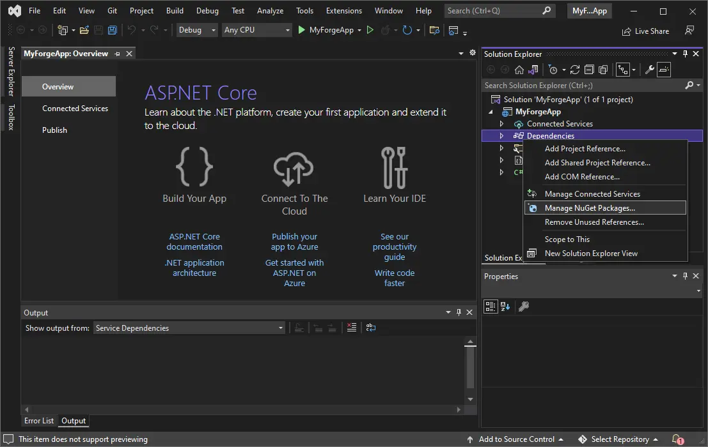

Next we will need to install the dependencies. In this case it will be a couple of modules
of the official APS SDK. In the _Solution Explorer_,
right-click on _Dependencies_, and then click on _Manage NuGet Packages..._:

In the _NuGet Package Manager_, switch to the _Browse_ tab, and search for and install
the following packages:
:::note
At the writing of this documentation, the tutorial sample is using the specified version next to the package name.
:::

- [Autodesk.Authentication v2.2.1 ](https://www.nuget.org/packages/Autodesk.Construction.AccountAdmin/2.2.1)
- [Autodesk.DataManagement v2.1.2](https://www.nuget.org/packages/Autodesk.DataManagement/2.1.2)
- [Autodesk.Construction.AccountAdmin v3.1.0-beta](https://www.nuget.org/packages/Autodesk.Construction.AccountAdmin/3.1.0-beta)
- [Autodesk.Construction.Issues  v4.0.0-beta](https://www.nuget.org/packages/Autodesk.Construction.Issues/4.0.0-beta)
