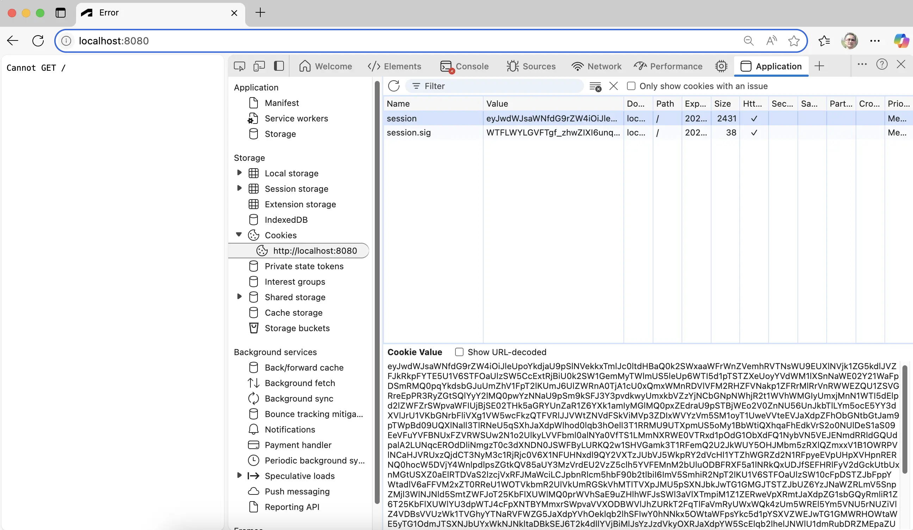

If the application is still running, restart it (for example, using _Run > Restart Debugging_,
or by clicking the green restart icon), otherwise start it again (using _Run > Start Debugging_,
or by pressing `F5`).

When you navigate to [http://localhost:8080/api/auth/login](http://localhost:8080/api/auth/login)
in the browser, you should be redirected to Autodesk login page, and after logging in,
it routes back to your application with simply showing `Cannot GET /` now.
This is expected as we haven't implemented the `GET /` endpoint yet. However, if you use
browser dev tools and explore the cookies stored by your browser for the `localhost` origin,
you'll notice that the application is already to store the authentication data there.

:::info
Here's where you can find your website cookies in different browsers:
- [Chrome](https://developer.chrome.com/docs/devtools/storage/sessionstorage/)
- [Firefox](https://developer.mozilla.org/en-US/docs/Tools/Storage_Inspector/Cookies)
- [Edge](https://docs.microsoft.com/en-us/microsoft-edge/devtools-guide-chromium/storage/cookies)
- [Safari](https://developer.apple.com/safari/tools/)
:::

