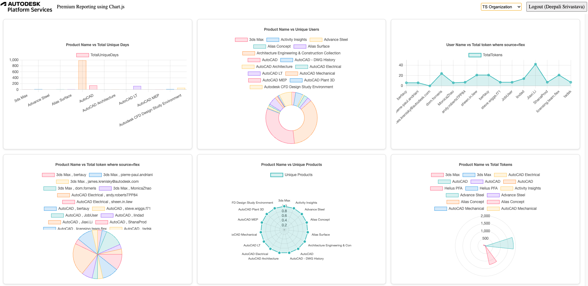

import EnvTabs from "@site/src/components/EnvTabs.js";

import NodeJsVsCodeStructure from "./_shared/nodejs-vscode/final-folder-structure.mdx";

# Application Logic

Next is that we implement the logic for main.js

Now let's wire all the UI components together. Create a main.js file under the wwwroot folder, and populate it with the following code:

Let's start by implementing the Viewer functionality for our application.
Create a `main.js` file under the `wwwroot` subfolder with the following code:

```js title="wwwroot/main.js"
import { chart1, chart2, chart3, chart4, chart5, chart6 } from "./login.js";

const login = document.getElementById("login");
const dropdown = document.getElementById("dropdown");

let usecases = []; // Global variable to store the server response

async function fetchUserProfile() {
  const resp = await fetch("/api/auth/profile");
  if (!resp.ok) throw new Error("Failed to fetch user profile");
  return await resp.json();
}

async function fetchContexts() {
  const resp = await fetch("/api/contexts");
  if (!resp.ok) throw new Error("Failed to fetch dropdown data");
  return await resp.json();
}

// Function to update charts with new data
function updateCharts(usecases) {
  chart1(document.getElementById("myChart1"), usecases[0]);
  chart2(document.getElementById("myChart2"), usecases[1]);
  chart3(document.getElementById("myChart3"), usecases[2]);
  chart4(document.getElementById("myChart4"), usecases[3]);
  chart5(document.getElementById("myChart5"), usecases[4]);
  chart6(document.getElementById("myChart6"), usecases[5]);
}

// Function to initialize charts after getting the context data
async function initializeCharts(usecases) {
  if (usecases) {
    updateCharts(usecases); // Update the charts with the new usecase1 data
  } else {
    console.log("No data to update charts.");
  }
}

async function initialize() {
  try {
    const resp = await fetch("/api/auth/profile");
    if (resp.ok) {
      const user = await resp.json();
      login.innerText = `Logout (${user.name})`;
      login.onclick = () => {
        const iframe = document.createElement("iframe");
        iframe.style.visibility = "hidden";
        iframe.src = "https://accounts.autodesk.com/Authentication/LogOut";
        document.body.appendChild(iframe);
        iframe.onload = () => {
          window.location.replace("/api/auth/logout");
          document.body.removeChild(iframe);
        };
      };
    } else {
      login.innerText = "Login";
      login.onclick = () => window.location.replace("/api/auth/login");
    }

    // Make sure login button is visible
    login.style.visibility = "visible";

    // Initialize dropdown
    const data = await fetchContexts();
    dropdown.innerHTML =
      '<option value="" disabled selected>Select a Context</option>';
    data.forEach((item) => {
      const option = document.createElement("option");
      option.value = item.contextId;
      option.textContent = item.alias;
      dropdown.appendChild(option);
    });

    dropdown.addEventListener("change", async () => {
      const selectedValue = dropdown.value;
      console.log("Selected Value:", selectedValue);
      alert(`You selected: ${selectedValue}`);

      // Send the selected contextId to the server
      const response = await fetch("/api/submit-dropdown", {
        method: "POST",
        headers: {
          "Content-Type": "application/json",
        },
        body: JSON.stringify({ selectedValue: selectedValue }),
      });

      if (response.ok) {
        const data = await response.json();
        usecases = data; // Store the received data in the usecase1 variable

        console.log("Server Response:", data);
        // Initialize charts only after receiving the usecase1 data

        initializeCharts(usecases);
      } else {
        console.error("Error fetching data from server");
      }
    });
  } catch (err) {
    console.error("Error during initialization:", err);
    alert(
      "Could not initialize the application. See console for more details."
    );
  }
}

// Initialize the application
initialize();
```

This script initializes a web application with dynamic chart rendering and user-specific interactions. It imports chart functions, fetches user profiles, and populates a dropdown menu with context data from the server. Based on the user’s dropdown selection, it sends the context ID to the server, updates the usecases dataset, and renders charts dynamically using chart1 through chart6. The login/logout button adapts based on the user's authentication status. The initialize function orchestrates these tasks,
ensuring a responsive and interactive UI by fetching data, handling user actions, and updating charts seamlessly.

## User interface

Finally, let's define the UI of our application with a simple HTML markup and CSS.

Create an `index.html` file in the `wwwroot` subfolder with the following content:

```html title="wwwroot/index.html"
<!DOCTYPE html>
<html lang="en">
  <head>
    <meta charset="utf-8" />
    <meta name="viewport" content="width=device-width, initial-scale=1" />
    <link
      rel="icon"
      type="image/x-icon"
      href="https://cdn.autodesk.io/favicon.ico"
    />
    <script src="https://cdn.jsdelivr.net/npm/chart.js"></script>
    <link rel="stylesheet" href="/main.css" />

    <title>Autodesk Platform Services: Premium Reporting using Chart.js</title>
  </head>

  <body>
    <div id="header">
      
      <span class="title">Premium Reporting using Chart.js</span>
      <select id="dropdown">
        <option value="" disabled selected>Loading...</option>
      </select>
      <button id="login" style="visibility: hidden;">Login</button>
    </div>

    <div class="chart-container">
      <div class="chart-wrapper">
        <canvas id="myChart1"></canvas>
      </div>
      <div class="chart-wrapper">
        <canvas id="myChart2"></canvas>
      </div>
      <div class="chart-wrapper">
        <canvas id="myChart3"></canvas>
      </div>
      <div class="chart-wrapper">
        <canvas id="myChart4"></canvas>
      </div>
      <div class="chart-wrapper">
        <canvas id="myChart5"></canvas>
      </div>
      <div class="chart-wrapper">
        <canvas id="myChart6"></canvas>
      </div>
    </div>

    <script src="https://cdnjs.cloudflare.com/ajax/libs/lodash.js/4.17.21/lodash.min.js"></script>

    <script src="/main.js" type="module"></script>
  </body>
</html>
```

This HTML document is a reporting interface using Chart.js for dynamic data visualization.

It features a header with the Autodesk logo, a title, a context-selection dropdown, and a dynamically managed login button.

Six canvas elements are included for chart rendering, styled using an external CSS file.

Libraries like Chart.js enhance chart functionality and utilities, while a custom script (main.js) handles initialization, data fetching, and user interactions.

The layout is responsive, ensuring compatibility across devices, and integrates professional Autodesk branding for a cohesive user experience.

Create a `main.css` file, also under the `wwwroot` subfolder, and populate it with these CSS rules:

```css title="wwwroot/main.css"
body,
html {
  margin: 0;
  padding: 0;
  height: 100%;
  font-family: ArtifaktElement;
  overflow: hidden;
}

#header {
  height: 3em;
  width: 100%;
  display: flex;
  flex-flow: row nowrap;
  justify-content: space-between;
  align-items: center;
}

.chart-container {
  display: grid;
  grid-template-columns: repeat(3, 1fr);
  gap: 1em;
  height: calc(100vh - 3em);
  padding: 1em;
  box-sizing: border-box;
  overflow: auto;
  overflow-x: scroll;
  overflow-y: scroll;
}

.chart-wrapper {
  width: 100%;
  height: 100%;
  background: #fff;
  border: 1px solid #ddd;
  border-radius: 8px;
  box-shadow: 0px 2px 5px rgba(0, 0, 0, 0.1);
  padding: 1em;
  display: flex;
  justify-content: center;
  align-items: center;
  box-sizing: border-box;
  overflow: auto;
  max-width: 100%;
  max-height: 100%;
}

.chart-content {
  width: 100%;
  height: 100%;
  object-fit: contain;
  max-width: 100%;
  max-height: 100%;
}

#myChart1,
#myChart2,
#myChart3,
#myChart4,
#myChart5,
#myChart6 {
  width: 100%;
  height: 100%;
  object-fit: contain;
}

#header > * {
  height: 2em;
  margin: 0 0.5em;
}

#login {
  font-family: ArtifaktElement;
  font-size: 1em;
}

#header .title {
  height: auto;
  margin-right: auto;
}

@media (max-width: 768px) {
  .chart-container {
    grid-template-columns: repeat(2, 1fr);
  }

  .chart-wrapper {
    width: 100%;
  }
}

.icon-hub:before {
  background-image: url(https://raw.githubusercontent.com/primer/octicons/main/icons/apps-16.svg); /* or https://raw.githubusercontent.com/primer/octicons/main/icons/stack-16.svg */
  background-size: cover;
}

.icon-project:before {
  background-image: url(https://raw.githubusercontent.com/primer/octicons/main/icons/project-16.svg); /* or https://raw.githubusercontent.com/primer/octicons/main/icons/organization-16.svg */
  background-size: cover;
}

.icon-my-folder:before {
  background-image: url(https://raw.githubusercontent.com/primer/octicons/main/icons/file-directory-16.svg);
  background-size: cover;
}

.icon-item:before {
  background-image: url(https://raw.githubusercontent.com/primer/octicons/main/icons/file-16.svg);
  background-size: cover;
}

.icon-version:before {
  background-image: url(https://raw.githubusercontent.com/primer/octicons/main/icons/clock-16.svg);
  background-size: cover;
}
```

This CSS defines the layout and styling of a web page with a header, sidebar, and preview section, designed for both desktop and responsive mobile views. The body and html are set to fill the viewport height with no margins or padding. The #header spans the top, containing navigation and a login button styled with ArtifaktElement. The #sidebar and #preview are positioned side by side on desktops, while on smaller screens (max-width: 768px), they stack vertically with adjusted dimensions. The layout ensures flexibility and accessibility across different devices.

The final folder structure of your application's source code should now look something like this:

<EnvTabs NodeJsVsCode={NodeJsVsCodeStructure} />

## Try it out

And that's it! Your application is now complete. Start (or restart) the app as usual, and navigate
to [http://localhost:8080](http://localhost:8080) in your browser. You should be presented with
a simple UI, with a dropdown in the top-right corner that will get populated with the context ID. As soon as you
select one of the IDs from the dropdown, the corresponding charts will get loaded .


