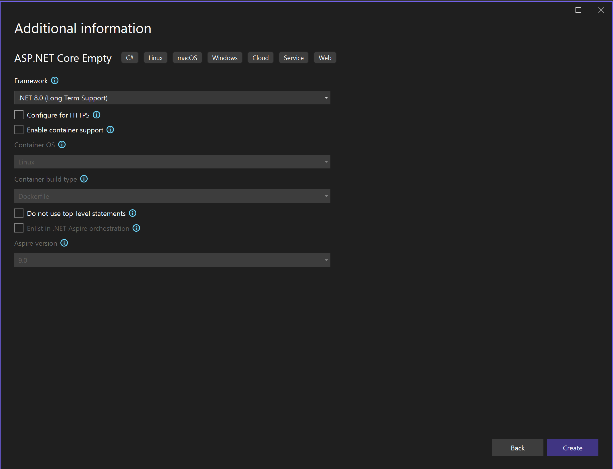

Create a new project in Visual Studio:

Choose the _ASP.NET Core Empty_ template:

Name the project any way you want:

Choose the _.NET 6.0 (Long-term support)_ framework, and disable HTTPS as we don't need it for now:

Once the project is ready, create the following subfolders in your project folder:

- `Controllers` - this is where we're going to implement all the server endpoints
- `Models` - here we're going to keep all the server-side logic that can be shared by different endpoints
- `wwwroot` - this is where we're going to put all the client side assets (HTML, CSS, JavaScript, images, etc.)
