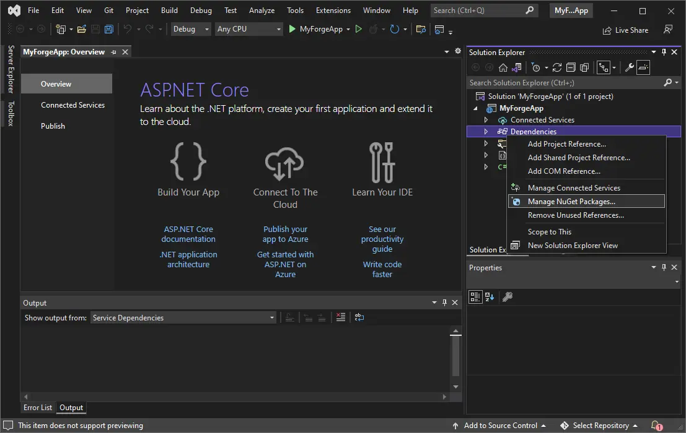

Next we will need to install the dependencies. In this case it will be a couple of modules
of the official APS SDK. In the _Solution Explorer_,
right-click on _Dependencies_, and then click on _Manage NuGet Packages..._:

In the _NuGet Package Manager_, switch to the _Browse_ tab, and search for and install
the following packages:

- [Autodesk.SdkManager](https://www.nuget.org/packages/Autodesk.SdkManager)
- [Autodesk.Authentication](https://www.nuget.org/packages/Autodesk.Authentication)
- [Autodesk.OSS](https://www.nuget.org/packages/Autodesk.OSS)
- [Autodesk.DataManagement](https://www.nuget.org/packages/Autodesk.DataManagement)
- [Autodesk.ModelDerivative](https://www.nuget.org/packages/Autodesk.ModelDerivative)