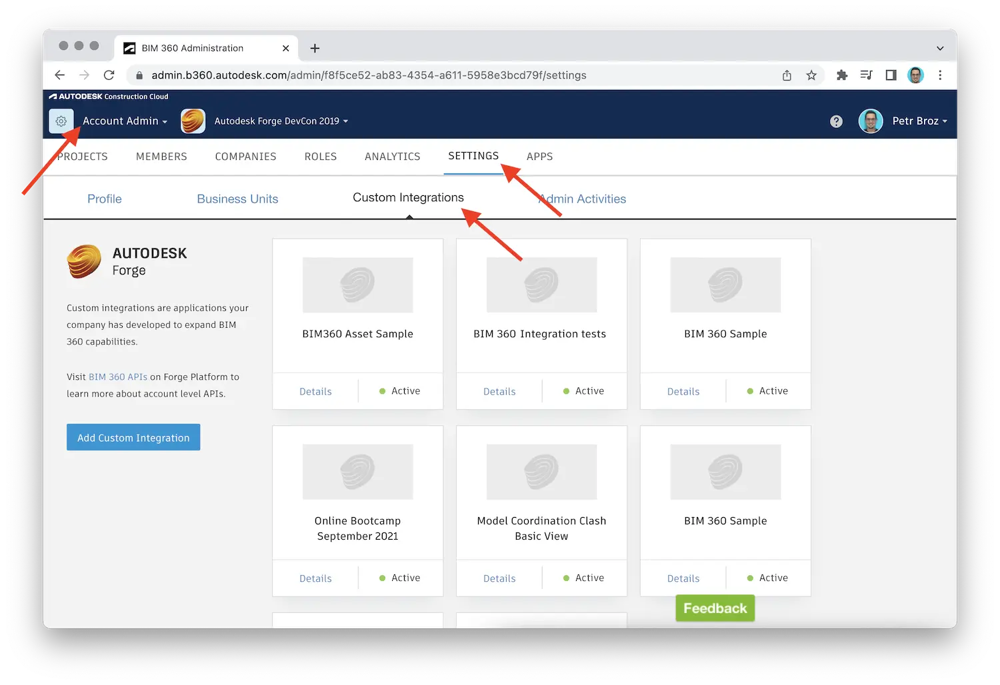

1. Make sure you have _admin_ access to a BIM 360 account
2. Log into the BIM 360 account and navigate to the _Custom Integrations_ tab

3. Use the _Add Custom Integration_ button on the left side to start a simple wizard
that will guide you through the process
4. On the _Select Access_ page, keep both the _BIM 360 Account Administration_
and the _Document Management_ options checked, and hit the _Next_ button

5. On the next page of the wizard, choose the _I'm the developer_ option, and hit
the _Next_ button

:::info
Here we assume that the _account admin_ is also the owner of the Forge application.
If that is not the case, the account administrator can use the _Invite a developer_
option instead, and the invited developer will input the Forge application details later.
:::

6. On the next and final page, make note of the _BIM 360 Account ID_, check the
checkbox next to it, and fill out the _Forge Client ID_ and the _App Name_ fields
exactly as they appear in your application's page on https://forge.autodesk.com/myapps

:::tip
Consider storing your Forge application client ID somewhere in _App Description_.
The client ID will _not_ appear in the custom integration after it has been created,
and if the number of integrations in your account starts to grow, this will help you
quickly identify the Forge application each custom integration is associated with.
:::

7. When ready, scroll down and hit the _Save_ button

And that's it. Now your application can use different Forge services such as
[Data Management API](https://forge.autodesk.com/en/docs/data/v2/developers_guide/overview)
or [BIM 360 API](https://forge.autodesk.com/en/docs/bim360/v1/overview/introduction)
to access information from all projects under this BIM 360 account.
