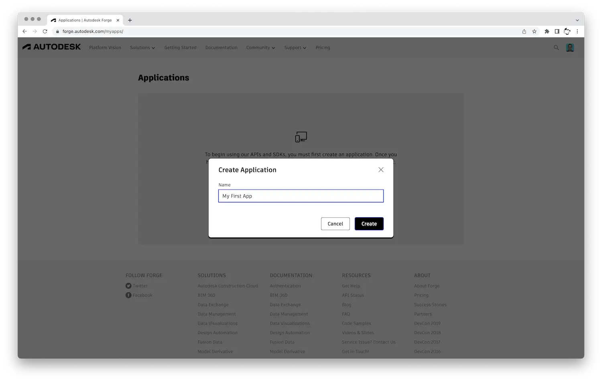
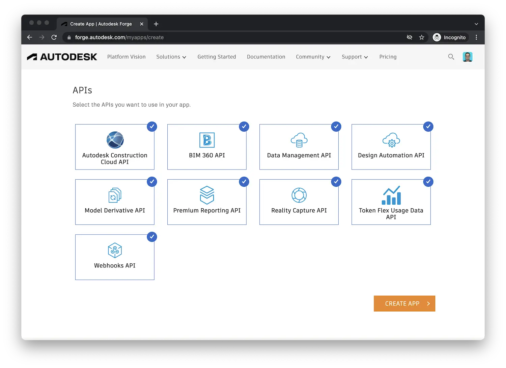
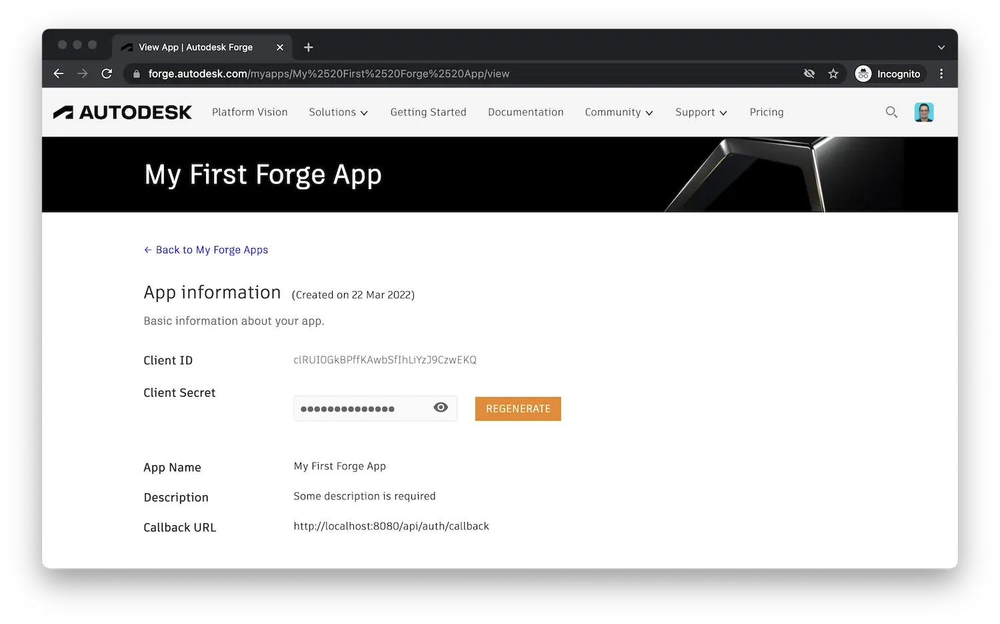

import Tabs from '@theme/Tabs';
import TabItem from '@theme/TabItem';
import AccProvisioningSteps from './_shared/provisioning/acc/steps.mdx';
import Bim360ProvisioningSteps from './_shared/provisioning/bim360/steps.mdx';

# Getting Started

Here's a couple of things you want to do before building your first Forge application.

## Create an account

If you don't have a Forge account yet, sign up for one on https://forge.autodesk.com.
You can take advantage of a trial subscription that is valid for 3 months.

## Create app credentials

In order to authenticate ourselves to the Forge platform, we will need to generate
_app credentials_ (specifically, a _client ID_ and _client secret_) for our application.

After logging into the Forge developer portal, go to _My Apps_:

And click on the _Create App_ button:

Now, let's fill out the basic information about our application. The _App name_,
_App description_, and _Callback URL_ fields are all required, the rest is optional.

:::caution
Pay close attention to the _Callback URL_ field. This is the address your application's
users will be redirected to after logging in with their Autodesk credentials. It can be
any arbitrary URL but it has to match exactly the URL your server application expects.
In our tutorials we will always use the same address: `http://localhost:8080/api/auth/callback`.
:::

Finally, enable the APIs you want your application to have access to. Unless you have
any specific reason for limiting your application's access to the different services,
enable everything.

And that's it. Now let's just store your _client ID_ and _client secret_ credentials as
we will need those **very** soon!

## Provision access in other products

In certain cases it is possible for your application to integrate with other Forge-based products
such as [Autodesk Construction Cloud](https://construction.autodesk.com),
or [Autodesk BIM 360](https://www.autodesk.com/bim-360). We leverage this capability in
the [Hubs Browser](./tutorials/hubs-browser) tutorial where you can learn about accessing designs
from [Autodesk Docs](https://www.autodesk.com/products/autodesk-docs/overview),
[BIM 360 Docs](https://www.autodesk.com/bim-360/construction-document-management-software/),
or [Fusion Teams](https://www.autodesk.com/products/fusion-360/overview).

However, some of these products must _provision access_ for a specific Forge application
based on its client ID. Follow the steps below for any specific product you would like
to integrate your application with.

:::info
If you are _not_ planning to integrate your application with other products for now,
you can skip the rest of this page and come back to it later when needed.
:::

<Tabs groupId="access-provisioning">
    <TabItem value="acc" label="Autodesk Construction Cloud" default>
        <AccProvisioningSteps />
    </TabItem>
    <TabItem value="bim360" label="Autodesk BIM 360">
        <Bim360ProvisioningSteps />
    </TabItem>
<TabItem value="fusion360" label="Autodesk Fusion Team">

No provisioning steps are needed. Your Forge application can automatically access
the data of your authenticated users in this product.

</TabItem>
</Tabs>
