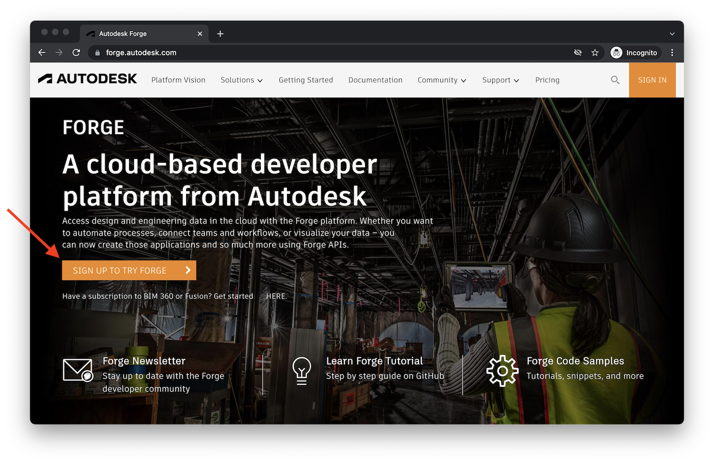
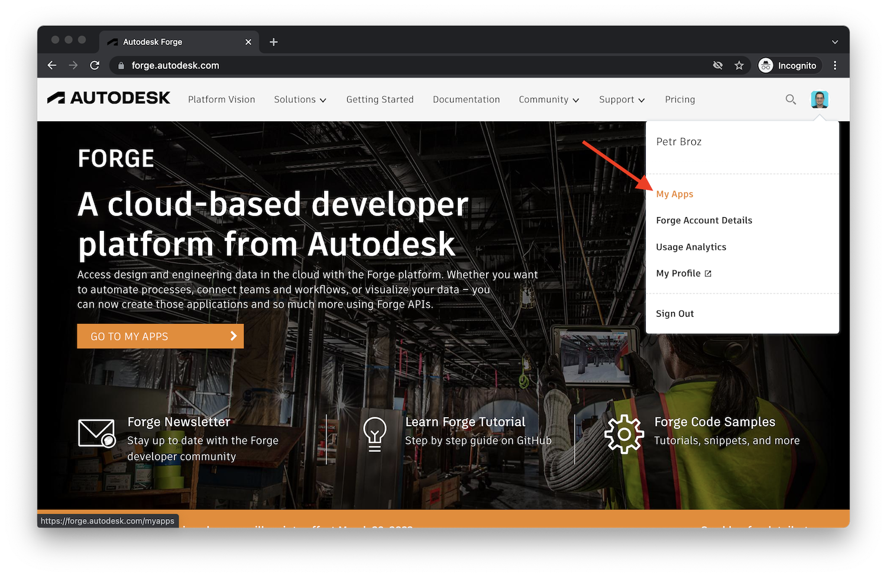
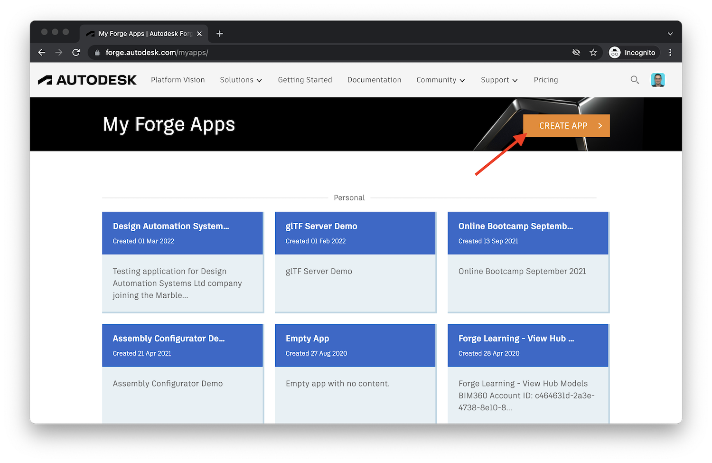
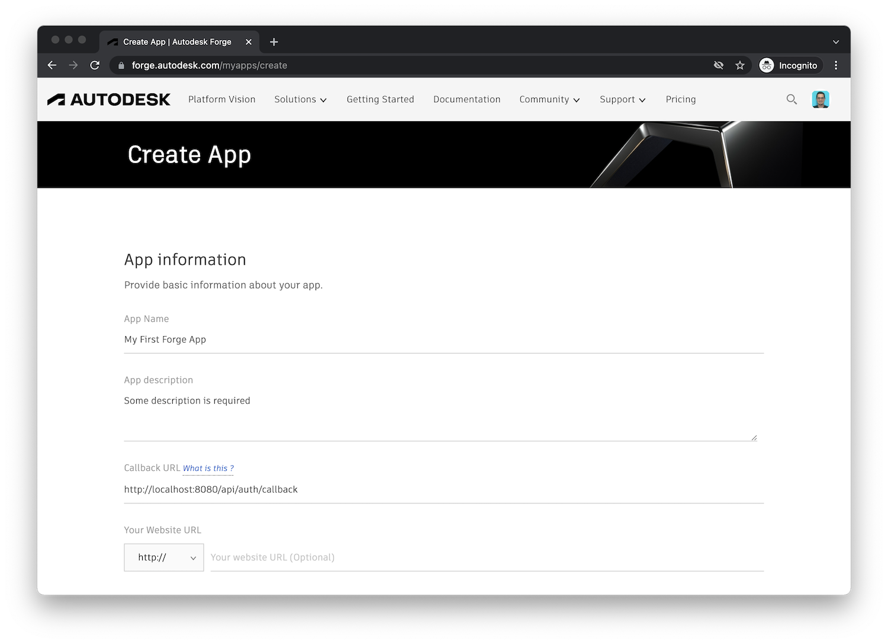
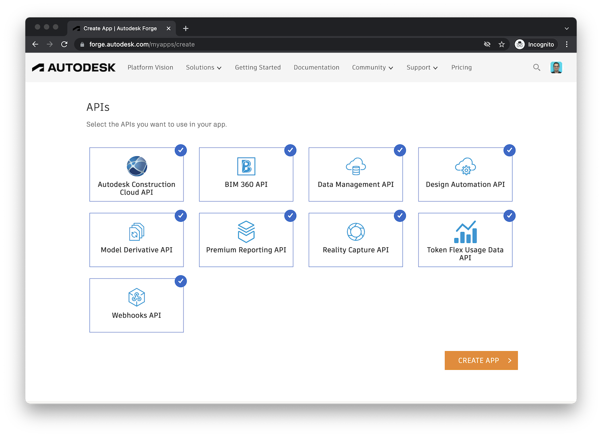
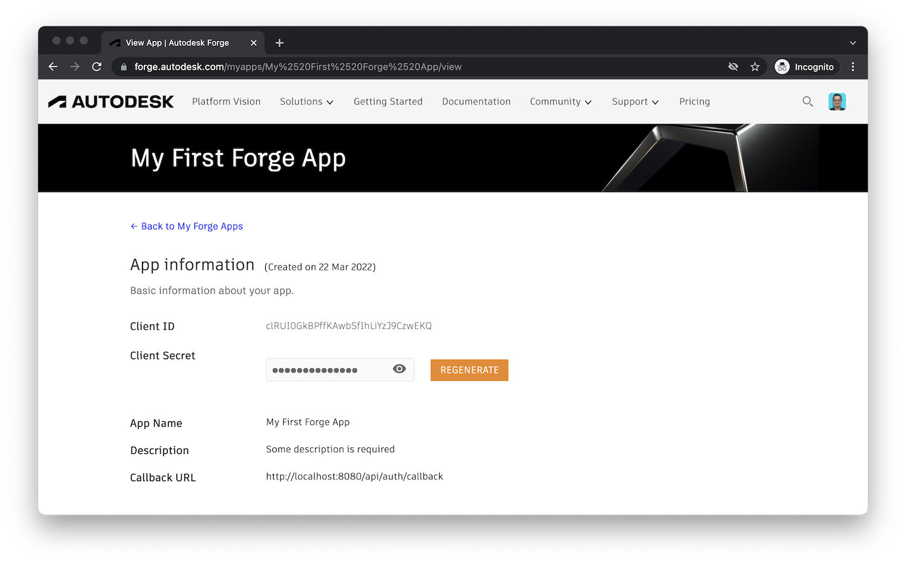
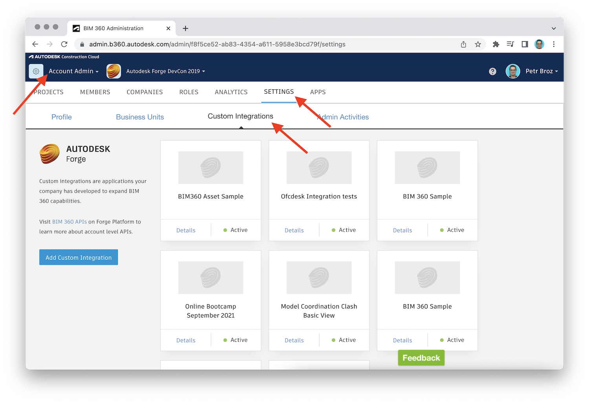
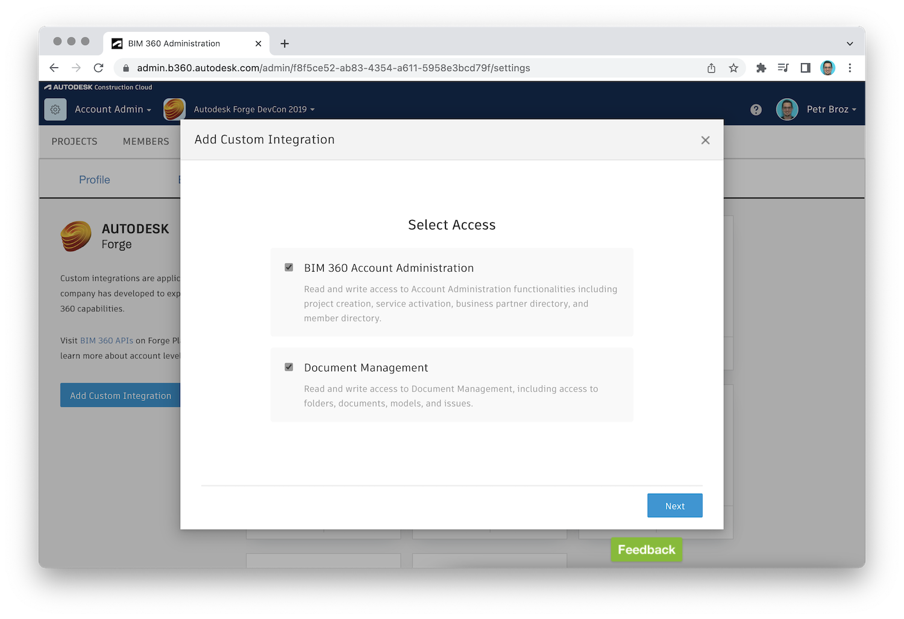
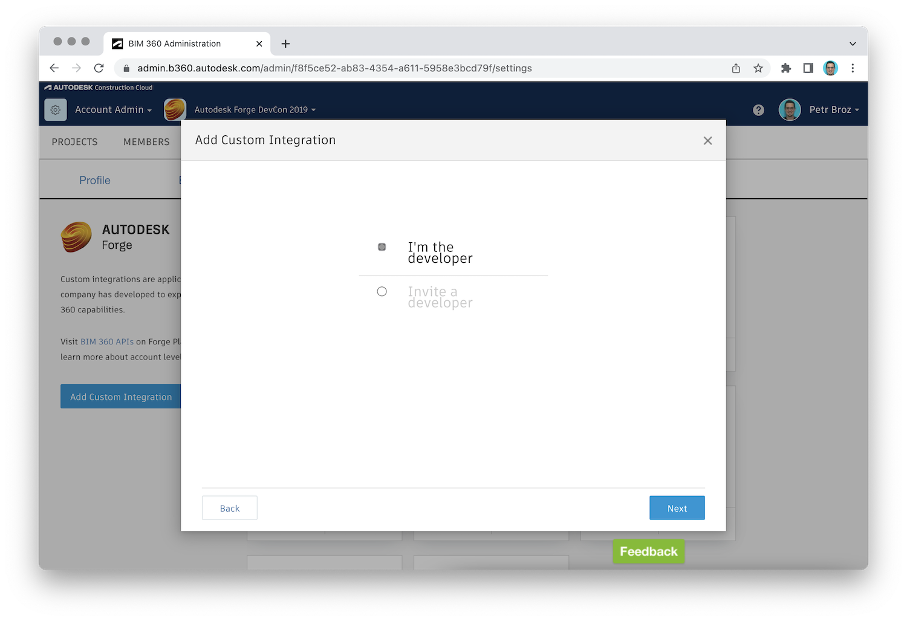

# Getting Started

Here's a couple of things you want to do before building your first Forge application.

## Create an account

If you don't have a Forge account yet, sign up for one on https://forge.autodesk.com.
You can take advantage of a trial subscription that is valid for 3 months.

## Create app credentials

In order to authenticate ourselves to the Forge platform, we will need to generate
_app credentials_ (specifically, a _client ID_ and _client secret_) for our application.

After logging into the Forge developer portal, go to _My Apps_:

And click on the _Create App_ button:

Now, let's fill out the basic information about our application. The _App name_,
_App description_, and _Callback URL_ fields are all required, the rest is optional.

:::caution
Pay close attention to the _Callback URL_ field. This is the address your application's
users will be redirected to after logging in with their Autodesk credentials. It can be
any arbitrary URL but it has to match exactly the URL your server application expects.
In our tutorials we will always use the same address: `http://localhost:8080/api/auth/callback`.
:::

Finally, enable the APIs you want your application to have access to. Unless you have
any specific reason for limiting your application's access to the different services,
enable everything.

And that's it. Now let's just store your _client ID_ and _client secret_ credentials as
we will need those **very** soon!

## Provision access in other products

In certain cases it is possible for your application to access information from other
Forge-based products such as [Autodesk BIM 360](https://www.autodesk.com/bim-360) or
[Autodesk Docs](https://www.autodesk.com/products/autodesk-docs/overview).
However, in order to enable this workflow, the 3rd party product must _provision access_
for your specific application based on its client ID. Follow the steps below in order
to provide your application access to a specific product.

:::info
If you are _not_ planning to integrate your application with other products for now,
you can skip the rest of this page and come back to it later when needed.
:::

### BIM 360

1. Make sure you have _admin_ access to a BIM 360 account
2. Log into the BIM 360 account and navigate to the _Custom Integrations_ tab

3. Use the _Add Custom Integration_ button on the left side to start a simple wizard
that will guide you through the process
4. On the _Select Access_ page, keep both the _BIM 360 Account Administration_
and the _Document Management_ options checked, and hit the _Next_ button

5. On the next page of the wizard, choose the _I'm the developer_ option, and hit
the _Next_ button

:::info
Here we assume that the _account admin_ is also the owner of the Forge application.
If that is not the case, the account administrator can use the _Invite a developer_
option instead, and the invited developer can input the Forge application details later.
:::

6. On the next and final page, make note of the _BIM 360 Account ID_, check the
checkbox next to it, and fill out the _Forge Client ID_ and the _App Name_ fields
exactly as they appear in your application's page on https://forge.autodesk.com/myapps

:::tip
Consider mentioning your Forge application client ID in _App Description_. The client ID
will _not_ appear in the custom integration after it has been created, and if the number
of integrations in your account starts to grow, this will help you quickly identify
the Forge application a specific integration is associated with.
:::

7. When ready, scroll down and hit the _Save_ button

And that's it. Now your Forge application can use [Data Management API](https://forge.autodesk.com/en/docs/data/v2/developers_guide/overview/)
or [BIM 360 API](https://forge.autodesk.com/en/docs/bim360/v1/overview/introduction/)
to access information from this BIM 360 account.
