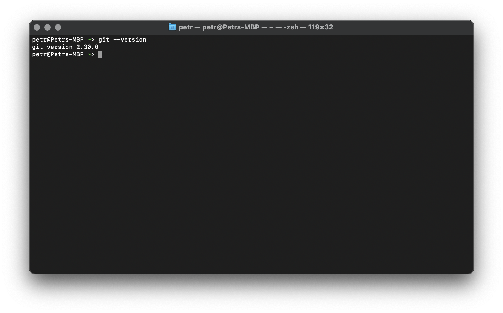

import Tabs from '@theme/Tabs';
import TabItem from '@theme/TabItem';
import NodejsRuntime from './setup/_nodejs.md';
import DotnetRuntime from './setup/_dotnet.md';

# Environment Setup

## Command-line interface

Command-line interface, a _CLI_, is an essential tool when developing modern web applications.
It is often used to initialize new projects, handle their dependencies, or to manage their
source code. Different operating systems have their own options (for example, in Windows there's
the [Command Prompt](https://en.wikipedia.org/wiki/Cmd.exe) and [PowerShell](https://en.wikipedia.org/wiki/PowerShell),
and Unix-based systems have all sorts of [shells](https://en.wikipedia.org/wiki/Unix_shell))
but in our case we're going to be using `bash` which is available _cross-platform_.

- On Unix-based systems, `bash` (or one of its flavors like `zsh`) is most likely available
already, and if not, you can get it from https://www.gnu.org/software/bash.
- On Windows, `bash` will be installed as part of `git`, the source code management tool
discussed in the next section.

## Source code management

Another essential part of the modern software development, especially for web, is the source code
management tool [git](https://git-scm.com). Go to the [Downloads](https://git-scm.com/downloads)
section, and install the latest release for your platform. As mentioned in the previous section,
the Windows installer comes with the `bash` CLI as well.

To check whether `git` is installed and available, try running the following command in `bash`:

```bash
git --version
```

You should see something like this:



## Runtime

<Tabs groupId="programming-language">
    <TabItem value="dotnet" label=".NET" default>
        <DotnetRuntime />
    </TabItem>
    <TabItem value="nodejs" label="Node.js">
        <NodejsRuntime />
    </TabItem>
</Tabs>

## Editor

For the coding itself you're welcome to use whichever editor you like the most.
If you're open to suggestions, we recommend [Visual Studio Code](https://code.visualstudio.com)
which is free, cross-platform, and fast. Simply install the latest stable build
for your platform.

:::tip
We've also built an extension for Visual Studio Code that gives you access to
some of the Forge services and data directly from the editor, without writing
a single line of code:
[vscode-forge-tools](https://marketplace.visualstudio.com/items?itemName=petrbroz.vscode-forge-tools).
:::
