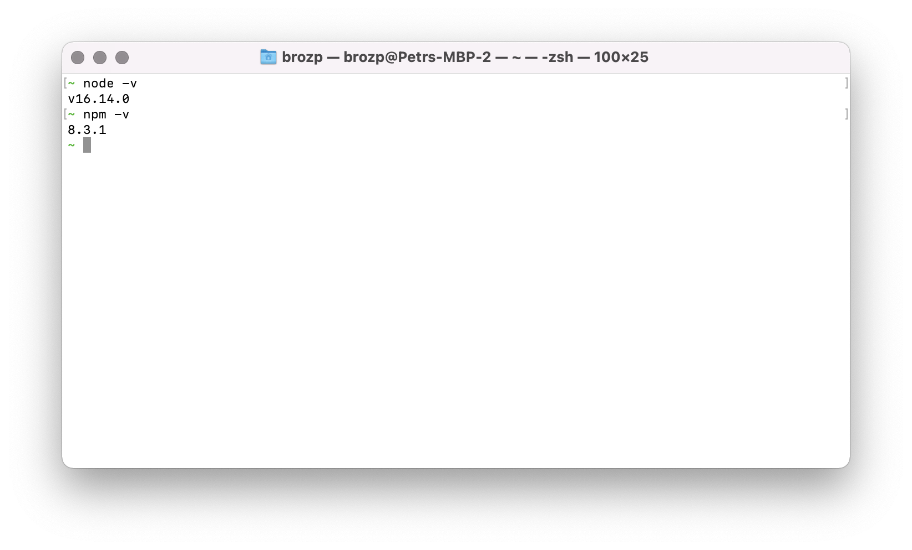

We will also need the Node.js _runtime_ to run our code, and the Node.js package manager, _NPM_,
to manage 3rd party dependencies. You can get an installer for your platform on https://nodejs.org/en/download
which will install both.

To make sure the tools are available, try running the following two commands in `bash`:

```bash
node -v
npm -v
```

You should see something like this:


