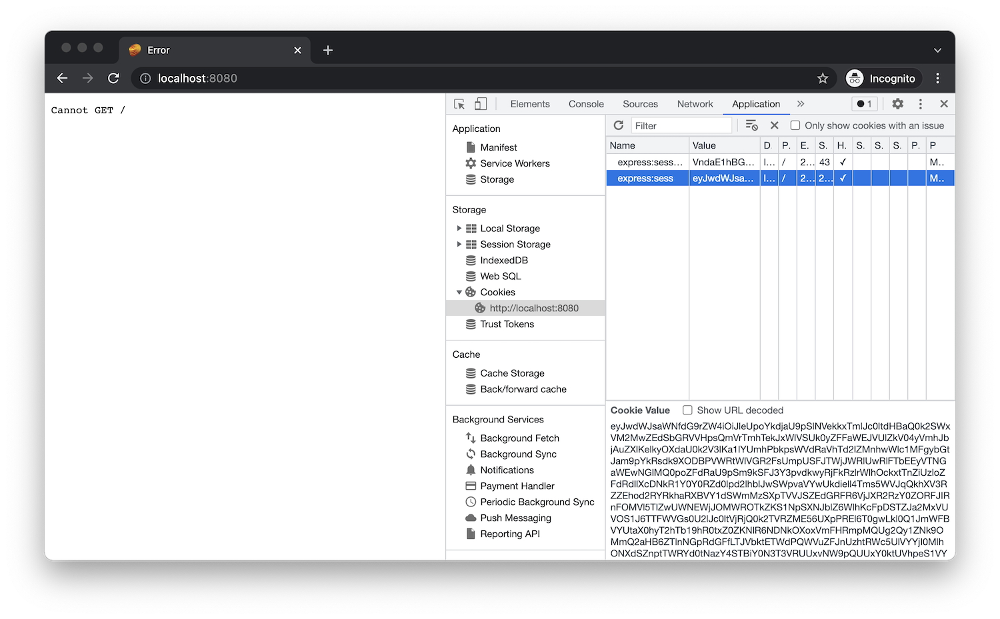

If the application is still running, restart it (for example, using _Run > Restart Debugging_,
or by clicking the green restart icon), otherwise start it again (using _Run > Start Debugging_,
or by pressing `F5`).

When you navigate to [http://localhost:8080/api/auth/login](http://localhost:8080/api/auth/login)
in the browser, you should be redirected to Autodesk login page, and after logging in,
you should be redirected back to your application, for now simply showing `Cannot GET /`.
This is expected as we haven't implemented the `GET /` endpoint yet. However, if you try
and explore the cookies stored by your browser for the `localhost:8080` origin,
you'll notice that the application is already storing the session data in an `express:sess` cookie.
That is where we will get our tokens from later in this tutorial.

