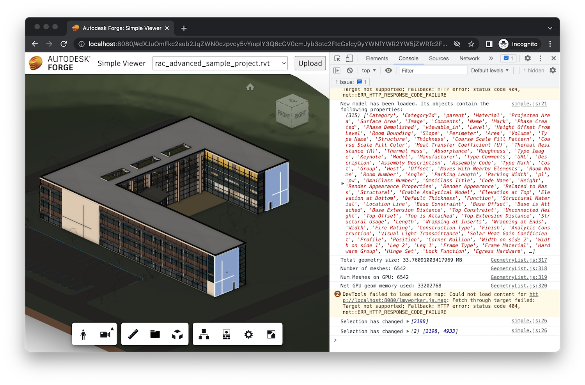

# Basic Extension

Forge Viewer provides its own set of [APIs](https://forge.autodesk.com/en/docs/viewer/v7/reference/Viewing/Viewer3D)
that you can use to customize its look and feel, behavior, and even the rendered content.

While you _could_ just start sprinkling your viewer customization code here and there, it is a good practice
to encapsulate custom viewer functionality into a _viewer extension_. That way you can easily share the same
functionality across different pages of your web application, and even across different projects entirely.

Let's start by implementing a simple viewer extension that will extract different types of information
from the currently loaded design. Later on we will implement additional extensions that will display this
information in different ways.

:::important
The client side assets we will be working with in this tutorial may be located in different folders
depending on the codebase you are starting with. If you have followed the .NET tutorials,
client side assets are stored in the **wwwroot** folder. If you have followed the Node.js tutorials,
client side assets will be stored in the **public** folder.
:::

## Extension skeleton

Go to the folder that contains your client side assets (such as the `main.js` script or the `viewer.js` script),
and create a new subfolder called `extensions`. This is where we will store all our viewer extensions.
In the `extensions` folder, create a new file called `summary.js`, and populate it with the following content:

```js title="{wwwroot|public}/extensions/summary.js"
export class SummaryExtension extends Autodesk.Viewing.Extension {
    constructor(viewer, options) {
        super(viewer, options);
    }

    load() {
        console.log('SummaryExtension loaded.');
        return true;
    }

    unload() {
        console.log('SummaryExtension unloaded.');
        return true;
    }
}

Autodesk.Viewing.theExtensionManager.registerExtension('SummaryExtension', SummaryExtension);
```

As you can see, a viewer extension is basically a subclass of [Autodesk.Viewing.Extension](https://forge.autodesk.com/en/docs/viewer/v7/reference/Viewing/Extension)
that overrides some of its lifecycle methods. For now we have only overridden the following methods:

- `load` - called when the extension is loaded by the viewer, returning a boolean flag indicating whether the loading was successful
- `unload` - called when the extension is unloaded by the viewer, returning a boolean flag indicating whether the unloading was successful

We also **register** the extension under a specific unique ID so that the viewer is aware of it. This is done via
a singleton class called `Autodesk.Viewing.theExtensionManager` and its `registerExtension(extensionId, extensionClass)` method.

Now, let's just import the extension script into our `viewer.js` file:

```js title="{wwwroot|public}/viewer.js"
/// import * as Autodesk from "@types/forge-viewer";

// highlight-start
import './extensions/summary.js';
// highlight-end

// ...

export async function initViewer(container) {
    return new Promise(function (resolve, reject) {
        Autodesk.Viewing.Initializer({ getAccessToken }, async function () {
            // highlight-start
            const config = {
                extensions: ['SummaryExtension']
            };
            // highlight-end
            const viewer = new Autodesk.Viewing.GuiViewer3D(container, config);
            viewer.start();
            viewer.setTheme('light-theme');
            resolve(viewer);
        });
    });
}

// ...
```

## Extracting metadata

Now let's add some custom functionality to our extension. We will start with two helper methods,
one that will traverse the object hierarchy of a design and return all _leaf objects_ (that is,
objects that do not have any other children), and another one that will retrieve the names of all
properties found on all objects in the model. Add the following two methods in your `summary.js` file:

```js title="{wwwroot|public}/extensions/summary.js"
export class SummaryExtension extends Autodesk.Viewing.Extension {
    constructor(viewer, options) {
        super(viewer, options);
    }

    load() {
        console.log('SummaryExtension loaded.');
        return true;
    }

    unload() {
        console.log('SummaryExtension unloaded.');
        return true;
    }

    // highlight-start
    /**
     * Finds all leaf objects (that is, objects that do not have any children)
     * in the object hierarchy of a model.
     * @async
     * @param {Autodesk.Viewing.Model} model Forge model.
     * @returns {Promise<number[]>} IDs of all leaf objects.
     */
    findLeafNodes(model) {
        return new Promise(function (resolve, reject) {
            model.getObjectTree(function (tree) {
                let leaves = [];
                tree.enumNodeChildren(tree.getRootId(), function (dbid) {
                    if (tree.getChildCount(dbid) === 0) {
                        leaves.push(dbid);
                    }
                }, true);
                resolve(leaves);
            }, reject);
        });
    }
    // highlight-end

    // highlight-start
    /**
     * Finds names of all properties available in a model.
     * @async
     * @param {Autodesk.Viewing.Model} model Forge model.
     * @returns {Promise<string[]>} List of property names.
     */
    async findPropertyNames(model) {
        const dbids = await this.findLeafNodes(model);
        return new Promise(function (resolve, reject) {
            model.getBulkProperties(dbids, {}, function (results) {
                let propNames = new Set();
                for (const result of results) {
                    for (const prop of result.properties) {
                        propNames.add(prop.displayName);
                    }
                }
                resolve(Array.from(propNames.values()));
            }, reject);
        });
    }
    // highlight-end
}

Autodesk.Viewing.theExtensionManager.registerExtension('SummaryExtension', SummaryExtension);
```

Here we're already using some of the first viewer APIs such as:

- [Model#getObjectTree](https://forge.autodesk.com/en/docs/viewer/v7/reference/Viewing/Model/#getobjecttree-onsuccesscallback-onerrorcallback) - used to
retrieve the object hierarchy (sometimes called an "instance tree") of the model
- [Model#getBulkProperties](https://forge.autodesk.com/en/docs/viewer/v7/reference/Viewing/Model/#getbulkproperties-dbids-options-onsuccesscallback-onerrorcallback) - used to
retrieve the metadata for one or more objects
- [InstanceTree#getRootId](https://forge.autodesk.com/en/docs/viewer/v7/reference/Private/InstanceTree/#getrootid) - returning the ID of the root object
- [InstanceTree#enumNodeChildren](https://forge.autodesk.com/en/docs/viewer/v7/reference/Private/InstanceTree/#enumnodechildren-node-callback-recursive) - used to
enumerate (recursively) all children of a specific object

## Aggregating information

Let's finalize our first extension by adding two more methods: one for finding all the values
that appear for a specific property (incl. the list of object IDs where this value is set),
and another one for aggregating the values of a specific property across a list of objects.
Add the following code to the `summary.js` file:

```js title="{wwwroot|public}/extensions/summary.js"
export class SummaryExtension extends Autodesk.Viewing.Extension {
    constructor(viewer, options) {
        super(viewer, options);
    }

    load() {
        console.log('SummaryExtension loaded.');
        return true;
    }

    unload() {
        console.log('SummaryExtension unloaded.');
        return true;
    }

    /**
     * Finds all leaf objects (that is, objects that do not have any children)
     * in the object hierarchy of a model.
     * @async
     * @param {Autodesk.Viewing.Model} model Forge model.
     * @returns {Promise<number[]>} IDs of all leaf objects.
     */
    findLeafNodes(model) {
        return new Promise(function (resolve, reject) {
            model.getObjectTree(function (tree) {
                let leaves = [];
                tree.enumNodeChildren(tree.getRootId(), function (dbid) {
                    if (tree.getChildCount(dbid) === 0) {
                        leaves.push(dbid);
                    }
                }, true);
                resolve(leaves);
            }, reject);
        });
    }

    /**
     * Finds names of all properties available in a model.
     * @async
     * @param {Autodesk.Viewing.Model} model Forge model.
     * @returns {Promise<string[]>} List of property names.
     */
    async findPropertyNames(model) {
        const dbids = await this.findLeafNodes(model);
        return new Promise(function (resolve, reject) {
            model.getBulkProperties(dbids, {}, function (results) {
                let propNames = new Set();
                for (const result of results) {
                    for (const prop of result.properties) {
                        propNames.add(prop.displayName);
                    }
                }
                resolve(Array.from(propNames.values()));
            }, reject);
        });
    }

    // highlight-start
    /**
     * Finds all the different values that appear for a specific property,
     * together with a list of IDs of objects that contain these values.
     * @async
     * @param {Autodesk.Viewing.Model} model Forge model.
     * @param {string} propertyName Name of property to compute the histogram for.
     * @returns {Promise<Map<string, number[]>>} Mapping of property values to lists of object IDs that contain these values.
     */
    async computePropertyHistogram(model, propertyName) {
        const dbids = await this.findLeafNodes(model);
        return new Promise(function (resolve, reject) {
            model.getBulkProperties(dbids, { propFilter: [propertyName] }, function (results) {
                let histogram = new Map();
                for (const result of results) {
                    if (result.properties.length > 0) {
                        const key = result.properties[0].displayValue;
                        if (histogram.has(key)) {
                            histogram.get(key).push(result.dbId);
                        } else {
                            histogram.set(key, [result.dbId]);
                        }
                    }
                }
                resolve(histogram);
            }, reject);
        });
    }
    // highlight-end

    // highlight-start
    /**
     * Aggregates values of a specific property from a range of objects, using a specific aggregating function.
     * @async
     * @param {Autodesk.Viewing.Model} model Forge model.
     * @param {number[]} [dbids] Optional list of object IDs to include in the aggregation (by default, all objects are included).
     * @param {string} propertyName Name of property whose values will be aggregated.
     * @param {(aggregateValue: number, currentValue: number, property) => number} aggregateFunc Aggregating function for the property values.
     * For example, `(sum, current, prop) => { return sum + current; }`.
     * @param {number} initialValue Initial value for the aggregating function.
     * @returns {Promise<number>} Final aggregated value.
     */
    async aggregatePropertyValues(model, dbids, propertyName, aggregateFunc, initialValue = 0) {
        if (!dbids) {
            dbids = await this.findLeafNodes(model);
        }
        return new Promise(function (resolve, reject) {
            let aggregatedValue = initialValue;
            model.getBulkProperties(dbids, { propFilter: [propertyName] }, function (results) {
                for (const result of results) {
                    if (result.properties.length > 0) {
                        const prop = result.properties[0];
                        aggregatedValue = aggregateFunc(aggregatedValue, prop.displayValue, prop);
                    }
                }
                resolve(aggregatedValue);
            }, reject);
        });
    }
    // highlight-end
}

Autodesk.Viewing.theExtensionManager.registerExtension('SummaryExtension', SummaryExtension);
```

## Try it out

Alright, our first extension is now ready to use. It doesn't have any user interface but we can
test it out directly in the browser.

Start your application as usual (again, this will depend on which of the tutorials you followed),
open it in your browser, and open the browser's console.

:::info
All the modern browsers provide _developer tools_, incl. a console, that you can use to debug
your web applications. Look for the instructions for the specific browser of your choice on how
these tools can be accessed.
:::

In the console, run the following commands:

```js
let summaryExt = NOP_VIEWER.getExtension('SummaryExtension');
summaryExt.findPropertyNames(NOP_VIEWER.model).then(console.log).catch(console.error);
```

`NOP_VIEWER` is a reference to the current instance of [Autodesk.Viewing.Viewer3D](https://forge.autodesk.com/en/docs/viewer/v7/reference/Viewing/Viewer3D)
that you can use to quickly debug or experiment with the viewer APIs in the browser console.

:::warning
We do not recommend using `NOP_VIEWER` in production code!
:::

Since we have already configured the viewer to load our `SummaryExtension` during the viewer's
initialization, we can simply retrieve the extension object using the `getExtension` method.
And since the `findPropertyNames` method on our extension returns a promise, we simply chain
the outputs to either `console.log` (if the promise is fulfilled) or `console.error` (if the
promise is rejected).

You will receive different results depending on the type of model you have loaded in the viewer.
In my case it was a Fusion 360 model, and the extension returned the following result


