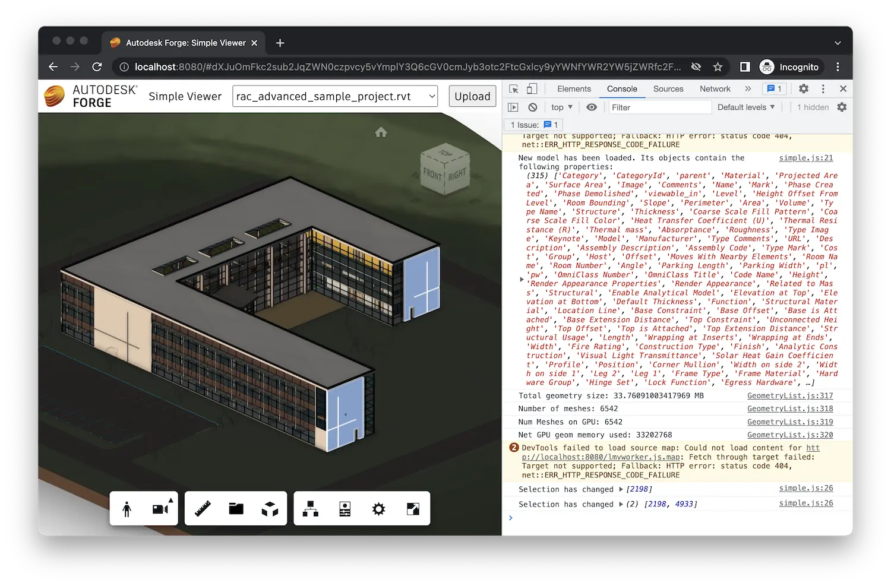

import Tabs from '@theme/Tabs';
import TabItem from '@theme/TabItem';

# Basic Extension

Forge Viewer provides its own set of [APIs](https://forge.autodesk.com/en/docs/viewer/v7/reference/Viewing/Viewer3D)
that you can use to customize its look and feel, behavior, and even the rendered content. While you _could_
simply sprinkle your custom viewer logic in random places of the client-side code, it is a good practice
to encapsulate any viewer functionality into a _viewer extension_. That way you can easily share the same
functionality across different pages of your web application, and even across different projects entirely.

Let's start by implementing a simple viewer extension that will react to various viewer events, and output
different types of information about the currently loaded design.

:::tip
If you don't have an existing Forge application to start with, you can use one of the apps from
previous tutorials. Here's a quick way to get the [Simple Viewer](../simple-viewer) application
running locally using your preferred programming language:

<Tabs>
<TabItem value="nodejs" label="Node.js" default>

- Create Forge app credentials if you don't have them already (see [Getting Started](/) for
more details)
- Make sure you have [Node.js](https://nodejs.org/en/download), [git](https://git-scm.com/),
and a Unix-like terminal installed
  - On Windows systems, you can install [Git for Windows](https://gitforwindows.org)
  which comes bundled with a `bash` terminal
- Open the terminal and run the following commands:

```bash
git clone https://github.com/autodesk-forge/forge-simple-viewer-nodejs
cd forge-simple-viewer-nodejs
npm install
FORGE_CLIENT_ID="your client id" FORGE_CLIENT_SECRET="your client secret" npm start
```

- Open the browser and navigate to [http://localhost:8080](http://localhost:8080)

</TabItem>
<TabItem value="dotnet" label=".NET 6">

- Create Forge app credentials if you don't have them already (see [Getting Started](/) for
more details)
- Make sure you have [.NET 6](https://dotnet.microsoft.com/en-us/download/dotnet/6.0),
[git](https://git-scm.com/), and a Unix-like terminal installed
  - On Windows systems, you can install [Git for Windows](https://gitforwindows.org)
  which comes bundled with a `bash` terminal
- Open the terminal and run the following commands:

```bash
git clone https://github.com/autodesk-forge/forge-simple-viewer-dotnet
cd forge-simple-viewer-dotnet
dotnet build
FORGE_CLIENT_ID="your client id" FORGE_CLIENT_SECRET="your client secret" dotnet run
```

- Open the browser and navigate to [http://localhost:8080](http://localhost:8080)

</TabItem>
</Tabs>
:::

## Extension skeleton

Later in this tutorial we will implement other extensions that may share similar functionality, so we will
first implement a base class that all the extensions will be derived from.

Go to the folder that contains your client side assets such as the `index.html` page (in our case it's
the `wwwroot` folder), and create a new subfolder called `extensions`. This is where we will store all
our viewer extensions. Create a `BaseExtension.js` file in the `extensions` folder, and populate it with
the following content:

```js title="wwwroot/extensions/BaseExtension.js"
export class BaseExtension extends Autodesk.Viewing.Extension {
    constructor(viewer, options) {
        super(viewer, options);
    }

    load() {
        return true;
    }

    unload() {
        return true;
    }
}
```

As you can see, a viewer extension is basically a subclass of [Autodesk.Viewing.Extension](https://forge.autodesk.com/en/docs/viewer/v7/reference/Viewing/Extension)
that overrides some of its lifecycle methods. For now we have overridden the following methods:

- `load` - called when the extension is loaded by the viewer, returning a boolean flag indicating whether the loading was successful
- `unload` - called when the extension is unloaded by the viewer, returning a boolean flag indicating whether the unloading was successful

In its constructor the extension always receives the instance of the viewer that "owns" this extension,
and optionally another object with extension-specific inputs.

## Event handling

Now, let's update our extension so that it reacts to different kinds of events in the viewer, for example,
when a new model is loaded, when the user selects one or more elements, or when one or more elements are
"isolated". Update the `BaseExtension` class with the following code:

```js title="wwwroot/extensions/BaseExtension.js"
export class BaseExtension extends Autodesk.Viewing.Extension {
    constructor(viewer, options) {
        super(viewer, options);
        // highlight-start
        this._onObjectTreeCreated = (ev) => this.onModelLoaded(ev.model);
        this._onSelectionChanged = (ev) => this.onSelectionChanged(ev.model, ev.dbIdArray);
        this._onIsolationChanged = (ev) => this.onIsolationChanged(ev.model, ev.nodeIdArray);
        // highlight-end
    }

    load() {
        // highlight-start
        this.viewer.addEventListener(Autodesk.Viewing.OBJECT_TREE_CREATED_EVENT, this._onObjectTreeCreated);
        this.viewer.addEventListener(Autodesk.Viewing.SELECTION_CHANGED_EVENT, this._onSelectionChanged);
        this.viewer.addEventListener(Autodesk.Viewing.ISOLATE_EVENT, this._onIsolationChanged);
        // highlight-end
        return true;
    }

    unload() {
        // highlight-start
        this.viewer.removeEventListener(Autodesk.Viewing.OBJECT_TREE_CREATED_EVENT, this._onObjectTreeCreated);
        this.viewer.removeEventListener(Autodesk.Viewing.SELECTION_CHANGED_EVENT, this._onSelectionChanged);
        this.viewer.removeEventListener(Autodesk.Viewing.ISOLATE_EVENT, this._onIsolationChanged);
        // highlight-end
        return true;
    }

    // highlight-start
    onModelLoaded(model) {}

    onSelectionChanged(model, dbids) {}

    onIsolationChanged(model, dbids) {}
    // highlight-end
}
```

As you can see, the viewer provides `addEventListener` and `removeEventListener` methods that we can use
to handle different viewer events. In this case we're handling the `OBJECT_TREE_CREATED_EVENT`,
`SELECTION_CHANGED_EVENT`, and `ISOLATE_EVENT` events by calling the `onModelLoaded`, `onSelectionChanged`,
and `onIsolationChanged` methods respectively. For now these methods don't do anything - we will override
them in other extensions derived from the `BaseExtension` class.

:::tip
Full list of viewer events can be found at
[https://forge.autodesk.com/en/docs/viewer/v7/reference/Viewing/#events](https://forge.autodesk.com/en/docs/viewer/v7/reference/Viewing/#events).
:::

## Metadata queries

Most of the extensions in this tutorial will need to access the metadata of the currently loaded design,
for example, to iterate through the design's logical hierarchy, or to query properties of elements.

In the viewer UI, logical hierarchy is what you see in the _Model_ panel:


To navigate the logical hierarchy programatically, the viewer API provides a structure called
an _instance tree_ (or an _object tree_) that simply defines parent-child relationships between
different design elements, called _nodes_. For example, you can use this structure to find
all children of a specific node, to find a parent of a node, or to _recursively_ enumerate all
children of a given node. Nodes without any children - we call them _leaf nodes_ - are usually
more interesting for us as they contain more metadata than the internal nodes.

Let's update our `BaseExtension` class with a couple of helper methods:

```js title="wwwroot/extensions/BaseExtension.js"
export class BaseExtension extends Autodesk.Viewing.Extension {
    constructor(viewer, options) {
        super(viewer, options);
        this._onObjectTreeCreated = (ev) => this.onModelLoaded(ev.model);
        this._onSelectionChanged = (ev) => this.onSelectionChanged(ev.model, ev.dbIdArray);
        this._onIsolationChanged = (ev) => this.onIsolationChanged(ev.model, ev.nodeIdArray);
    }

    load() {
        this.viewer.addEventListener(Autodesk.Viewing.OBJECT_TREE_CREATED_EVENT, this._onObjectTreeCreated);
        this.viewer.addEventListener(Autodesk.Viewing.SELECTION_CHANGED_EVENT, this._onSelectionChanged);
        this.viewer.addEventListener(Autodesk.Viewing.ISOLATE_EVENT, this._onIsolationChanged);
        return true;
    }

    unload() {
        this.viewer.removeEventListener(Autodesk.Viewing.OBJECT_TREE_CREATED_EVENT, this._onObjectTreeCreated);
        this.viewer.removeEventListener(Autodesk.Viewing.SELECTION_CHANGED_EVENT, this._onSelectionChanged);
        this.viewer.removeEventListener(Autodesk.Viewing.ISOLATE_EVENT, this._onIsolationChanged);
        return true;
    }

    onModelLoaded(model) {}

    onSelectionChanged(model, dbids) {}

    onIsolationChanged(model, dbids) {}

    // highlight-start
    findLeafNodes(model) {
        return new Promise(function (resolve, reject) {
            model.getObjectTree(function (tree) {
                let leaves = [];
                tree.enumNodeChildren(tree.getRootId(), function (dbid) {
                    if (tree.getChildCount(dbid) === 0) {
                        leaves.push(dbid);
                    }
                }, true /* recursively enumerate children's children as well */);
                resolve(leaves);
            }, reject);
        });
    }
    // highlight-end

    // highlight-start
    async findPropertyNames(model) {
        const dbids = await this.findLeafNodes(model);
        return new Promise(function (resolve, reject) {
            model.getBulkProperties(dbids, {}, function (results) {
                let propNames = new Set();
                for (const result of results) {
                    for (const prop of result.properties) {
                        propNames.add(prop.displayName);
                    }
                }
                resolve(Array.from(propNames.values()));
            }, reject);
        });
    }
    // highlight-end
}
```

Here we're starting to use the [Model](https://forge.autodesk.com/en/docs/viewer/v7/reference/Viewing/Model) class
(representing the currently loaded design) and some of its methods, for example:

- [Model#getObjectTree](https://forge.autodesk.com/en/docs/viewer/v7/reference/Viewing/Model/#getobjecttree-onsuccesscallback-onerrorcallback) - used to
retrieve the model's instance tree
- [Model#getBulkProperties](https://forge.autodesk.com/en/docs/viewer/v7/reference/Viewing/Model/#getbulkproperties-dbids-options-onsuccesscallback-onerrorcallback) - used to
retrieve the metadata for one or more objects
- [InstanceTree#getRootId](https://forge.autodesk.com/en/docs/viewer/v7/reference/Private/InstanceTree/#getrootid) - returning the ID of the root object
- [InstanceTree#enumNodeChildren](https://forge.autodesk.com/en/docs/viewer/v7/reference/Private/InstanceTree/#enumnodechildren-node-callback-recursive) - used to
recursively enumerate all children of a specific object

## Simple extension

Alright, now to try this new functionality in the viewer, let's create another extension
derived from the `BaseExtension` class, and load it in our viewer application. Create a
`LoggerExtension.js` file in the same folder where `BaseExtension.js` is located, and
populate it with the following code:

```js title="wwwroot/extensions/LoggerExtension.js"
import { BaseExtension } from './BaseExtension.js';

class LoggerExtension extends BaseExtension {
    load() {
        super.load();
        console.log('LoggerExtension loaded.');
        return true;
    }

    unload() {
        super.unload();
        console.log('LoggerExtension unloaded.');
        return true;
    }

    async onModelLoaded(model) {
        super.onModelLoaded(model);
        const props = await this.findPropertyNames(this.viewer.model);
        console.log('New model has been loaded. Its objects contain the following properties:', props);
    }

    async onSelectionChanged(model, dbids) {
        super.onSelectionChanged(model, dbids);
        console.log('Selection has changed', dbids);
    }

    onIsolationChanged(model, dbids) {
        super.onIsolationChanged(model, dbids);
        console.log('Isolation has changed', dbids);
    }
}

Autodesk.Viewing.theExtensionManager.registerExtension('LoggerExtension', LoggerExtension);
```

The new extension simply overrides methods of the `BaseExtension` class, and outputs some
useful information to the browser console in reaction to different viewer events.

:::info
Browser console is essential for web development and debugging. Learn more on how to use it for
[Chrome](https://developers.google.com/web/tools/chrome-devtools/console/),
[Edge](https://docs.microsoft.com/en-us/microsoft-edge/devtools-guide/console),
[Firefox](https://developer.mozilla.org/en-US/docs/Tools/Web_Console/Opening_the_Web_Console),
and [Safari](https://developer.apple.com/safari/tools/).
:::

We also **register** the extension under a specific unique ID so that the viewer can later find it.
This is done via a singleton object called `Autodesk.Viewing.theExtensionManager` and its
`registerExtension(extensionId, extensionClass)` method.

Now, let's make sure the extension code is loaded by our web application. In our case we can simply
add the following `import` statement to the top of the `wwwroot/viewer.js` file:

```js
import './extensions/LoggerExtension.js';
```

:::info
If you're working with a different application source code, you may need to include the file
using a `<script>` tag in your `index.html` page, for example, like so:

```html
<script type="module" src="extensions/LoggerExtension.js"></script>
```
:::

Finally, we need to tell the viewer to load this extension. Open the `wwwroot/viewer.js` file,
find the line where the `GuiViewer3D` class is instantiated, and pass in a custom configuration
object listed below as the second parameter to the constructor. If you are already passing a custom
config to the constructor, simply include the `'LoggerExtension'` string to its `extensions` list.

```js
const config = {
    extensions: [
        'LoggerExtension'
    ]
};
const viewer = new Autodesk.Viewing.GuiViewer3D(container, config);
```

## Try it out

And with that, our first extension is ready to use. It doesn't have any user interface
but we can test it out in the browser console. Start your application as usual, view it
in the browser, open the browser console, and load one of your designs into the viewer.
When the model finishes loading, our `LoggerExtension` will list all properties used
in this model to the console. And if we select one or more objects in the viewer,
the extension will list their IDs.


