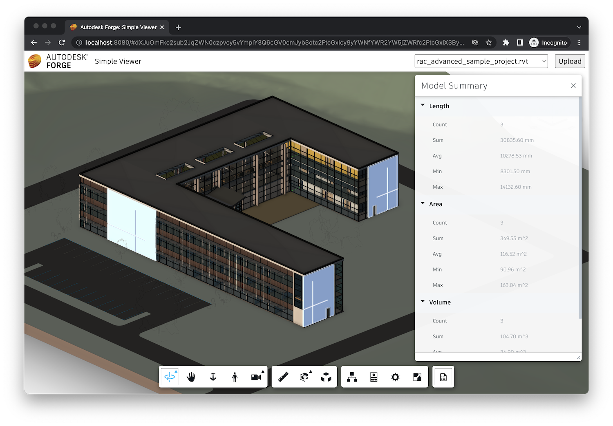

# Model Summary

In this step we will create another viewer extension, this time introducing custom UI elements
as well. We will add a custom button to the viewer toolbar, and when the button is clicked,
we display a docking panel with the summary of property values in different design elements.

## Extension skeleton

Just like with the previous extension, create a new file under the `extensions` subfolder,
call it `SummaryExtension.js`, and populate it with the following code:

```js title="wwwroot/extensions/SummaryExtension.js"
import { BaseExtension } from './BaseExtension.js';

class SummaryExtension extends BaseExtension {
    constructor(viewer, options) {
        super(viewer, options);
    }

    load() {
        super.load();
        console.log('SummaryExtension loaded.');
        return true;
    }

    unload() {
        super.unload();
        console.log('SummaryExtension unloaded.');
        return true;
    }

    onModelLoaded(model) {
        super.onModelLoaded(model);
        this.update();
    }

    onSelectionChanged(model, dbids) {
        super.onSelectionChanged(model, dbids);
        this.update();
    }

    onIsolationChanged(model, dbids) {
        super.onIsolationChanged(model, dbids);
        this.update();
    }

    async update() {
        // TODO
    }
}

Autodesk.Viewing.theExtensionManager.registerExtension('SummaryExtension', SummaryExtension);
```

Next, import the extension code to our application, and pass the extension ID
to the viewer constructor:

```js
import './extensions/LoggerExtension.js';
// highlight-start
import './extensions/SummaryExtension.js';
// highlight-end
```

```js
const config = {
    extensions: [
        'LoggerExtension',
        // highlight-start
        'SummaryExtension',
        // highlight-end
    ]
};
const viewer = new Autodesk.Viewing.GuiViewer3D(container, config);
```

## Toolbar button

Now we will create a new button in the viewer toolbar. Since other extensions will need
this functionality as well, let's update our `BaseExtension` class (in the `BaseExtension.js` file)
with the following helper methods:

```js title="wwwroot/extensions/BaseExtension.js"
export class BaseExtension extends Autodesk.Viewing.Extension {
    constructor(viewer, options) {
        super(viewer, options);
        this._onObjectTreeCreated = (ev) => this.onModelLoaded(ev.model);
        this._onSelectionChanged = (ev) => this.onSelectionChanged(ev.model, ev.dbIdArray);
        this._onIsolationChanged = (ev) => this.onIsolationChanged(ev.model, ev.nodeIdArray);
    }

    load() {
        this.viewer.addEventListener(Autodesk.Viewing.OBJECT_TREE_CREATED_EVENT, this._onObjectTreeCreated);
        this.viewer.addEventListener(Autodesk.Viewing.SELECTION_CHANGED_EVENT, this._onSelectionChanged);
        this.viewer.addEventListener(Autodesk.Viewing.ISOLATE_EVENT, this._onIsolationChanged);
        return true;
    }

    unload() {
        this.viewer.removeEventListener(Autodesk.Viewing.OBJECT_TREE_CREATED_EVENT, this._onObjectTreeCreated);
        this.viewer.removeEventListener(Autodesk.Viewing.SELECTION_CHANGED_EVENT, this._onSelectionChanged);
        this.viewer.removeEventListener(Autodesk.Viewing.ISOLATE_EVENT, this._onIsolationChanged);
        return true;
    }

    onModelLoaded(model) {}

    onSelectionChanged(model, dbids) {}

    onIsolationChanged(model, dbids) {}

    findLeafNodes(model) {
        return new Promise(function (resolve, reject) {
            model.getObjectTree(function (tree) {
                let leaves = [];
                tree.enumNodeChildren(tree.getRootId(), function (dbid) {
                    if (tree.getChildCount(dbid) === 0) {
                        leaves.push(dbid);
                    }
                }, true);
                resolve(leaves);
            }, reject);
        });
    }

    async findPropertyNames(model) {
        const dbids = await this.findLeafNodes(model);
        return new Promise(function (resolve, reject) {
            model.getBulkProperties(dbids, {}, function (results) {
                let propNames = new Set();
                for (const result of results) {
                    for (const prop of result.properties) {
                        propNames.add(prop.displayName);
                    }
                }
                resolve(Array.from(propNames.values()));
            }, reject);
        });
    }

    // highlight-start
    createToolbarButton(buttonId, buttonIconUrl, buttonTooltip) {
        let group = this.viewer.toolbar.getControl('dashboard-toolbar-group');
        if (!group) {
            group = new Autodesk.Viewing.UI.ControlGroup('dashboard-toolbar-group');
            this.viewer.toolbar.addControl(group);
        }
        const button = new Autodesk.Viewing.UI.Button(buttonId);
        button.setToolTip(buttonTooltip);
        group.addControl(button);
        const icon = button.container.querySelector('.adsk-button-icon');
        if (icon) {
            icon.style.backgroundImage = `url(${buttonIconUrl})`; 
            icon.style.backgroundSize = `24px`; 
            icon.style.backgroundRepeat = `no-repeat`; 
            icon.style.backgroundPosition = `center`; 
        }
        return button;
    }
    // highlight-end

    // highlight-start
    removeToolbarButton(button) {
        const group = this.viewer.toolbar.getControl('dashboard-toolbar-group');
        group.removeControl(button);
    }
    // highlight-end
}
```

The new code is using classes from the `Autodesk.Viewing.UI` namespace to create
a new toolbar button group, and a new toolbar button with specific ID, icon URL,
and tooltip message.

Now let's use these helper methods in the `SummaryExtension` class:

```js title="wwwroot/extensions/SummaryExtension.js"
import { BaseExtension } from './BaseExtension.js';

class SummaryExtension extends BaseExtension {
    constructor(viewer, options) {
        super(viewer, options);
        // highlight-start
        this._button = null;
        // highlight-end
    }

    load() {
        super.load();
        console.log('SummaryExtension loaded.');
        return true;
    }

    unload() {
        super.unload();
        // highlight-start
        if (this._button) {
            this.removeToolbarButton(this._button);
            this._button = null;
        }
        // highlight-end
        console.log('SummaryExtension unloaded.');
        return true;
    }

    onToolbarCreated() {
        // highlight-start
        this._button = this.createToolbarButton('summary-button', 'https://img.icons8.com/small/32/brief.png', 'Show Model Summary');
        this._button.onClick = () => {
            // TODO
        };
        // highlight-end
    }

    onModelLoaded(model) {
        super.onModelLoaded(model);
        this.update();
    }

    onSelectionChanged(model, dbids) {
        super.onSelectionChanged(model, dbids);
        this.update();
    }

    onIsolationChanged(model, dbids) {
        super.onIsolationChanged(model, dbids);
        this.update();
    }

    async update() {
        // TODO
    }
}

Autodesk.Viewing.theExtensionManager.registerExtension('SummaryExtension', SummaryExtension);
```

The `onToolbarCreated` method will be automatically called by the viewer when (and if)
the toolbar is ready. Note that the viewer may be activated in a "headless" mode,
in which case no UI will be created, and the `onToolbarCreated` method will not be called.

## Custom panel

And finally, we update the `SummaryExtension` extension so that when the user clicks on
the toolbar button, we display a custom viewer panel with data aggregated from properites
of the currently loaded design.

Start by creating a `SummaryPanel.js` file in the same folder where `SummaryExtension.js`
is located, and add the following code to it:

```js title="wwwroot/extensions/SummaryPanel.js"
export class SummaryPanel extends Autodesk.Viewing.UI.PropertyPanel {
    constructor(extension, id, title) {
        super(extension.viewer.container, id, title);
        this.extension = extension;
    }

    async update(model, dbids, propNames) {
        this.removeAllProperties();
        for (const propName of propNames) {
            const initialValue = { sum: 0, count: 0, min: Infinity, max: -Infinity };
            const aggregateFunc = (aggregate, value, property) => {
                return {
                    count: aggregate.count + 1,
                    sum: aggregate.sum + value,
                    min: Math.min(aggregate.min, value),
                    max: Math.max(aggregate.max, value)
                };
            };
            const { sum, count, min, max } = await this.aggregatePropertyValues(model, dbids, propName, aggregateFunc, initialValue);
            if (count > 0) {
                const category = propName;
                this.addProperty('Count', count, category);
                this.addProperty('Sum', sum.toFixed(2), category);
                this.addProperty('Avg', (sum / count).toFixed(2), category);
                this.addProperty('Min', min.toFixed(2), category);
                this.addProperty('Max', max.toFixed(2), category);
            }
        }
    }

    async aggregatePropertyValues(model, dbids, propertyName, aggregateFunc, initialValue = 0) {
        return new Promise(function (resolve, reject) {
            let aggregatedValue = initialValue;
            model.getBulkProperties(dbids, { propFilter: [propertyName] }, function (results) {
                for (const result of results) {
                    if (result.properties.length > 0) {
                        const prop = result.properties[0];
                        aggregatedValue = aggregateFunc(aggregatedValue, prop.displayValue, prop);
                    }
                }
                resolve(aggregatedValue);
            }, reject);
        });
    }
}
```

The new class is derived from [Autodesk.Viewing.UI.PropertyPanel](https://forge.autodesk.com/en/docs/viewer/v7/reference/UI/PropertyPanel/)
which is the standard panel UI used for displaying properties of selected design elements.
In this case we use the `removeAllProperties` and `addProperty` methods to display different
kind of data. Given a specific set of object IDs and property names, the `SummaryPanel` will
display aggregated values (count, sum, average, minimum, and maximum) of these properties
across all objects.

Finally, let's add the panel to our extension:

```js title="wwwroot/extensions/SummaryExtension.js"
import { BaseExtension } from './BaseExtension.js';
// highlight-start
import { SummaryPanel } from './SummaryPanel.js';
// highlight-end

// highlight-start
const SUMMARY_PROPS = ['Length', 'Area', 'Volume', 'Density', 'Mass', 'Price'];
// highlight-end

class SummaryExtension extends BaseExtension {
    constructor(viewer, options) {
        super(viewer, options);
        this._button = null;
        // highlight-start
        this._panel = null;
        // highlight-end
    }

    load() {
        super.load();
        console.log('SummaryExtension loaded.');
        return true;
    }

    unload() {
        super.unload();
        if (this._button) {
            this.removeToolbarButton(this._button);
            this._button = null;
        }
        // highlight-start
        if (this._panel) {
            this._panel.setVisible(false);
            this._panel.uninitialize();
            this._panel = null;
        }
        // highlight-end
        console.log('SummaryExtension unloaded.');
        return true;
    }

    onToolbarCreated() {
        // highlight-start
        this._panel = new SummaryPanel(this, 'model-summary-panel', 'Model Summary');
        // highlight-end
        this._button = this.createToolbarButton('summary-button', 'https://img.icons8.com/small/32/brief.png', 'Show Model Summary');
        this._button.onClick = () => {
            // highlight-start
            this._panel.setVisible(!this._panel.isVisible());
            this._button.setState(this._panel.isVisible() ? Autodesk.Viewing.UI.Button.State.ACTIVE : Autodesk.Viewing.UI.Button.State.INACTIVE);
            if (this._panel.isVisible()) {
                this.update();
            }
            // highlight-end
        };
    }

    onModelLoaded(model) {
        super.onModelLoaded(model);
        this.update();
    }

    onSelectionChanged(model, dbids) {
        super.onSelectionChanged(model, dbids);
        this.update();
    }

    onIsolationChanged(model, dbids) {
        super.onIsolationChanged(model, dbids);
        this.update();
    }

    async update() {
        // highlight-start
        if (this._panel) {
            const selectedIds = this.viewer.getSelection();
            const isolatedIds = this.viewer.getIsolatedNodes();
            if (selectedIds.length > 0) { // If any nodes are selected, compute the aggregates for them
                this._panel.update(this.viewer.model, selectedIds, SUMMARY_PROPS);
            } else if (isolatedIds.length > 0) { // Or, if any nodes are isolated, compute the aggregates for those
                this._panel.update(this.viewer.model, isolatedIds, SUMMARY_PROPS);
            } else { // Otherwise compute the aggregates for all nodes
                const dbids = await this.findLeafNodes(this.viewer.model);
                this._panel.update(this.viewer.model, dbids, SUMMARY_PROPS);
            }
        }
        // highlight-end
    }
}

Autodesk.Viewing.theExtensionManager.registerExtension('SummaryExtension', SummaryExtension);
```

## Try it out

This time we can test our new extension directly in the viewer. Try clicking the new toolbar
button to open our summary panel. The panel shows various aggregates of properties
we hard-coded in the `SUMMARY_PROPS` constant (_Length_, _Area_, _Volume_, _Density_,
_Mass_, and _Price_) for all objects. And when we isolate or select some of the design
elements by hand, the aggregated values should reflect that as well.


