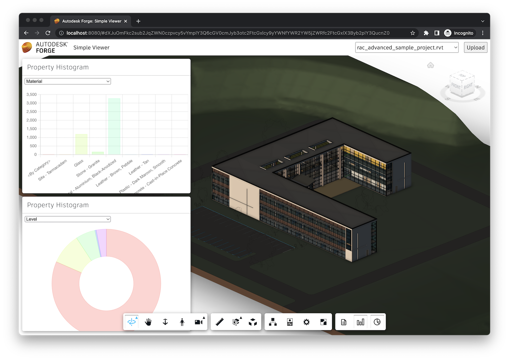

# Histogram Charts

In this step we will create a viewer extension that will allow us to display aggregates
from `SummaryExtension` as histogram chars using the open source [Chart.js](https://www.chartjs.org)
library.

## Extension skeleton

Just like in previous steps, let's create a new file under the `extensions` subfolder,
call it `histogram.js`, and populate it with the following code:

```js
/// import * as Chart from "@types/chart.js";

class HistogramExtension extends Autodesk.Viewing.Extension {
    constructor(viewer, options) {
        super(viewer, options);
    }

    async load() {
        await Autodesk.Viewing.Private.theResourceLoader.loadScript('https://cdnjs.cloudflare.com/ajax/libs/Chart.js/3.5.1/chart.min.js', 'Chart');
        console.log('HistogramExtension loaded.');
        return true;
    }

    async unload() {
        console.log('HistogramExtension unloaded.');
        return true;
    }
}

Autodesk.Viewing.theExtensionManager.registerExtension('HistogramExtension', HistogramExtension);
```

:::tip
The `/// import * as Chart from "@types/chart.js";` line at the beginning of the JavaScript file
might be useful if you are using Node.js and Visual Studio Code. In that case, you can install
the [@types/chart.js](https://www.npmjs.com/package/@types/chart.js) NPM package, and Visual Studio
Code will provide additional intellisense for the Chart.js library as well.
:::

As you can see in the `load` method, we are using a helper method from the `Autodesk.Viewing.Private`
namespace to load the Chart.js library, so that we don't have to include it in the HTML by hand.
The library will only be loaded if there is no `Chart` symbol in the global scope.

Now let's import the JavaScript file to our application, and pass the extension ID to the viewer
constructor:

```js
import './extensions/summary.js';
import './extensions/aggregates.js';
// highlight-start
import './extensions/histogram.js';
// highlight-end
```

```js
const config = {
    extensions: [
        'SummaryExtension',
        'AggregatesExtension',
        // highlight-start
        'HistogramExtension',
        // highlight-end
    ]
};
const viewer = new Autodesk.Viewing.GuiViewer3D(container, config);
```

## Toolbar

Next, let's update the `HistogramExtension` class so that it adds two new buttons to the viewer
toolbar, one for showing a bar chart, and another one for showing a pie chart:

```js
/// import * as Chart from "@types/chart.js";

class HistogramExtension extends Autodesk.Viewing.Extension {
    constructor(viewer, options) {
        super(viewer, options);
        // highlight-start
        this._barChartButton = null;
        this._pieChartButton = null;
        // highlight-end
    }

    async load() {
        await Autodesk.Viewing.Private.theResourceLoader.loadScript('https://cdnjs.cloudflare.com/ajax/libs/Chart.js/3.5.1/chart.min.js', 'Chart'); // kinda hacky...
        console.log('HistogramExtension loaded.');
        return true;
    }

    async unload() {
        // highlight-start
        this._removeUI();
        // highlight-end
        console.log('HistogramExtension unloaded.');
        return true;
    }

    // highlight-start
    onToolbarCreated() {
        this._createUI();
    }
    // highlight-end

    // highlight-start
    _createUI() {
        let group = this.viewer.toolbar.getControl('dashboard-toolbar-group');
        if (!group) {
            group = new Autodesk.Viewing.UI.ControlGroup('dashboard-toolbar-group');
            this.viewer.toolbar.addControl(group);
        }
        this._barChartButton = new Autodesk.Viewing.UI.Button('histogram-barchart-button');
        this._barChartButton.onClick = () => {
            // TODO
        };
        this._barChartButton.setToolTip('Show Property Histogram (Bar Chart)');
        group.addControl(this._barChartButton);

        this._pieChartButton = new Autodesk.Viewing.UI.Button('histogram-piechart-button');
        this._pieChartButton.onClick = () => {
            // TODO
        };
        this._pieChartButton.setToolTip('Show Property Histogram (Pie Chart)');
        group.addControl(this._pieChartButton);

        const style = document.createElement('style');
        style.innerText = `
            #histogram-barchart-button {
                background-image: url(https://img.icons8.com/small/32/bar-chart.png);
                background-size: 24px;
                background-repeat: no-repeat;
                background-position: center;
            }
            #histogram-piechart-button {
                background-image: url(https://img.icons8.com/small/32/pie-chart.png);
                background-size: 24px;
                background-repeat: no-repeat;
                background-position: center;
            }
        `;
        document.head.appendChild(style);
    }
    // highlight-end

    // highlight-start
    _removeUI() {
        if (this._barChartButton) {
            this.viewer.toolbar.getControl('dashboard-toolbar-group').removeControl(this._barChartButton);
            this._barChartButton = null;
        }
        if (this._pieChartButton) {
            this.viewer.toolbar.getControl('dashboard-toolbar-group').removeControl(this._pieChartButton);
            this._pieChartButton = null;
        }
    }
    // highlight-start
}

Autodesk.Viewing.theExtensionManager.registerExtension('HistogramExtension', HistogramExtension);
```

## Charts

Finally, we create another custom docking panel that will host the actual chart graphics:

```js
/// import * as Chart from "@types/chart.js";

class HistogramExtension extends Autodesk.Viewing.Extension {
    constructor(viewer, options) {
        super(viewer, options);
        this._barChartButton = null;
        this._pieChartButton = null;
        // highlight-start
        this._barChartPanel = null;
        this._pieChartPanel = null;
        // highlight-end
    }

    async load() {
        await Autodesk.Viewing.Private.theResourceLoader.loadScript('https://cdnjs.cloudflare.com/ajax/libs/Chart.js/3.5.1/chart.min.js', 'Chart'); // kinda hacky...
        // highlight-start
        Chart.defaults.plugins.legend.display = false;
        this.viewer.addEventListener(Autodesk.Viewing.OBJECT_TREE_CREATED_EVENT, () => {
            if (this._barChartPanel) {
                this._barChartPanel.setModel(this.viewer.model);
            }
            if (this._pieChartPanel) {
                this._pieChartPanel.setModel(this.viewer.model);
            }
        });
        // highlight-end
        console.log('HistogramExtension loaded.');
        return true;
    }

    async unload() {
        this._removeUI();
        console.log('HistogramExtension unloaded.');
        return true;
    }

    onToolbarCreated() {
        this._createUI();
    }

    _createUI() {
        let group = this.viewer.toolbar.getControl('dashboard-toolbar-group');
        if (!group) {
            group = new Autodesk.Viewing.UI.ControlGroup('dashboard-toolbar-group');
            this.viewer.toolbar.addControl(group);
        }
        this._barChartButton = new Autodesk.Viewing.UI.Button('histogram-barchart-button');
        this._barChartButton.onClick = () => {
            // highlight-start
            if (!this._barChartPanel) {
                this._barChartPanel = new ChartPanel(this.viewer, 'histogram-barchart', 'Property Histogram', { x: 10, y: 10, chartType: 'bar' });
                if (this.viewer.model) {
                    this._barChartPanel.setModel(this.viewer.model);
                }
            }
            this._barChartPanel.setVisible(!this._barChartPanel.isVisible());
            const { ACTIVE, INACTIVE } = Autodesk.Viewing.UI.Button.State;
            this._barChartButton.setState(this._barChartPanel.isVisible() ? ACTIVE : INACTIVE);
            // highlight-end
        };
        this._barChartButton.setToolTip('Show Property Histogram (Bar Chart)');
        group.addControl(this._barChartButton);

        this._pieChartButton = new Autodesk.Viewing.UI.Button('histogram-piechart-button');
        this._pieChartButton.onClick = () => {
            // highlight-start
            if (!this._pieChartPanel) {
                this._pieChartPanel = new ChartPanel(this.viewer, 'histogram-piechart', 'Property Histogram', { x: 10, y: 420, chartType: 'doughnut' });
                if (this.viewer.model) {
                    this._pieChartPanel.setModel(this.viewer.model);
                }
            }
            this._pieChartPanel.setVisible(!this._pieChartPanel.isVisible());
            this._pieChartButton.setState(this._pieChartPanel.isVisible() ? Autodesk.Viewing.UI.Button.State.ACTIVE : Autodesk.Viewing.UI.Button.State.INACTIVE);
            // highlight-end
        };
        this._pieChartButton.setToolTip('Show Property Histogram (Pie Chart)');
        group.addControl(this._pieChartButton);

        const style = document.createElement('style');
        style.innerText = `
            #histogram-barchart-button {
                background-image: url(https://img.icons8.com/small/32/bar-chart.png);
                background-size: 24px;
                background-repeat: no-repeat;
                background-position: center;
            }
            #histogram-piechart-button {
                background-image: url(https://img.icons8.com/small/32/pie-chart.png);
                background-size: 24px;
                background-repeat: no-repeat;
                background-position: center;
            }
        `;
        document.head.appendChild(style);
    }

    _removeUI() {
        // highlight-start
        if (this._barChartPanel) {
            this._barChartPanel.setVisible(false);
            this._barChartPanel.uninitialize();
            this._barChartPanel = null;
        }
        if (this._pieChartPanel) {
            this._pieChartPanel.setVisible(false);
            this._pieChartPanel.uninitialize();
            this._pieChartPanel = null;
        }
        // highlight-end
        if (this._barChartButton) {
            this.viewer.toolbar.getControl('dashboard-toolbar-group').removeControl(this._barChartButton);
            this._barChartButton = null;
        }
        if (this._pieChartButton) {
            this.viewer.toolbar.getControl('dashboard-toolbar-group').removeControl(this._pieChartButton);
            this._pieChartButton = null;
        }
    }
}

// highlight-start
class ChartPanel extends Autodesk.Viewing.UI.DockingPanel {
    constructor(viewer, id, title, options) {
        super(viewer.container, id, title, options);
        this.viewer = viewer;
        this.container.style.left = (options.x || 0) + 'px';
        this.container.style.top = (options.y || 0) + 'px';
        this.container.style.width = (options.width || 500) + 'px';
        this.container.style.height = (options.height || 400) + 'px';
        this.container.style.resize = 'none';
        this.chartType = options.chartType || 'bar'; // See https://www.chartjs.org/docs/latest for all the supported types of charts
        this.chart = this.createChart();
    }

    initialize() {
        this.title = this.createTitleBar(this.titleLabel || this.container.id);
        this.initializeMoveHandlers(this.title);
        this.container.appendChild(this.title);
        this.content = document.createElement('div');
        this.content.style.height = '350px';
        this.content.style.backgroundColor = 'white';
        this.content.innerHTML = `
            <div class="props-container" style="position: relative; height: 25px; padding: 0.5em;">
                <select class="props"></select>
            </div>
            <div class="chart-container" style="position: relative; height: 325px; padding: 0.5em;">
                <canvas class="chart"></canvas>
            </div>
        `;
        this.select = this.content.querySelector('select.props');
        this.canvas = this.content.querySelector('canvas.chart');
        this.container.appendChild(this.content);
    }

    createChart() {
        return new Chart(this.canvas.getContext('2d'), {
            type: this.chartType,
            data: {
                labels: [],
                datasets: [{ data: [], backgroundColor: [], borderColor: [], borderWidth: 1 }],
            },
            options: { maintainAspectRatio: false }
        });
    }

    async setModel(model) {
        const summaryExt = this.viewer.getExtension('SummaryExtension');
        const propertyNames = await summaryExt.findPropertyNames(model);
        this.select.innerHTML = propertyNames.map(prop => `<option value="${prop}">${prop}</option>`).join('\n');
        this.select.onchange = () => this.updateChart(model, this.select.value);
        this.updateChart(model, this.select.value);
    }

    async updateChart(model, propName) {
        const summaryExt = this.viewer.getExtension('SummaryExtension');
        const histogram = await summaryExt.computePropertyHistogram(model, propName);
        const propertyValues = Array.from(histogram.keys());
        this.chart.data.labels = propertyValues;
        const dataset = this.chart.data.datasets[0];
        dataset.label = propName;
        dataset.data = propertyValues.map(val => histogram.get(val).length);
        if (dataset.data.length > 0) {
            const hslaColors = dataset.data.map((val, index) => `hsla(${Math.round(index * (360 / dataset.data.length))}, 100%, 50%, 0.2)`);
            dataset.backgroundColor = dataset.borderColor = hslaColors;
        }
        this.chart.update();
        this.chart.config.options.onClick = (ev, items) => {
            if (items.length === 1) {
                const index = items[0].index;
                const dbids = histogram.get(propertyValues[index]);
                this.viewer.isolate(dbids);
                this.viewer.fitToView(dbids);
            }
        };
    }
}
// highlight-end

Autodesk.Viewing.theExtensionManager.registerExtension('HistogramExtension', HistogramExtension);
```

## Try it out

Alright, time to test our charts extension in the viewer. Click on either of the new toolbar
buttons. A new panel should show up with either a bar chart or a pie chart showing the histogram
of different values appearing for a specific property (which you can select in the dropdown).
And clicking on any bar or pie segment will then isolate all the corresponding design elements
in the viewer.


