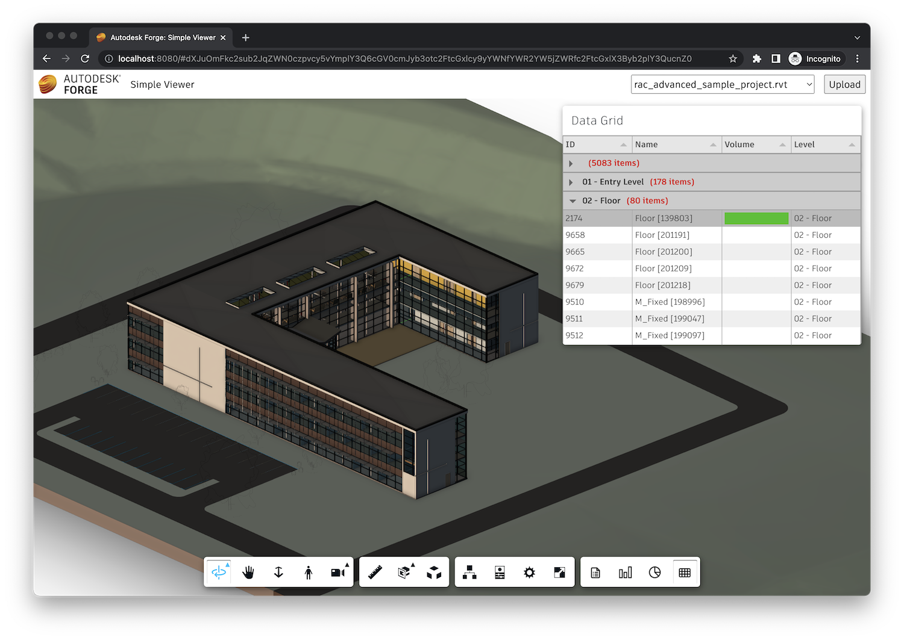

# Data Grid

In this final step we will build a viewer extension that will provide a datagrid view
of `SummaryExtension` data using the open source [Tabulator](http://tabulator.info) library.

## Extension skeleton

As usual, let's create a new file under the `extensions` subfolder, call it `datagrid.js`,
and populate it with the following code:

```js
class DataGridExtension extends Autodesk.Viewing.Extension {
    constructor(viewer, options) {
        super(viewer, options);
    }

    async load() {
        const loadCSS = (href) => new Promise(function (resolve, reject) {
            const el = document.createElement('link');
            el.rel = 'stylesheet';
            el.href = href;
            el.onload = resolve;
            el.onerror = reject;
            document.head.appendChild(el);
        });
        await Promise.all([
            Autodesk.Viewing.Private.theResourceLoader.loadScript('https://cdn.jsdelivr.net/npm/moment@2.29.1/moment.min.js', 'moment'),
            Autodesk.Viewing.Private.theResourceLoader.loadScript('https://unpkg.com/tabulator-tables@4.9.3/dist/js/tabulator.min.js', 'Tabulator'),
            loadCSS('https://unpkg.com/tabulator-tables@4.9.3/dist/css/tabulator.min.css')
        ]);
        console.log('DataGridExtension loaded.');
        return true;
    }

    async unload() {
        console.log('DataGridExtension unloaded.');
        return true;
    }
}

Autodesk.Viewing.theExtensionManager.registerExtension('DataGridExtension', DataGridExtension);
```

This time we're loading multiple dependencies that are required by the Tabulator library.

Now let's import the JavaScript file to our application, and pass the extension ID to the viewer
constructor:

```js
import './extensions/summary.js';
import './extensions/aggregates.js';
import './extensions/histogram.js';
// highlight-start
import './extensions/datagrid.js';
// highlight-end
```

```js
const config = {
    extensions: [
        'SummaryExtension',
        'AggregatesExtension',
        'HistogramExtension',
        // highlight-start
        'DataGridExtension',
        // highlight-end
    ]
};
const viewer = new Autodesk.Viewing.GuiViewer3D(container, config);
```

## Toolbar

Next, let's update the `DataGridExtension` class so that it adds a new button to the viewer
toolbar when the extension gets loaded:

```js
// Viewer extension providing a datagrid UI via a 3rd party library (http://tabulator.info)
class DataGridExtension extends Autodesk.Viewing.Extension {
    constructor(viewer, options) {
        super(viewer, options);
        // highlight-start
        this._dataGridButton = null;
        // highlight-end
    }

    async load() {
        const loadCSS = (href) => new Promise(function (resolve, reject) {
            const el = document.createElement('link');
            el.rel = 'stylesheet';
            el.href = href;
            el.onload = resolve;
            el.onerror = reject;
            document.head.appendChild(el);
        });
        await Promise.all([
            Autodesk.Viewing.Private.theResourceLoader.loadScript('https://cdn.jsdelivr.net/npm/moment@2.29.1/moment.min.js', 'moment'), // kinda hacky...
            Autodesk.Viewing.Private.theResourceLoader.loadScript('https://unpkg.com/tabulator-tables@4.9.3/dist/js/tabulator.min.js', 'Tabulator'), // kinda hacky...
            loadCSS('https://unpkg.com/tabulator-tables@4.9.3/dist/css/tabulator.min.css') // kinda hacky...
        ]);
        console.log('DataGridExtension loaded.');
        return true;
    }

    async unload() {
        // highlight-start
        this._removeUI();
        // highlight-end
        console.log('DataGridExtension unloaded.');
        return true;
    }

    // highlight-start
    onToolbarCreated() {
        this._createUI();
    }
    // highlight-end

    // highlight-start
    _createUI() {
        let group = this.viewer.toolbar.getControl('dashboard-toolbar-group');
        if (!group) {
            group = new Autodesk.Viewing.UI.ControlGroup('dashboard-toolbar-group');
            this.viewer.toolbar.addControl(group);
        }
        this._dataGridButton = new Autodesk.Viewing.UI.Button('datagrid-button');
        this._dataGridButton.onClick = () => {
        };
        this._dataGridButton.setToolTip('Show Data Grid');
        group.addControl(this._dataGridButton);

        const style = document.createElement('style');
        style.innerText = `
            #datagrid-button {
                background-image: url(https://img.icons8.com/small/32/activity-grid.png);
                background-size: 24px;
                background-repeat: no-repeat;
                background-position: center;
            }
        `;
        document.head.appendChild(style);
    }
    // highlight-end

    // highlight-start
    _removeUI() {
        if (this._dataGridButton) {
            this.viewer.toolbar.getControl('dashboard-toolbar-group').removeControl(this._dataGridButton);
            this._dataGridButton = null;
        }
    }
    // highlight-end
}

Autodesk.Viewing.theExtensionManager.registerExtension('DataGridExtension', DataGridExtension);
```

## Data grid

Finally, we create a custom docking panel that will host the actual Tabulator grid.

```js
class DataGridExtension extends Autodesk.Viewing.Extension {
    constructor(viewer, options) {
        super(viewer, options);
        this._dataGridButton = null;
        // highlight-start
        this._dataGridPanel = null;
        // highlight-end
    }

    async load() {
        const loadCSS = (href) => new Promise(function (resolve, reject) {
            const el = document.createElement('link');
            el.rel = 'stylesheet';
            el.href = href;
            el.onload = resolve;
            el.onerror = reject;
            document.head.appendChild(el);
        });
        await Promise.all([
            Autodesk.Viewing.Private.theResourceLoader.loadScript('https://cdn.jsdelivr.net/npm/moment@2.29.1/moment.min.js', 'moment'), // kinda hacky...
            Autodesk.Viewing.Private.theResourceLoader.loadScript('https://unpkg.com/tabulator-tables@4.9.3/dist/js/tabulator.min.js', 'Tabulator'), // kinda hacky...
            loadCSS('https://unpkg.com/tabulator-tables@4.9.3/dist/css/tabulator.min.css') // kinda hacky...
        ]);
        // highlight-start
        this.viewer.addEventListener(Autodesk.Viewing.OBJECT_TREE_CREATED_EVENT, () => {
            if (this._dataGridPanel) {
                this._dataGridPanel.setModel(this.viewer.model);
            }
        });
        // highlight-end
        console.log('DataGridExtension loaded.');
        return true;
    }

    async unload() {
        this._removeUI();
        console.log('DataGridExtension unloaded.');
        return true;
    }

    onToolbarCreated() {
        this._createUI();
    }

    _createUI() {
        let group = this.viewer.toolbar.getControl('dashboard-toolbar-group');
        if (!group) {
            group = new Autodesk.Viewing.UI.ControlGroup('dashboard-toolbar-group');
            this.viewer.toolbar.addControl(group);
        }
        this._dataGridButton = new Autodesk.Viewing.UI.Button('datagrid-button');
        this._dataGridButton.onClick = () => {
            // highlight-start
            if (!this._dataGridPanel) {
                this._dataGridPanel = new DataGridPanel(this.viewer, 'datagrid', 'Data Grid', { x: 10, y: 10 });
                if (this.viewer.model) {
                    this._dataGridPanel.setModel(this.viewer.model);
                }
            }
            this._dataGridPanel.setVisible(!this._dataGridPanel.isVisible());
            const { ACTIVE, INACTIVE } = Autodesk.Viewing.UI.Button.State;
            this._dataGridButton.setState(this._dataGridPanel.isVisible() ? ACTIVE : INACTIVE);
            // highlight-end
        };
        this._dataGridButton.setToolTip('Show Data Grid');
        group.addControl(this._dataGridButton);

        const style = document.createElement('style');
        style.innerText = `
            #datagrid-button {
                background-image: url(https://img.icons8.com/small/32/activity-grid.png);
                background-size: 24px;
                background-repeat: no-repeat;
                background-position: center;
            }
        `;
        document.head.appendChild(style);
    }

    _removeUI() {
        if (this._dataGridPanel) {
            this._dataGridPanel.setVisible(false);
            this._dataGridPanel.uninitialize();
            this._dataGridPanel = null;
        }
        if (this._dataGridButton) {
            this.viewer.toolbar.getControl('dashboard-toolbar-group').removeControl(this._dataGridButton);
            this._dataGridButton = null;
        }
    }
}

// highlight-start
class DataGridPanel extends Autodesk.Viewing.UI.DockingPanel {
    constructor(viewer, id, title, options) {
        super(viewer.container, id, title, options);
        this.viewer = viewer;
        this.container.style.left = (options.x || 0) + 'px';
        this.container.style.top = (options.y || 0) + 'px';
        this.container.style.width = (options.width || 500) + 'px';
        this.container.style.height = (options.height || 400) + 'px';
        this.container.style.resize = 'none';
    }

    initialize() {
        this.title = this.createTitleBar(this.titleLabel || this.container.id);
        this.initializeMoveHandlers(this.title);
        this.container.appendChild(this.title);
        this.content = document.createElement('div');
        this.content.style.height = '350px';
        this.content.style.backgroundColor = 'white';
        this.content.innerHTML = `<div class="datagrid-container" style="position: relative; height: 350px;"></div>`;
        this.container.appendChild(this.content);
        this.table = new Tabulator('.datagrid-container', {
            height: '100%',
            layout: 'fitColumns',
            groupBy: 'material',
            columns: [
                { title: 'ID', field: 'dbid' },
                { title: 'Name', field: 'name', width: 150 },
                { title: 'Volume', field: 'volume', hozAlign: 'left', formatter: 'progress' },
                { title: 'Material', field: 'material' }
            ],
            rowClick: (e, row) => {
                const { dbid } = row.getData();
                this.viewer.isolate([dbid]);
                this.viewer.fitToView([dbid]);
            }
        });
    }

    async setModel(model) {
        this.updateTable(model);
    }

    async updateTable(model) {
        const getProps = (model, dbids, props) => new Promise(function (resolve, reject) {
            model.getBulkProperties(dbids, { propFilter: props }, resolve, reject);
        });
        const summaryExt = this.viewer.getExtension('SummaryExtension');
        const dbids = await summaryExt.findLeafNodes(model);
        const results = await getProps(model, dbids, ['Name', 'Volume', 'Structural Material', 'name']);
        this.table.replaceData(results.map(result => {
            return {
                dbid: result.dbId,
                name: result.name,
                volume: result.properties.find(item => item.displayName === 'Volume')?.displayValue,
                material: result.properties.find(item => item.displayName === 'Structural Material')?.displayValue
            };
        }));
    }
}
// highlight-end

Autodesk.Viewing.theExtensionManager.registerExtension('DataGridExtension', DataGridExtension);
```

:::info
To keep things simple, the `DataGridPanel` class is currently hard-coding the grid columns
to only show a couple of specific properties of our design metadata (specifically the object ID,
object name, and `Volume` and `Structural Material` properties). Depending on the type of design
you will be loading into your application, you may want to change these.
:::

## Try it out

Click on the new toolbar button to bring up the datagrid panel. The grid should list selected
properties (in our case, object ID, object name, and the `Volume` and `Structural Material` properties)
of all design elements, and clicking on any row in the grid should isolate the specific design
element.


