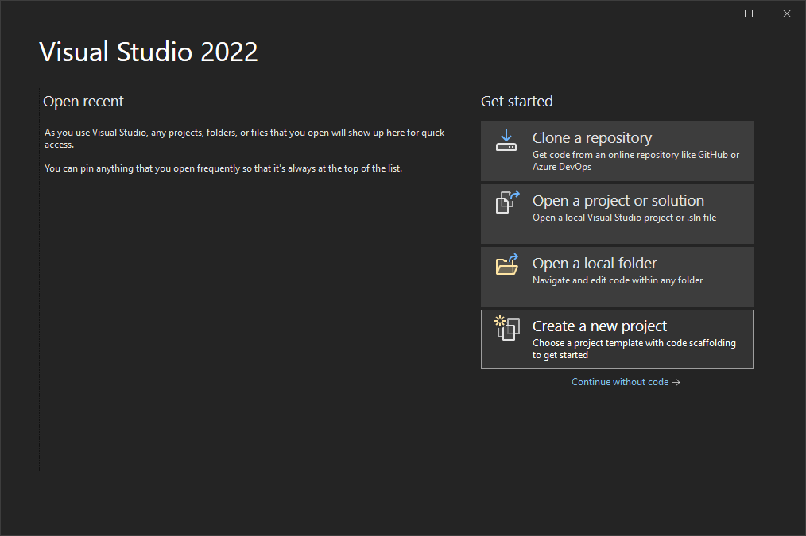
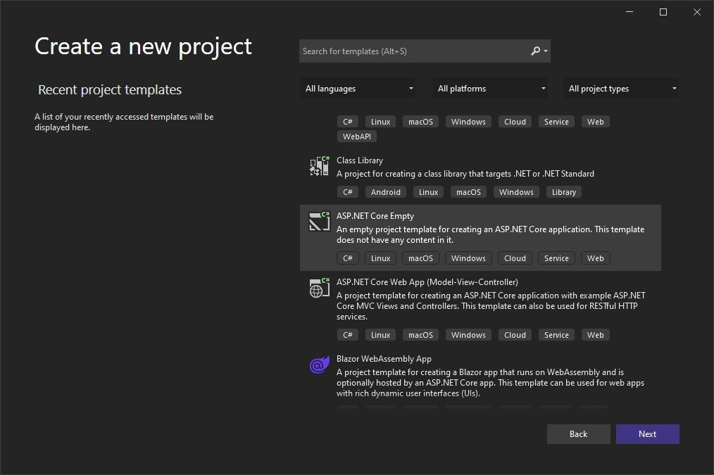
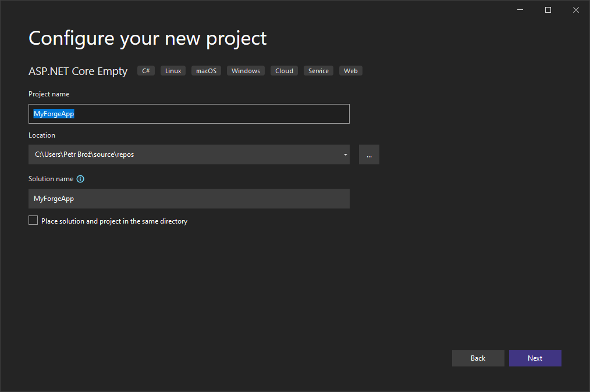
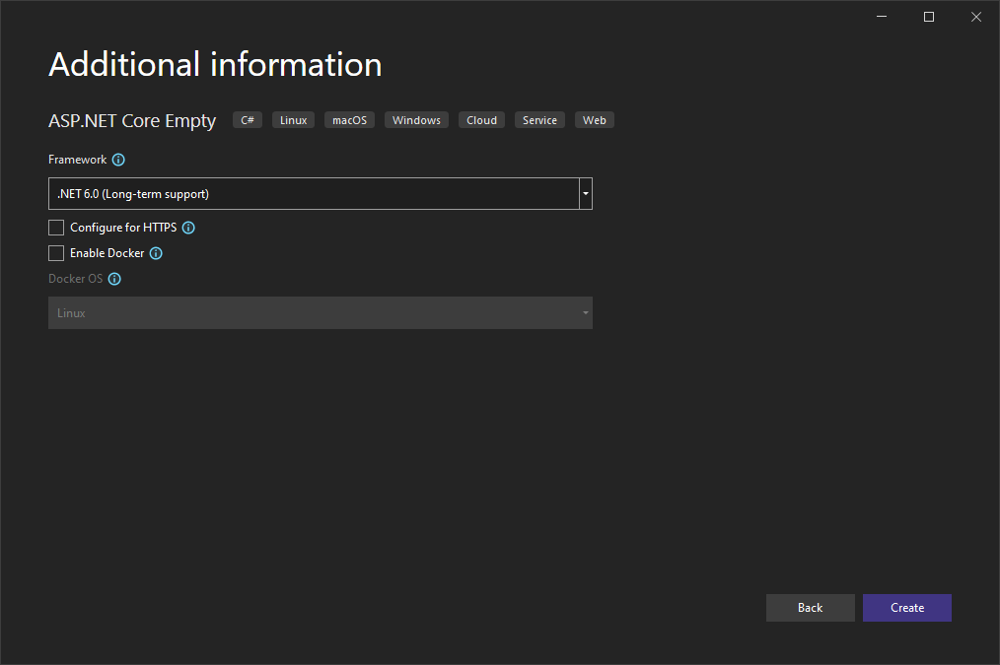

Create a new project in Visual Studio:

Choose the _ASP.NET Core Empty_ template:

Name the project in any way you want:

Choose the _.NET 6.0 (Long-term support)_ framework:

Once the project is ready, create a couple of subfolders in your project folder that we're going to need later:

- `Controllers` - this is where we're going to implement all the server endpoints
- `Models` - here we're going to keep all the server-side logic that can be shared by different endpoints
- `wwwrooot` - this is where we're going to put all the client side assets (HTML, CSS, JavaScript, images, etc.)
