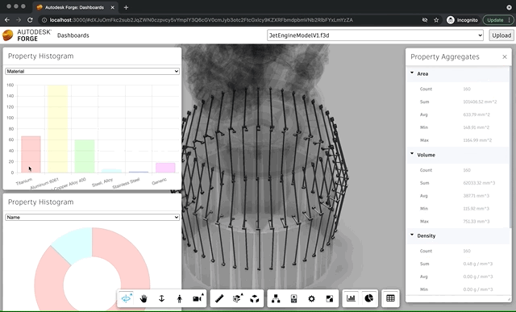

# Introduction

In this tutorial we will enhance an existing Forge application with dashboard-like
functionality, for example, retrieving and aggregating information from our designs'
metadata, displaying the results in charts and tables, and linking the results back
to the design preview.

All the features will be implemented as viewer extensions, and will only use
the viewer UI, so you're free to use any Forge application you want as your starting
point. We will use the sample app from the [Simple Viewer](../simple-viewer/index)
tutorial, and you can already check out the implementation of our dashboard application
in the `dashboard` branch of the original sample code for Node.js:
https://github.com/petrbroz/forge-simple-viewer-nodejs/tree/dashboards.

Throughout this tutorial we will be using the [Viewer](https://forge.autodesk.com/en/docs/viewer/v7/developers_guide/overview)
API and its various features such as:

- Creating and loading viewer extensions
- Querying metadata of loaded models
- Controlling the state of the viewer
- Customizing the viewer toolbar
- Creating custom UI elements

Alright, let's get started!

... WIP ...
