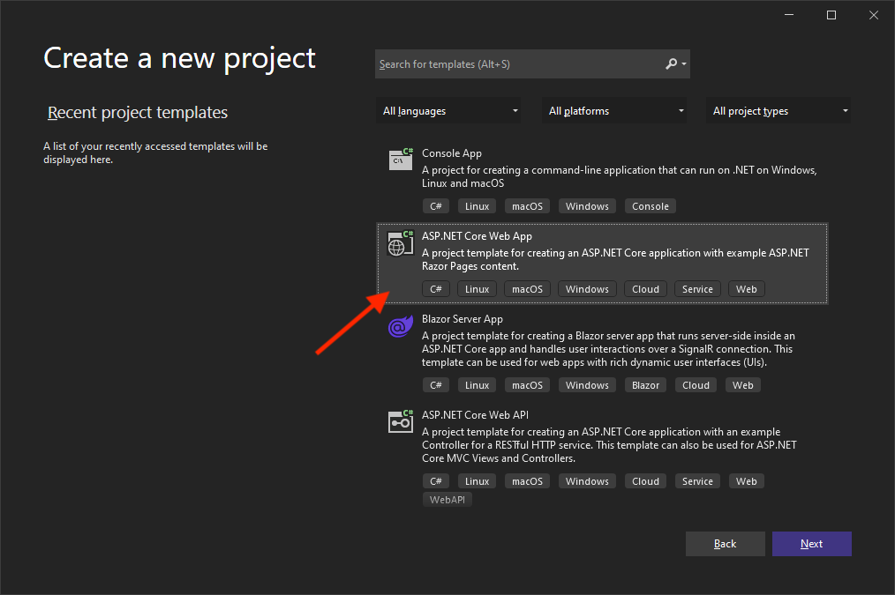
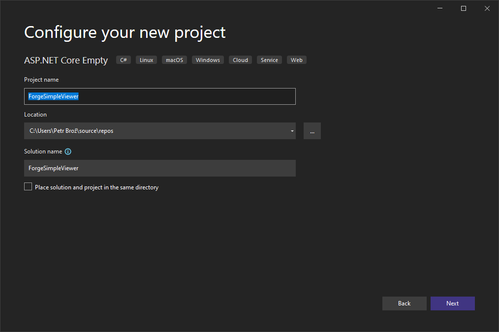
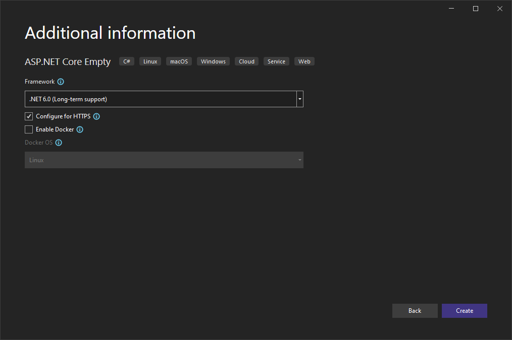
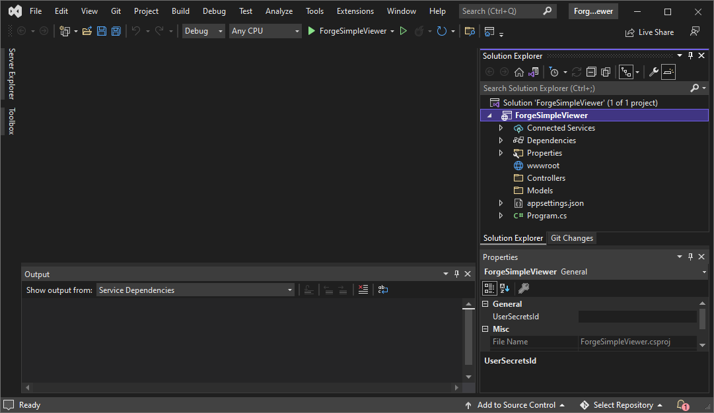

# Basic Server

In this step we're going to create a new .NET 6 project, install all the required dependencies,
and setup a basic ASP.NET server.

## Create new project

Create a new project in Visual Studio:


Choose the _ASP.NET Core Empty_ template:



Name the project in any way you want:



Choose the _.NET 6.0 (Long-term support)_ framework:



Once the project is ready, create a couple of subfolders in your project folder that we're going to need later:

- `Controllers` - this is where we're going to implement all the server endpoints
- `Models` - here we're going to keep all the server-side logic that can be shared by different endpoints
- `wwwrooot` - this is where we're going to put all the client side assets (HTML, CSS, JavaScript, images, etc.)

The folder structure in the _Solution Explorer_ should look similar to this:



## Add dependencies

Next we will need to install the dependencies. In this case it will just be the
[Forge SDK](https://www.nuget.org/packages/Autodesk.Forge). In the _Solution Explorer_,
right-click on _Dependencies_, and then click on _Manage NuGet Packages..._:


In the _NuGet Package Manager_, switch to the _Browse_ tab, and search for and install
the `Autodesk.Forge` package:


## Create a basic server

Next we'll setup our basic server. Start by creating a `Startup.cs` file in the root folder
of your project with the following content:

```csharp title="Startup.cs"
using System;
using Microsoft.AspNetCore.Builder;
using Microsoft.AspNetCore.Hosting;
using Microsoft.Extensions.Configuration;
using Microsoft.Extensions.DependencyInjection;
using Microsoft.Extensions.Hosting;

public class Startup
{
    public Startup(IConfiguration configuration)
    {
        Configuration = configuration;
    }

    public IConfiguration Configuration { get; }

    // This method gets called by the runtime. Use this method to add services to the container.
    public void ConfigureServices(IServiceCollection services)
    {
        services.AddControllers();
        var ForgeClientID = Environment.GetEnvironmentVariable("FORGE_CLIENT_ID");
        var ForgeClientSecret = Environment.GetEnvironmentVariable("FORGE_CLIENT_SECRET");
        var ForgeCallbackURL = Environment.GetEnvironmentVariable("FORGE_CALLBACK_URL");
        if (string.IsNullOrEmpty(ForgeClientID) || string.IsNullOrEmpty(ForgeClientSecret) || string.IsNullOrEmpty(ForgeCallbackURL))
        {
            throw new ApplicationException("Missing required environment variables FORGE_CLIENT_ID, FORGE_CLIENT_SECRET, or FORGE_CALLBACK_URL.");
        }
    }

    // This method gets called by the runtime. Use this method to configure the HTTP request pipeline.
    public void Configure(IApplicationBuilder app, IWebHostEnvironment env)
    {
        if (env.IsDevelopment())
        {
            app.UseDeveloperExceptionPage();
        }
        app.UseHttpsRedirection();
        app.UseDefaultFiles();
        app.UseStaticFiles();
        app.UseRouting();
        app.UseEndpoints(endpoints =>
        {
            endpoints.MapControllers();
        });
    }
}
```

The `Startup` class is responsible for configuring our server and its "middleware", for example,
serving of static files. We also try and retrieve the Forge application client ID, client secret
(these are the values you obtain when [creating a new Forge application](../../../intro#create-an-app)),
and the callback URL (where our users will be redirected to after logging in) from environment
variables for later use.

Next, replace the content of `Program.cs` with the following:

```csharp title="Program.cs"
using Microsoft.AspNetCore.Hosting;
using Microsoft.Extensions.Hosting;

public class Program
{
    public static void Main(string[] args)
    {
        CreateHostBuilder(args).Build().Run();
    }

    public static IHostBuilder CreateHostBuilder(string[] args) =>
        Host.CreateDefaultBuilder(args)
            .ConfigureWebHostDefaults(webBuilder =>
            {
                webBuilder.UseStartup<Startup>();
            });
}
```

This code will make sure that the .NET application creates a web server with our
new `Startup` class.

## Try it out

Now that we have a basic ASP.NET application setup, let's try it out! First of all, we need to provide
the three environment variables, `FORGE_CLIENT_ID`, `FORGE_CLIENT_SECRET`, and `FORGE_CALLBACK_URL`
to our application. In Visual Studio 2022 this can be done via _Launch Profiles_. Open the properties
of your ASP.NET project (for example, by pressing `Alt`+`Enter`), navigate to the _Debug_ > _General_
section, and click on _Open debug launch profiles UI_. Then, in the _Launch Profiles_ window, add
the environment variables and their values to the _Environment variables_ field as "key=value" pairs
separated by a comma.

:::caution
The callback URL we specify here must match the callback URL that you've configured
for your Forge application on https://forge.autodesk.com/myapps.
:::


When you start the application, Visual Studio will automaticaly open [https://localhost:7197](https://localhost:7197)
in your browser, and you should get a 404 response because we haven't implemented any server logic yet.
That's going to be the topic of the next step.

:::info
When starting the application for the first time you may be prompted to trust the self-signed
SSL certificate generated by ASP.NET Core. This is expected, and you can accept this prompt.
:::
