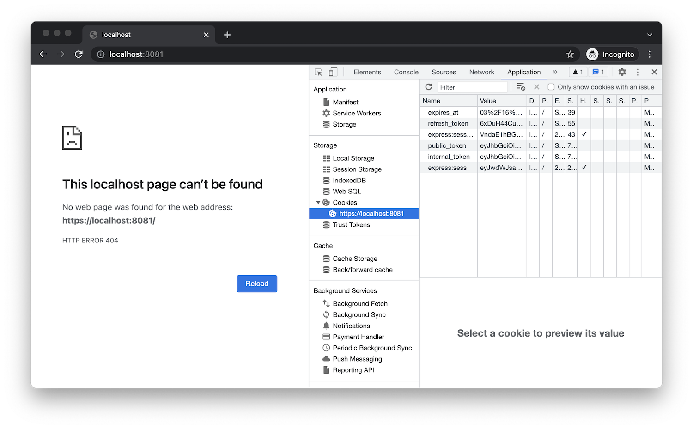

# Authentication

In this step we're going to extend the server implementation so that it can authenticate itself
to the Forge platform, guide the user through a [3-legged OAuth workflow](https://forge.autodesk.com/en/docs/oauth/v2/tutorials/get-3-legged-token),
and generate access tokens for various needs.

:::tip
It is a good practice to generate an "internal" token with more capabilities (for example,
allowing the owner to create or delete files in the Data Management service) that will only be used
by the server, and a "public" token with fewer capabilities that can be safely shared with
the client-side logic.
:::

## Token management

Create a `ForgeService.cs` file under the `Models` subfolder. This is where we will be implementing
the Forge-specific logic that will be used in different areas of our server application. Let's
start by adding the following code to the file:

```csharp title="Models/ForgeService.cs"
using System;
using Autodesk.Forge;

public class Tokens
{
    public string InternalToken;
    public string PublicToken;
    public string RefreshToken;
    public DateTime ExpiresAt;
}

public partial class ForgeService
{
    private readonly string _clientId;
    private readonly string _clientSecret;
    private readonly string _callbackUri;
    private readonly Scope[] InternalTokenScopes = new Scope[] { Scope.DataRead, Scope.ViewablesRead };
    private readonly Scope[] PublicTokenScopes = new Scope[] { Scope.ViewablesRead };

    public ForgeService(string clientId, string clientSecret, string callbackUri)
    {
        _clientId = clientId;
        _clientSecret = clientSecret;
        _callbackUri = callbackUri;
    }
}
```

Notice that the `ForgeService` class is declared as `partial`. We're going to extend in other `*.cs` files later.
A `ForgeService` singleton will then be provided to our server through ASP.NET's [dependency injection](https://docs.microsoft.com/en-us/aspnet/core/fundamentals/dependency-injection?view=aspnetcore-6.0).

Next, let's create a `ForgeService.Auth.cs` file under the `Models` subfolder with the following code:

```csharp title="Models/ForgeService.Auth.cs"
using System;
using System.Threading.Tasks;
using Autodesk.Forge;

public partial class ForgeService
{
    public string GetAuthorizationURL()
    {
        return new ThreeLeggedApi().Authorize(_clientId, "code", _callbackUri, InternalTokenScopes);
    }

    public async Task<Tokens> GenerateTokens(string code)
    {
        dynamic internalAuth = await new ThreeLeggedApi().GettokenAsync(_clientId, _clientSecret, "authorization_code", code, _callbackUri);
        dynamic publicAuth = await new ThreeLeggedApi().RefreshtokenAsync(_clientId, _clientSecret, "refresh_token", internalAuth.refresh_token, PublicTokenScopes);
        return new Tokens
        {
            PublicToken = publicAuth.access_token,
            InternalToken = internalAuth.access_token,
            RefreshToken = publicAuth.refresh_token,
            ExpiresAt = DateTime.Now.ToUniversalTime().AddSeconds(internalAuth.expires_in)
        };
    }

    public async Task<Tokens> RefreshTokens(Tokens tokens)
    {
        dynamic internalAuth = await new ThreeLeggedApi().RefreshtokenAsync(_clientId, _clientSecret, "refresh_token", tokens.RefreshToken, InternalTokenScopes);
        dynamic publicAuth = await new ThreeLeggedApi().RefreshtokenAsync(_clientId, _clientSecret, "refresh_token", internalAuth.refresh_token, PublicTokenScopes);
        return new Tokens
        {
            PublicToken = publicAuth.access_token,
            InternalToken = internalAuth.access_token,
            RefreshToken = publicAuth.refresh_token,
            ExpiresAt = DateTime.Now.ToUniversalTime().AddSeconds(internalAuth.expires_in)
        };
    }

    public async Task<dynamic> GetUserProfile(Tokens tokens)
    {
        var api = new UserProfileApi();
        api.Configuration.AccessToken = tokens.InternalToken;
        dynamic profile = await api.GetUserProfileAsync();
        return profile;
    }
}
```

These helper methods will later be used in our server's controllers to handle
various types of requests related to authentication, for example, redirecting the user
to the Autodesk login page, processing the callback when the user gets redirected back
to our application, or refreshing tokens that have expired.

Finally, let's update our `Startup.cs` file to make a singleton instance of the `ForgeService` class
available to our server application:

```csharp title="Startup.cs"
using System;
using Microsoft.AspNetCore.Builder;
using Microsoft.AspNetCore.Hosting;
using Microsoft.Extensions.Configuration;
using Microsoft.Extensions.DependencyInjection;
using Microsoft.Extensions.Hosting;

public class Startup
{
    public Startup(IConfiguration configuration)
    {
        Configuration = configuration;
    }

    public IConfiguration Configuration { get; }

    // This method gets called by the runtime. Use this method to add services to the container.
    public void ConfigureServices(IServiceCollection services)
    {
        services.AddControllers();
        var ForgeClientID = Environment.GetEnvironmentVariable("FORGE_CLIENT_ID");
        var ForgeClientSecret = Environment.GetEnvironmentVariable("FORGE_CLIENT_SECRET");
        var ForgeCallbackURL = Environment.GetEnvironmentVariable("FORGE_CALLBACK_URL");
        if (string.IsNullOrEmpty(ForgeClientID) || string.IsNullOrEmpty(ForgeClientSecret) || string.IsNullOrEmpty(ForgeCallbackURL))
        {
            throw new ApplicationException("Missing required environment variables FORGE_CLIENT_ID, FORGE_CLIENT_SECRET, or FORGE_CALLBACK_URL.");
        }
        // highlight-start
        services.AddSingleton<ForgeService>(new ForgeService(ForgeClientID, ForgeClientSecret, ForgeCallbackURL));
        // highlight-end
    }

    // This method gets called by the runtime. Use this method to configure the HTTP request pipeline.
    public void Configure(IApplicationBuilder app, IWebHostEnvironment env)
    {
        if (env.IsDevelopment())
        {
            app.UseDeveloperExceptionPage();
        }
        app.UseHttpsRedirection();
        app.UseDefaultFiles();
        app.UseStaticFiles();
        app.UseRouting();
        app.UseEndpoints(endpoints =>
        {
            endpoints.MapControllers();
        });
    }
}
```

## Server endpoints

Next, let's add a first endpoint to our server. Create an `AuthController.cs` file under the `Controllers` subfolder
with the following content:

```csharp title="Controllers/AuthController.cs"
using System;
using System.Threading.Tasks;
using Microsoft.AspNetCore.Http;
using Microsoft.AspNetCore.Mvc;
using Microsoft.Extensions.Logging;

[ApiController]
[Route("api/[controller]")]
public class AuthController : ControllerBase
{
    private readonly ILogger<AuthController> _logger;
    private readonly ForgeService _forgeService;

    public AuthController(ILogger<AuthController> logger, ForgeService forgeService)
    {
        _logger = logger;
        _forgeService = forgeService;
    }

    public static async Task<Tokens> PrepareTokens(HttpRequest request, HttpResponse response, ForgeService forgeService)
    {
        if (!request.Cookies.ContainsKey("internal_token"))
        {
            return null;
        }
        var tokens = new Tokens
        {
            PublicToken = request.Cookies["public_token"],
            InternalToken = request.Cookies["internal_token"],
            RefreshToken = request.Cookies["refresh_token"],
            ExpiresAt = DateTime.Parse(request.Cookies["expires_at"])
        };
        if (tokens.ExpiresAt < DateTime.Now.ToUniversalTime())
        {
            tokens = await forgeService.RefreshTokens(tokens);
            response.Cookies.Append("public_token", tokens.PublicToken);
            response.Cookies.Append("internal_token", tokens.InternalToken);
            response.Cookies.Append("refresh_token", tokens.RefreshToken);
            response.Cookies.Append("expires_at", tokens.ExpiresAt.ToString());
        }
        return tokens;
    }

    [HttpGet("login")]
    public ActionResult Login()
    {
        var redirectUri = _forgeService.GetAuthorizationURL();
        return Redirect(redirectUri);
    }

    [HttpGet("logout")]
    public ActionResult Logout()
    {
        Response.Cookies.Delete("public_token");
        Response.Cookies.Delete("internal_token");
        Response.Cookies.Delete("refresh_token");
        Response.Cookies.Delete("expires_at");
        return Redirect("/");
    }

    [HttpGet("callback")]
    public async Task<ActionResult> Callback(string code)
    {
        var tokens = await _forgeService.GenerateTokens(code);
        Response.Cookies.Append("public_token", tokens.PublicToken);
        Response.Cookies.Append("internal_token", tokens.InternalToken);
        Response.Cookies.Append("refresh_token", tokens.RefreshToken);
        Response.Cookies.Append("expires_at", tokens.ExpiresAt.ToString());
        return Redirect("/");
    }

    [HttpGet("profile")]
    public async Task<dynamic> GetProfile()
    {
        var tokens = await PrepareTokens(Request, Response, _forgeService);
        if (tokens == null)
        {
            return Unauthorized();
        }
        dynamic profile = await _forgeService.GetUserProfile(tokens);
        return new
        {
            name = string.Format("{0} {1}", profile.firstName, profile.lastName)
        };
    }

    [HttpGet("token")]
    public async Task<dynamic> GetPublicToken()
    {
        var tokens = await PrepareTokens(Request, Response, _forgeService);
        if (tokens == null)
        {
            return Unauthorized();
        }
        return new
        {
            access_token = tokens.PublicToken,
            token_type = "Bearer",
            expires_in = Math.Floor((tokens.ExpiresAt - DateTime.Now.ToUniversalTime()).TotalSeconds)
        };
    }
}
```

The controller handles several different endpoints:

- `GET /api/auth/login` will redirect the user to the Autodesk login page
- `GET /api/auth/callback` is the URL our user will be redirected to after logging in successfully,
and it is where we're going to generate a new set of tokens for the user
- `GET /api/auth/logout` will remove any cookie-based session data for the given user, effectively
logging the user out of our application
- `GET /api/auth/token` will generate a public access token that will later be used by Forge Viewer
to load our designs
- `GET /api/auth/profile` will return a simple JSON with additional information about the logged in user

## Try it out

Let's see if our new server endpoint works. Try setting the `FORGE_CLIENT_ID` and `FORGE_CLIENT_SECRET`
environment variables to your own Forge app credentials, and set the `FORGE_CALLBACK_URL` env.
variable to `https://localhost:8081/api/auth/callback` because that's where we implemented our
code handling the callbacks from Forge:

```bash
export FORGE_CLIENT_ID=your-own-forge-client-id
export FORGE_CLIENT_SECRET=your-own-forge-client-secret
export FORGE_CALLBACK_URL=https://localhost:8081/api/auth/callback
dotnet run
```

:::caution
The callback URL we specify here must match the callback URL that you've configured
for your Forge application on https://forge.autodesk.com/myapps.
:::

When you navigate to [https://localhost:8081/api/auth/login](https://localhost:8081/api/auth/login)
in the browser, you should be redirected to Autodesk login page, and after logging in, you should
be redirected back to your application, for now simply returning 404. This is expected as we haven't
implemented the `GET /` endpoint yet. However, if you try and explore the cookies stored
by your browser for the `localhost` origin, you'll notice that the application is already storing
the authentication data.


