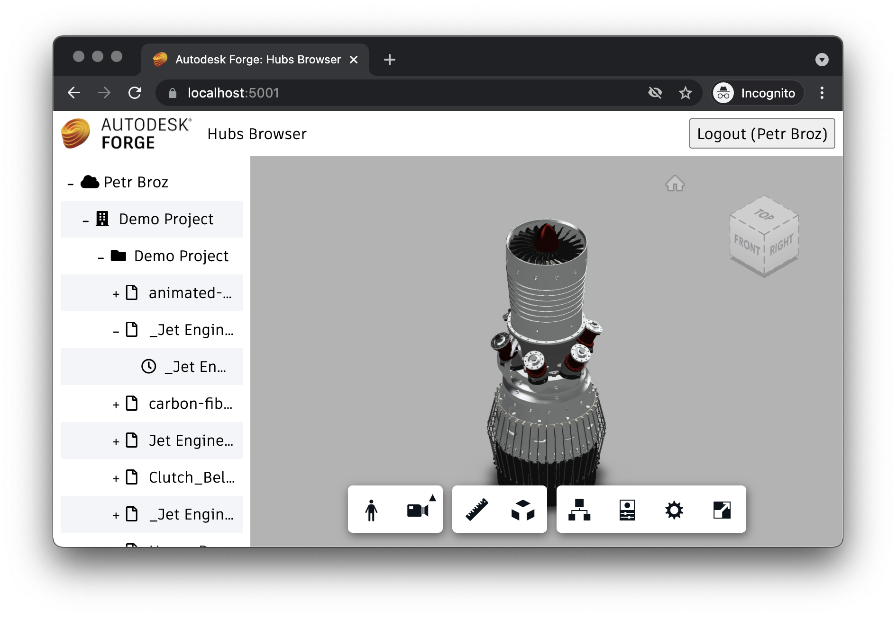

# Viewer & UI

Finally, we're ready to build the client-side piece of our application.

## Viewer logic

Let's start by implementing the Forge Viewer functionality of our application.
Create a `viewer.js` file under the `wwwroot` subfolder with the following code:

```js title="wwwroot/viewer.js"
export function initViewer(container) {
    async function getAccessToken(callback) {
        try {
            const resp = await fetch('/api/auth/token');
            if (!resp.ok)
                throw new Error(await resp.text());
            const { access_token, expires_in } = await resp.json();
            callback(access_token, expires_in);
        } catch (err) {
            alert('Could not obtain access token. See the console for more details.');
            console.error(err);        
        }
    }
    return new Promise(function (resolve, reject) {
        Autodesk.Viewing.Initializer({ getAccessToken }, async function () {
            const viewer = new Autodesk.Viewing.GuiViewer3D(container);
            viewer.start();
            viewer.setTheme('light-theme');
            resolve(viewer);
        });
    });
}

export function loadModel(viewer, urn) {
    function onDocumentLoadSuccess(doc) {
        viewer.loadDocumentNode(doc, doc.getRoot().getDefaultGeometry());
    }
    function onDocumentLoadFailure(code, message) {
        alert('Could not load model. See the console for more details.');
        console.error(message);
    }
    Autodesk.Viewing.Document.load('urn:' + urn, onDocumentLoadSuccess, onDocumentLoadFailure);
}
```

The script is an [ES6 module](https://developer.mozilla.org/en-US/docs/Web/JavaScript/Guide/Modules)
that exports two functions:

- `initViewer` will create a new instance of Forge Viewer in the specified DOM container
- `loadModel` for loading a specific model to the viewer

## Sidebar logic

Next we'll implement the behavior of a sidebar where we're going to display
all the hubs, projects, folders, items, and versions in a 3rd party tree-view
component. Create a `sidebar.js` file under the `wwwroot` subfolder with the following code:

```js title="wwwroot/sidebar.js"
import { VanillaTreeView } from 'https://unpkg.com/simple-treeview/dist/treeview.vanilla.js';

export function initTree(container, onSelectionChanged) {
    async function getHubs() {
        const resp = await fetch('/api/hubs');
        const hubs = await resp.json();
        return hubs.map(hub => ({
            id: `hub|${hub.id}`,
            label: hub.attributes.name,
            icon: { classes: ['fas', 'fa-cloud'] },
            state: 'collapsed'
        }));
    }

    async function getProjects(hubId) {
        const resp = await fetch(`/api/hubs/${hubId}/projects`);
        const projects = await resp.json();
        return projects.map(project => ({
            id: `project|${hubId}|${project.id}`,
            label: project.attributes.name,
            icon: { classes: ['fas', 'fa-building'] },
            state: 'collapsed'
        }));
    }

    async function getProjectContents(hubId, projectId, folderId) {
        let url = `/api/hubs/${hubId}/projects/${projectId}/contents`;
        if (folderId) {
            url += `?folder_id=${folderId}`;
        }
        const resp = await fetch(url);
        const contents = await resp.json();
        return contents.map(item => {
            if (item.type === 'folders') {
                return {
                    id: `folder|${hubId}|${projectId}|${item.id}`,
                    label: item.attributes.displayName,
                    icon: { classes: ['fas', 'fa-folder'] },
                    state: 'collapsed'
                };
            } else {
                return {
                    id: `item|${hubId}|${projectId}|${item.id}`,
                    label: item.attributes.displayName,
                    icon: { classes: ['far', 'fa-file'] },
                    state: 'collapsed'
                };
            }
        });
    }

    async function getItemVersions(hubId, projectId, itemId) {
        const resp = await fetch(`/api/hubs/${hubId}/projects/${projectId}/contents/${itemId}/versions`);
        const versions = await resp.json();
        return versions.map(version => ({
            id: version.id,
            label: version.attributes.displayName,
            icon: { classes: ['far', 'fa-clock'] }
        }));
    }

    return new VanillaTreeView(container, {
        provider: {
            async getChildren(id) {
                if (!id) {
                    return getHubs();
                }
                const tokens = id.split('|');
                switch (tokens[0]) {
                    case 'hub':
                        return getProjects(tokens[1]);
                    case 'project':
                        return getProjectContents(tokens[1], tokens[2], null);
                    case 'folder':
                        return getProjectContents(tokens[1], tokens[2], tokens[3]);
                    case 'item':
                        return getItemVersions(tokens[1], tokens[2], tokens[3]);
                    default:
                        return [];
                }
            }
        },
        onSelectionChanged: onSelectionChanged
    });
}
```

## Application logic

Now let's wire all the UI components together. Create a `main.js` file under
the `wwwroot` folder, and populate it with the following code:

```js title="wwwroot/main.js"
import { initViewer, loadModel } from './viewer.js';
import { initTree } from './sidebar.js';

const login = document.getElementById('login');
try {
    const resp = await fetch('/api/auth/profile');
    const profile = await resp.json();
    login.innerText = `Logout (${profile.name})`;
    login.onclick = () => window.location.replace('/api/auth/logout');
    const viewer = await initViewer(document.getElementById('preview'));
    initTree(document.getElementById('tree'), function (nodes) {
        if (nodes.length === 1) {
            const urn = btoa(nodes[0].id).replace(/=/g, '');
            loadModel(viewer, urn);
        }
    });
} catch (err) {
    login.innerText = 'Login';
    login.onclick = () => window.location.replace('/api/auth/login');
}
login.style.display = 'inline';
```

The script will first try and obtain user details to check whether we're logged in or not.
If we are, the code can then initialize the viewer as well as the tree-view component.
The callback function passed to `initTree` makes sure that when we click on a leaf node
in the tree, the viewer will start loading the corresponding Forge model.

## User interface

And finally, let's build the UI of our application.

Create a `main.css` file under the `wwwroot` subfolder, and populate it with the following
CSS rules:

```css title="wwwroot/main.css"
body, html {
    margin: 0;
    padding: 0;
    height: 100vh;
    font-family: ArtifaktElement;
}

#header, #sidebar, #preview {
    position: absolute;
}

#header {
    height: 3em;
    width: 100%;
    display: flex;
    flex-flow: row nowrap;
    justify-content: space-between;
    align-items: center;
}

#sidebar {
    width: 25%;
    left: 0;
    top: 3em;
    bottom: 0;
    overflow-y: scroll;
}

#preview {
    width: 75%;
    right: 0;
    top: 3em;
    bottom: 0;
}

#header > * {
    height: 2em;
    margin: 0 0.5em;
}

#login {
    font-family: ArtifaktElement;
    font-size: 1em;
}

#header .title {
    height: auto;
    margin-right: auto;
}

#tree {
    margin: 0.5em;
}

.treeview-node .icon {
    width: 16px;
}

@media (max-width: 768px) {
    #sidebar {
        width: 100%;
        top: 3em;
        bottom: 75%;
    }
    #preview {
        width: 100%;
        top: 25%;
        bottom: 0;
    }
}
```

Then, create an `index.html` file (also in the `wwwroot` subfolder) with the following content:

```html title="wwwroot/index.html"
<!doctype html>
<html lang="en">

<head>
    <meta charset="utf-8">
    <meta name="viewport" content="width=device-width, initial-scale=1">
    <link rel="stylesheet" href="https://developer.api.autodesk.com/modelderivative/v2/viewers/7.*/style.css">
    <link rel="stylesheet" href="https://unpkg.com/simple-treeview/dist/treeview.vanilla.css">
    <link rel="stylesheet" href="https://use.fontawesome.com/releases/v5.15.4/css/all.css">
    <link rel="stylesheet" href="/main.css">
    <title>Autodesk Forge: Hubs Browser</title>
</head>

<body>
    <div id="header">
        
        <span class="title">Hubs Browser</span>
        <button id="login" style="display: none">Login</button>
    </div>
    <div id="sidebar">
        <div id="tree"></div>
    </div>
    <div id="preview"></div>
    <script src="https://developer.api.autodesk.com/modelderivative/v2/viewers/7.*/viewer3D.js"></script>
    <script src="/main.js" type="module"></script>
</body>

</html>
```

> Note that since `wwwroot/main.js` is also an ES6 module, we have to use `type="module"`
> in its `<script>` tag.

The application will look for `favicon.ico` and `logo.png` images under the `wwwroot` folder to use
as the website's icon and logo. If you don't have any images of your own, feel free to download
them from one of our samples:

- https://github.com/petrbroz/forge-simple-viewer-nodejs/blob/develop/public/favicon.ico
- https://github.com/petrbroz/forge-simple-viewer-nodejs/blob/develop/public/logo.png

## Try it out

And that's it! Your application is now ready for action. Start it from the command line as usual:

```bash
export FORGE_CLIENT_ID=your-own-forge-client-id
export FORGE_CLIENT_SECRET=your-own-forge-client-secret
export FORGE_CALLBACK_URL=https://localhost:5001/api/auth/callback
dotnet trun
```

And then navigate to https://localhost:5001 in your browser. You should be presented with a simple UI,
with a tree-view on the left side, and an empty viewer on the right. Try browsing through the tree,
and select a specific version of one of your files. After that the corresponding model should be loaded
into the viewer.


