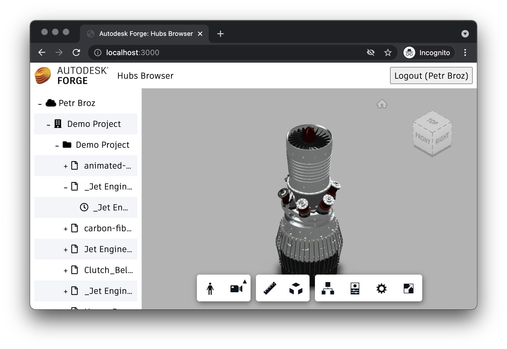

# Viewer & UI

import ViewerPartial from '../_viewer.mdx';

Finally, we're ready to build the client-side piece of our application.

<ViewerPartial assetsFolder="public" />

## Try it out

And that's it! Your application is now ready for action. Start it from the command line as usual:

```bash
export SERVER_SESSION_SECRET=some-secret-phrase
export FORGE_CLIENT_ID=your-own-forge-client-id
export FORGE_CLIENT_SECRET=your-own-forge-client-secret
export FORGE_CALLBACK_URL=http://localhost:3000/api/auth/callback
npm start
```

And then navigate to [http://localhost:3000](http://localhost:3000) in your browser.
You should be presented with a simple UI, with a tree-view on the left side, and an empty
viewer on the right. Try browsing through the tree, and select a specific version of one
of your files. After that the corresponding model should be loaded into the viewer.


