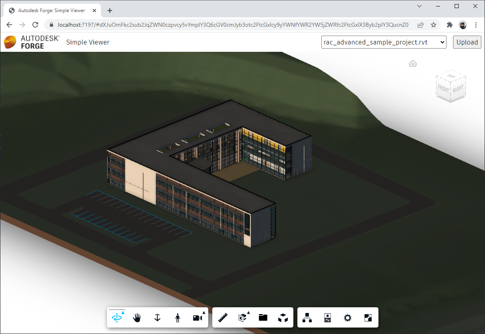

# Viewer & UI

import ViewerPartial from '../_viewer.mdx';

Finally, we're ready to build the client-side piece of our application.

<ViewerPartial assetsFolder="wwwroot" />

## Try it out

And that's it! Your application is now ready for action. Start it from Visual Studio, and then navigate
to [https://localhost:7197](https://localhost:7197) in your browser. You should be presented with a simple UI,
with a dropdown in the top-right corner that will eventually get populated with all models available in your
configured bucket, and with a button for uploading new models. And as soon as you select one of the options
from the dropdown, the corresponding model will get loaded in the viewer occupying the rest of the webpage.

