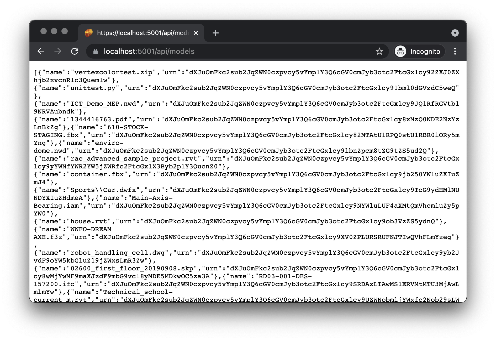

# Data Management

Next, let's extend our server so that we can list models, upload them, and also initiate
their translation for viewing.

## Preparing a bucket

First, let's make sure that our application has a bucket in the Data Management service
to store its files in. Typically the bucket would be created just once as part of a provisioning
step but in our sample we will implement a helper function that will make sure that the bucket
is available. Let's update the `Models/ForgeService.cs` file:

```csharp title="Models/ForgeService.cs"
using System;
using System.Collections.Generic;
using System.IO;
using System.Threading.Tasks;
using Autodesk.Forge;
using Autodesk.Forge.Client;
using Autodesk.Forge.Model;

namespace simpleviewer
{
    public class Token
    {
        public string AccessToken { get; set; }
        public DateTime ExpiresAt { get; set; }
    }

    public interface IForgeService
    {
        Task<Token> GetAccessToken();
    }

    public class ForgeService : IForgeService
    {
        private readonly string _clientId;
        private readonly string _clientSecret;
        private readonly string _bucket;
        private Token _internalTokenCache;
        private Token _publicTokenCache;

        public ForgeService(string clientId, string clientSecret, string bucket = null)
        {
            _clientId = clientId;
            _clientSecret = clientSecret;
            _bucket = string.IsNullOrEmpty(bucket) ? string.Format("{0}-basic-app", _clientId.ToLower()) : bucket;
        }

        public async Task<Token> GetAccessToken()
        {
            return await GetPublicToken();
        }

        // highlight-start
        private async Task EnsureBucketExists(string bucketKey)
        {
            var token = await GetInternalToken();
            var api = new BucketsApi();
            api.Configuration.AccessToken = token.AccessToken;
            try
            {
                await api.GetBucketDetailsAsync(bucketKey);
            }
            catch (ApiException e)
            {
                if (e.ErrorCode == 404)
                {
                    await api.CreateBucketAsync(new PostBucketsPayload(bucketKey, null, PostBucketsPayload.PolicyKeyEnum.Temporary));
                }
                else
                {
                    throw e;
                }
            }
        }
        // highlight-end

        private async Task<Token> GetPublicToken()
        {
            if (_publicTokenCache == null || _publicTokenCache.ExpiresAt < DateTime.UtcNow)
            {
                _publicTokenCache = await GetToken(new Scope[] { Scope.ViewablesRead });
            }
            return _publicTokenCache;
        }

        private async Task<Token> GetInternalToken()
        {
            if (_internalTokenCache == null || _internalTokenCache.ExpiresAt < DateTime.UtcNow)
            {
                _internalTokenCache = await GetToken(new Scope[] { Scope.BucketCreate, Scope.BucketRead, Scope.DataRead, Scope.DataWrite, Scope.DataCreate });
            }
            return _internalTokenCache;
        }

        private async Task<Token> GetToken(Scope[] scopes)
        {
            dynamic auth = await new TwoLeggedApi().AuthenticateAsync(_clientId, _clientSecret, "client_credentials", scopes);
            return new Token
            {
                AccessToken = auth.access_token,
                ExpiresAt = DateTime.UtcNow.AddSeconds(auth.expires_in)
            };
        }
    }
}
```

The `EnsureBucketExists` method will simply try and request additional information
about a specific bucket, and if the response from Forge is `404 Not Found`, it will
attempt to create a new bucket with that name.

## Listing models

Now we will update the `ForgeService` class with a helper function that will
list all objects in the preconfigured bucket:

```csharp title="Models/ForgeService.cs"
using System;
using System.Collections.Generic;
using System.IO;
using System.Threading.Tasks;
using Autodesk.Forge;
using Autodesk.Forge.Client;
using Autodesk.Forge.Model;

namespace simpleviewer
{
    public class Token
    {
        public string AccessToken { get; set; }
        public DateTime ExpiresAt { get; set; }
    }

    public interface IForgeService
    {
        // highlight-start
        Task<IEnumerable<dynamic>> GetObjects();
        // highlight-end
        Task<Token> GetAccessToken();
    }

    public class ForgeService : IForgeService
    {
        private readonly string _clientId;
        private readonly string _clientSecret;
        private readonly string _bucket;
        private Token _internalTokenCache;
        private Token _publicTokenCache;

        public ForgeService(string clientId, string clientSecret, string bucket = null)
        {
            _clientId = clientId;
            _clientSecret = clientSecret;
            _bucket = string.IsNullOrEmpty(bucket) ? string.Format("{0}-basic-app", _clientId.ToLower()) : bucket;
        }

        // highlight-start
        public async Task<IEnumerable<dynamic>> GetObjects()
        {
            const int PageSize = 64;
            await EnsureBucketExists(_bucket);
            var token = await GetInternalToken();
            var api = new ObjectsApi();
            api.Configuration.AccessToken = token.AccessToken;
            var objects = new List<dynamic>();
            dynamic response = await api.GetObjectsAsync(_bucket, PageSize);
            foreach (KeyValuePair<string, dynamic> obj in new DynamicDictionaryItems(response.items))
            {
                objects.Add(new { name = obj.Value.objectKey, urn = Base64Encode(obj.Value.objectId) });
            }
            while ((response as DynamicDictionary).Dictionary.ContainsKey("next")) // This feels hacky... is there a better way?
            {
                var queryParams = Microsoft.AspNetCore.WebUtilities.QueryHelpers.ParseQuery(new Uri(response.next).Query);
                response = await api.GetObjectsAsync(_bucket, PageSize, null, queryParams["startAt"]);
                foreach (KeyValuePair<string, dynamic> obj in new DynamicDictionaryItems(response.items))
                {
                    objects.Add(new { name = obj.Value.objectKey, urn = Base64Encode(obj.Value.objectId) });
                }
            }
            return objects;
        }
        // highlight-end

        public async Task<Token> GetAccessToken()
        {
            return await GetPublicToken();
        }

        private async Task EnsureBucketExists(string bucketKey)
        {
            var token = await GetInternalToken();
            var api = new BucketsApi();
            api.Configuration.AccessToken = token.AccessToken;
            try
            {
                await api.GetBucketDetailsAsync(bucketKey);
            }
            catch (ApiException e)
            {
                if (e.ErrorCode == 404)
                {
                    await api.CreateBucketAsync(new PostBucketsPayload(bucketKey, null, PostBucketsPayload.PolicyKeyEnum.Temporary));
                }
                else
                {
                    throw e;
                }
            }
        }

        private async Task<Token> GetPublicToken()
        {
            if (_publicTokenCache == null || _publicTokenCache.ExpiresAt < DateTime.UtcNow)
            {
                _publicTokenCache = await GetToken(new Scope[] { Scope.ViewablesRead });
            }
            return _publicTokenCache;
        }

        private async Task<Token> GetInternalToken()
        {
            if (_internalTokenCache == null || _internalTokenCache.ExpiresAt < DateTime.UtcNow)
            {
                _internalTokenCache = await GetToken(new Scope[] { Scope.BucketCreate, Scope.BucketRead, Scope.DataRead, Scope.DataWrite, Scope.DataCreate });
            }
            return _internalTokenCache;
        }

        private async Task<Token> GetToken(Scope[] scopes)
        {
            dynamic auth = await new TwoLeggedApi().AuthenticateAsync(_clientId, _clientSecret, "client_credentials", scopes);
            return new Token
            {
                AccessToken = auth.access_token,
                ExpiresAt = DateTime.UtcNow.AddSeconds(auth.expires_in)
            };
        }

        // highlight-start
        private static string Base64Encode(string plainText)
        {
            var plainTextBytes = System.Text.Encoding.UTF8.GetBytes(plainText);
            return System.Convert.ToBase64String(plainTextBytes).TrimEnd('=');
        }
        // highlight-end
    }
}
```

The `GetObjects` method pages through all objects in the bucket, and returns their name and URN
(the base64-encoded ID that will later be used when communicating with the Model Derivative service).

## Uploading and translating models

Finally we will add helper methods to `ForgeService` that will handle the uploading of a file
to the Data Management service, and its translation into a format that can later be loaded into
Forge Viewer:

```csharp title="Models/ForgeService.cs"
using System;
using System.Collections.Generic;
using System.IO;
using System.Threading.Tasks;
using Autodesk.Forge;
using Autodesk.Forge.Client;
using Autodesk.Forge.Model;

namespace simpleviewer
{
    public class Token
    {
        public string AccessToken { get; set; }
        public DateTime ExpiresAt { get; set; }
    }

    public interface IForgeService
    {
        Task<IEnumerable<dynamic>> GetObjects();
        Task<Token> GetAccessToken();
        // highlight-start
        Task<dynamic> UploadModel(string objectName, Stream content, long contentLength);
        Task<dynamic> TranslateModel(string objectId, string rootFilename);
        // highlight-end
    }

    public class ForgeService : IForgeService
    {
        private readonly string _clientId;
        private readonly string _clientSecret;
        private readonly string _bucket;
        private Token _internalTokenCache;
        private Token _publicTokenCache;

        public ForgeService(string clientId, string clientSecret, string bucket = null)
        {
            _clientId = clientId;
            _clientSecret = clientSecret;
            _bucket = string.IsNullOrEmpty(bucket) ? string.Format("{0}-basic-app", _clientId.ToLower()) : bucket;
        }

        public async Task<IEnumerable<dynamic>> GetObjects()
        {
            const int PageSize = 64;
            await EnsureBucketExists(_bucket);
            var token = await GetInternalToken();
            var api = new ObjectsApi();
            api.Configuration.AccessToken = token.AccessToken;
            var objects = new List<dynamic>();
            dynamic response = await api.GetObjectsAsync(_bucket, PageSize);
            foreach (KeyValuePair<string, dynamic> obj in new DynamicDictionaryItems(response.items))
            {
                objects.Add(new { name = obj.Value.objectKey, urn = Base64Encode(obj.Value.objectId) });
            }
            while ((response as DynamicDictionary).Dictionary.ContainsKey("next")) // This feels hacky... is there a better way?
            {
                var queryParams = Microsoft.AspNetCore.WebUtilities.QueryHelpers.ParseQuery(new Uri(response.next).Query);
                response = await api.GetObjectsAsync(_bucket, PageSize, null, queryParams["startAt"]);
                foreach (KeyValuePair<string, dynamic> obj in new DynamicDictionaryItems(response.items))
                {
                    objects.Add(new { name = obj.Value.objectKey, urn = Base64Encode(obj.Value.objectId) });
                }
            }
            return objects;
        }

        // highlight-start
        public async Task<dynamic> UploadModel(string objectName, Stream content, long contentLength)
        {
            await EnsureBucketExists(_bucket);
            var token = await GetInternalToken();
            var api = new ObjectsApi();
            api.Configuration.AccessToken = token.AccessToken;
            dynamic obj = await api.UploadObjectAsync(_bucket, objectName, (int)contentLength, content);
            return obj;
        }
        // highlight-end

        // highlight-start
        public async Task<dynamic> TranslateModel(string objectId, string rootFilename)
        {
            var token = await GetInternalToken();
            var api = new DerivativesApi();
            api.Configuration.AccessToken = token.AccessToken;
            var formats = new List<JobPayloadItem> {
                new JobPayloadItem (JobPayloadItem.TypeEnum.Svf, new List<JobPayloadItem.ViewsEnum> { JobPayloadItem.ViewsEnum._2d, JobPayloadItem.ViewsEnum._2d })
            };
            var payload = new JobPayload(
                new JobPayloadInput(Base64Encode(objectId)),
                new JobPayloadOutput(formats)
            );
            if (!string.IsNullOrEmpty(rootFilename))
            {
                payload.Input.RootFilename = rootFilename;
                payload.Input.CompressedUrn = true;
            }
            dynamic job = await api.TranslateAsync(payload);
            return job;
        }
        // highlight-end

        public async Task<Token> GetAccessToken()
        {
            return await GetPublicToken();
        }

        private async Task EnsureBucketExists(string bucketKey)
        {
            var token = await GetInternalToken();
            var api = new BucketsApi();
            api.Configuration.AccessToken = token.AccessToken;
            try
            {
                await api.GetBucketDetailsAsync(bucketKey);
            }
            catch (ApiException e)
            {
                if (e.ErrorCode == 404)
                {
                    await api.CreateBucketAsync(new PostBucketsPayload(bucketKey, null, PostBucketsPayload.PolicyKeyEnum.Temporary));
                }
                else
                {
                    throw e;
                }
            }
        }

        private async Task<Token> GetPublicToken()
        {
            if (_publicTokenCache == null || _publicTokenCache.ExpiresAt < DateTime.UtcNow)
            {
                _publicTokenCache = await GetToken(new Scope[] { Scope.ViewablesRead });
            }
            return _publicTokenCache;
        }

        private async Task<Token> GetInternalToken()
        {
            if (_internalTokenCache == null || _internalTokenCache.ExpiresAt < DateTime.UtcNow)
            {
                _internalTokenCache = await GetToken(new Scope[] { Scope.BucketCreate, Scope.BucketRead, Scope.DataRead, Scope.DataWrite, Scope.DataCreate });
            }
            return _internalTokenCache;
        }

        private async Task<Token> GetToken(Scope[] scopes)
        {
            dynamic auth = await new TwoLeggedApi().AuthenticateAsync(_clientId, _clientSecret, "client_credentials", scopes);
            return new Token
            {
                AccessToken = auth.access_token,
                ExpiresAt = DateTime.UtcNow.AddSeconds(auth.expires_in)
            };
        }

        private static string Base64Encode(string plainText)
        {
            var plainTextBytes = System.Text.Encoding.UTF8.GetBytes(plainText);
            return System.Convert.ToBase64String(plainTextBytes).TrimEnd('=');
        }
    }
}
```

## Server endpoints

Finally, let's expose this new functionality to the client-side code through another ASP.NET
controller. Create a `ModelsController.cs` file under the `Controllers` subfolder
with the following content:

```csharp title="Controllers/ModelsController.cs"
using System.IO;
using System.Threading.Tasks;
using Microsoft.AspNetCore.Http;
using Microsoft.AspNetCore.Mvc;
using Microsoft.Extensions.Logging;
using Newtonsoft.Json;

namespace simpleviewer
{
    [ApiController]
    [Route("api/[controller]")]
    public class ModelsController : ControllerBase
    {
        private readonly ILogger<ModelsController> _logger;
        private readonly IForgeService _forgeService;

        public ModelsController(ILogger<ModelsController> logger, IForgeService forgeService)
        {
            _logger = logger;
            _forgeService = forgeService;
        }

        [HttpGet()]
        public async Task<ActionResult<string>> GetModels()
        {
            var objects = await _forgeService.GetObjects();
            return JsonConvert.SerializeObject(objects);
        }

        public class UploadModelForm
        {
            [FromForm(Name = "model-zip-entrypoint")]
            public string Entrypoint { get; set; }

            [FromForm(Name = "model-file")]
            public IFormFile File { get; set; }
        }

        [HttpPost()]
        public async Task UploadAndTranslateModel([FromForm] UploadModelForm form)
        {
            // For some reason we cannot use the incoming stream directly...
            // so let's save the model into a local temp file first
            var tmpPath = Path.GetTempFileName();
            using (var stream = new FileStream(tmpPath, FileMode.OpenOrCreate))
            {
                await form.File.CopyToAsync(stream);
            }
            using (var stream = System.IO.File.OpenRead(tmpPath))
            {
                dynamic obj = await _forgeService.UploadModel(form.File.FileName, stream, form.File.Length);
                await _forgeService.TranslateModel(obj.objectId, form.Entrypoint);
            }
            System.IO.File.Delete(tmpPath);
        }
    }
}
```

The controller will handle two types of requests - a `GET /api/models` request when the client wants
to get the list of all available models for viewing, and a `POST /api/models` request when the client
wants to upload a new model and translate it for viewing.

## Try it out

Time to test our improved server application. This time, apart from setting the Forge application
credentials, you can also include the name of the Data Management bucket you want to use via
the optional `FORGE_BUCKET` environment variable:

```bash
export FORGE_CLIENT_ID=your-own-forge-client-id
export FORGE_CLIENT_SECRET=your-own-forge-client-secret
export FORGE_BUCKET=your-custom-bucket-name
dotnet run
```

If the bucket name is _not_ provided, the `ForgeService` class will generate one by appending `-basic-app`
to your Forge client ID.

> Note that the Data Management service requires bucket names to be **globally unique**,
> and attempts to create a bucket with an already used name will fail with `409 Conflict`.
> See the [documentation](https://forge.autodesk.com/en/docs/data/v2/reference/http/buckets-POST)
> for more details.

When you navigate to https://localhost:5001/api/models in the browser, the server should respond with
a JSON list with names and URNs of all objects available in your configured bucket.


