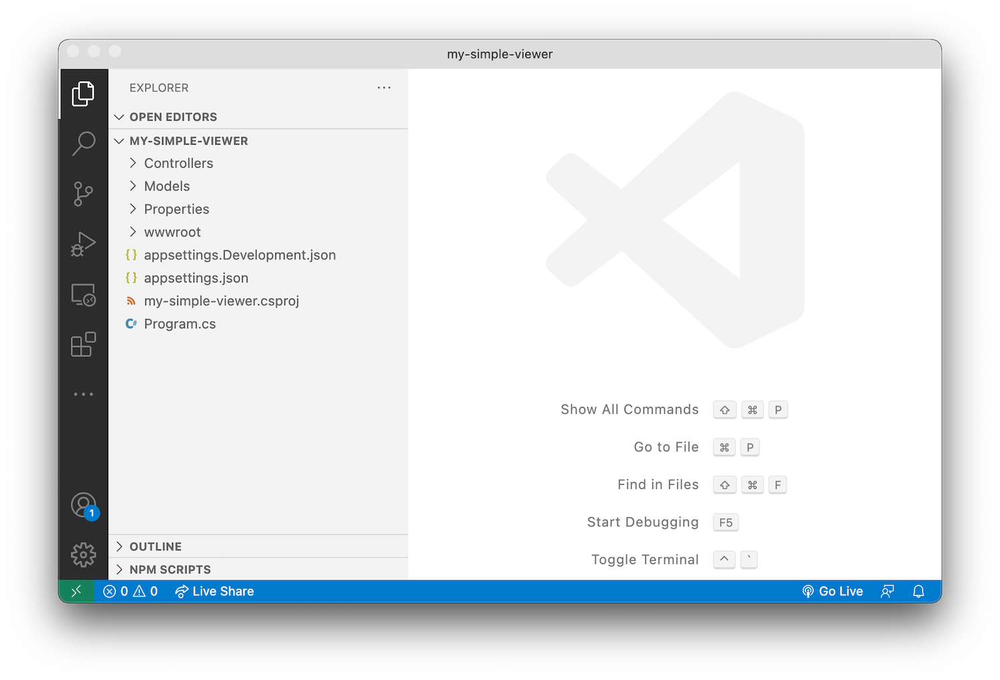

# Basic Server

In this step we're going to create a new .NET 6 project, install all the required dependencies,
and setup a basic ASP.NET server.

## Project & dependencies

Create a new folder for your project, navigate to it in the command line, and initialize a new
ASP.NET Core project:

```bash
dotnet new web
```

Next we will need to install the dependencies. In this case it will just be the
[Forge SDK](https://www.nuget.org/packages/Autodesk.Forge):

```bash
dotnet add package Autodesk.Forge
```

The `*.csproj` file in your project should now look similar to this (perhaps with
slightly version numbers):

```xml
<Project Sdk="Microsoft.NET.Sdk.Web">

  <PropertyGroup>
    <TargetFramework>net6.0</TargetFramework>
    <Nullable>enable</Nullable>
  </PropertyGroup>

  <ItemGroup>
    <PackageReference Include="Autodesk.Forge" Version="1.9.0" />
  </ItemGroup>

</Project>
```

Finally, let's create a couple more subfolders in your project folder that we're going to need later:

- `Controllers` - this is where we're going to implement all the server endpoints
- `Models` - here we're going to keep all the server-side logic that can be shared by different endpoints
- `wwwrooot` - this is where we're going to put all the client side assets (HTML, CSS, JavaScript, images, etc.)



## Create a basic server

Next we'll setup our basic server. Start by creating a `Startup.cs` file in the root folder
of your project with the following content:

```csharp title="Startup.cs"
using System;
using Microsoft.AspNetCore.Builder;
using Microsoft.AspNetCore.Hosting;
using Microsoft.Extensions.Configuration;
using Microsoft.Extensions.DependencyInjection;
using Microsoft.Extensions.Hosting;

namespace simpleviewer
{
    public class Startup
    {
        public Startup(IConfiguration configuration)
        {
            Configuration = configuration;
        }

        public IConfiguration Configuration { get; }

        // This method gets called by the runtime. Use this method to add services to the container.
        public void ConfigureServices(IServiceCollection services)
        {
            services.AddControllers();
            var ForgeClientID = Environment.GetEnvironmentVariable("FORGE_CLIENT_ID");
            var ForgeClientSecret = Environment.GetEnvironmentVariable("FORGE_CLIENT_SECRET");
            var ForgeBucket = Environment.GetEnvironmentVariable("FORGE_BUCKET"); // Optional
            if (string.IsNullOrEmpty(ForgeClientID) || string.IsNullOrEmpty(ForgeClientSecret))
            {
                throw new ApplicationException("Missing required environment variables FORGE_CLIENT_ID or FORGE_CLIENT_SECRET.");
            }
        }

        // This method gets called by the runtime. Use this method to configure the HTTP request pipeline.
        public void Configure(IApplicationBuilder app, IWebHostEnvironment env)
        {
            if (env.IsDevelopment())
            {
                app.UseDeveloperExceptionPage();
            }
            app.UseHttpsRedirection();
            app.UseDefaultFiles();
            app.UseStaticFiles();
            app.UseRouting();
            app.UseAuthorization();
            app.UseEndpoints(endpoints =>
            {
                endpoints.MapControllers();
            });
        }
    }
}
```

The `Startup` class is responsible for configuring our server and its "middleware", for example,
serving of static files. We also try and retrieve the Forge application client ID and secret
(these are the values you obtain when [creating a new Forge application](../../../intro#create-an-app))
from environment variables for later use.

Next, replace the content of `Program.cs` with the following:

```csharp title="Program.cs"
using Microsoft.AspNetCore.Hosting;
using Microsoft.Extensions.Hosting;

namespace simpleviewer
{
    public class Program
    {
        public static void Main(string[] args)
        {
            CreateHostBuilder(args).Build().Run();
        }

        public static IHostBuilder CreateHostBuilder(string[] args) =>
            Host.CreateDefaultBuilder(args)
                .ConfigureWebHostDefaults(webBuilder =>
                {
                    webBuilder.UseStartup<Startup>();
                });
    }
}
```

This code will make sure that the dotnet application creates a web server with our
new `Startup` class.

## Try it out

Now that we have a basic ASP.NET application setup, let's try it out. In the command line,
setup the two required environment variables, `FORGE_CLIENT_ID` and `FORGE_CLIENT_SECRET`,
and run the dotnet application:

```bash
export FORGE_CLIENT_ID=your-own-forge-client-id
export FORGE_CLIENT_SECRET=your-own-forge-client-secret
dotnet run
```

When you navigate to https://localhost:5001 in your browser, you should get a 404 response
because we haven't implemented any server logic yet. That's going to be the topic of the next
step - [Authentication](./auth).
