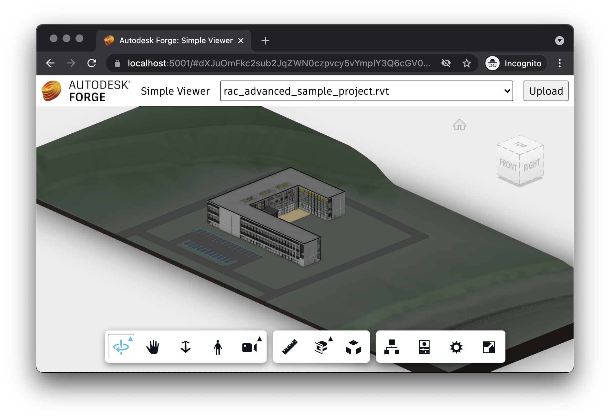

# Viewer & UI

Finally, we're ready to build the client-side piece of our application.

## Viewer logic

Let's start by implementing the Forge Viewer functionality of our application.
Create a `viewer.js` file under the `wwwroot` subfolder with the following code:

```js title="wwwroot/viewer.js"
export async function initViewer(container) {
    async function getAccessToken(callback) {
        const resp = await fetch('/api/auth/token');
        if (resp.ok) {
            const { access_token, expires_in } = await resp.json();
            callback(access_token, expires_in);
        } else {
            alert('Could not obtain access token. See the console for more details.');
            console.error(await resp.text());
        }
    }
    return new Promise(function (resolve, reject) {
        Autodesk.Viewing.Initializer({ getAccessToken }, async function () {
            const viewer = new Autodesk.Viewing.GuiViewer3D(container);
            viewer.start();
            viewer.setTheme('light-theme');
            resolve(viewer);
        });
    });
}

export function loadModel(viewer, urn) {
    function onDocumentLoadSuccess(doc) {
        viewer.loadDocumentNode(doc, doc.getRoot().getDefaultGeometry());
    }
    function onDocumentLoadFailure(code, message) {
        alert('Could not load model. See the console for more details.');
        console.error(message);
    }
    Autodesk.Viewing.Document.load('urn:' + urn, onDocumentLoadSuccess, onDocumentLoadFailure);
}
```

The script is an [ES6 module](https://developer.mozilla.org/en-US/docs/Web/JavaScript/Guide/Modules)
that exports two functions, `initViewer` that will create a new instance of Forge Viewer
in the specified DOM container, and `loadModel` which will load a specific model to the viewer.

## Application logic

Next, let's define the logic of the application itself. We will need to populate
the UI with all models available for viewing, and also the UI for uploading and
translating new models. Create a `main.js` file under the `wwwroot` subfolder with
the following content:

```js title="wwwroot/main.js"
import { initViewer, loadModel } from './viewer.js';

initViewer(document.getElementById('preview')).then(viewer => {
    const urn = window.location.hash ? window.location.hash.substr(1) : null;
    setupModelSelection(viewer, urn);
    setupModelUpload(viewer);
});

async function setupModelSelection(viewer, selectedUrn) {
    const models = document.getElementById('models');
    models.innerHTML = '';
    const resp = await fetch('/api/models');
    if (resp.ok) {
        for (const model of await resp.json()) {
            const option = document.createElement('option');
            option.innerText = model.name;
            option.setAttribute('value', model.urn);
            if (model.urn === selectedUrn) {
                option.setAttribute('selected', 'true');
            }
            models.appendChild(option);
        }
    } else {
        alert('Could not list models. See the console for more details.');
        console.error(await resp.text());
    }
    models.onchange = () => {
        window.location.hash = models.value;
        loadModel(viewer, models.value);
    }
    if (!viewer.model && models.value) {
        models.onchange();
    }
}

async function setupModelUpload(viewer) {
    const button = document.getElementById('upload');
    const input = document.getElementById('input');
    button.addEventListener('click', async function () {
        input.click();
    });
    input.addEventListener('change', async function () {
        if (input.files.length !== 1) {
            return;
        }
        const file = input.files[0];
        let data = new FormData();
        data.append('model-file', file);
        // When uploading a zip file, ask for the main design file in the archive
        if (file.name.endsWith('.zip')) {
            const entrypoint = window.prompt('Please enter the filename of the main design inside the archive.');
            data.append('model-zip-entrypoint', entrypoint);
        }
        const resp = await fetch('/api/models', { method: 'POST', body: data });
        if (resp.ok) {
            input.value = '';
            setupModelSelection(viewer);
        } else {
            alert('Could not upload model. See the console for more details.');
            console.error(await resp.text());
        }
    });
}
```

The scripts will initialize the viewer, populate a dropdown element in the UI with models
retrieved from the `/api/models` endpoint, and setup the file upload UI. Note that when
the uploaded file has a `.zip` extension, the JavaScript logic will also prompt the user
for the name of the file **inside the archive** that should be converted by Forge.

## User interface

And finally, let's build the UI of our application.

Create a `main.css` file under the `wwwroot` subfolder, and populate it with the following
CSS rules:

```css title="wwwroot/main.css"
body, html {
    margin: 0;
    padding: 0;
    height: 100vh;
}

#header, #preview {
    position: absolute;
    width: 100%;
}

#header {
    height: 3em;
    display: flex;
    flex-flow: row nowrap;
    justify-content: space-between;
    align-items: center;
}

#preview {
    top: 3em;
    bottom: 0;
}

#header > * {
    height: 2em;
    margin: 0 0.5em;
    font-family: ArtifaktElement; /* Will be added by Forge Viewer */
    font-size: 1em;
}

#header .title {
    flex: 1 0 auto;
    height: auto;
}

#models {
    flex: 0 1 auto;
    min-width: 2em;
}
```

Then, create an `index.html` file (also in the `wwwroot` subfolder) with the following content:

```html title="wwwroot/index.html"
<!DOCTYPE html>
<html lang="en">

<head>
    <meta charset="UTF-8">
    <meta name="viewport" content="width=device-width, initial-scale=1.0">
    <meta http-equiv="X-UA-Compatible" content="ie=edge">
    <link rel="stylesheet" href="https://developer.api.autodesk.com/modelderivative/v2/viewers/7.*/style.css">
    <link rel="stylesheet" href="/main.css">
    <title>Autodesk Forge: Simple Viewer</title>
</head>

<body>
    <div id="header">
        
        <span class="title">Simple Viewer</span>
        <select name="models" id="models"></select>
        <button id="upload" title="Upload New Model">Upload</button>
        <input style="display: none" type="file" id="input">
    </div>
    <div id="preview"></div>
    <script src="https://developer.api.autodesk.com/modelderivative/v2/viewers/7.*/viewer3D.js"></script>
    <script src="/main.js" type="module"></script>
</body>

</html>
```

The HTML markup simply uses a `<select>` element as the dropdown for listing the viewable models,
and an `<input type="file">` element with a `<button>` to handle the uploading of a new model.
Note that since `wwwroot/main.js` is also an ES6 module, we have to use `type="module"` in
its `<script>` tag.

The application will look for `favicon.ico` and `logo.png` images under the `wwwroot` folder to use
as the website's icon and logo. If you don't have any images of your own, feel free to download
them from one of our samples:

- https://raw.githubusercontent.com/petrbroz/forge-simple-viewer-nodejs/develop/public/favicon.ico
- https://raw.githubusercontent.com/petrbroz/forge-simple-viewer-nodejs/develop/public/logo.png

## Try it out

And that's it! Your application is now ready for action. Start it from the command line as usual:

```bash
export FORGE_CLIENT_ID=your-own-forge-client-id
export FORGE_CLIENT_SECRET=your-own-forge-client-secret
export FORGE_BUCKET=optional-custom-bucket-name
dotnet run
```

And then navigate to [https://localhost:5001](https://localhost:5001) in your browser. You should be
presented with a simple UI, with a dropdown in the top-right corner that will eventually get populated
with all models available in your configured bucket, and with a button for uploading new models.
And as soon as you select one of the options from the dropdown, the corresponding model will get loaded
in the viewer occupying the rest of the webpage.


