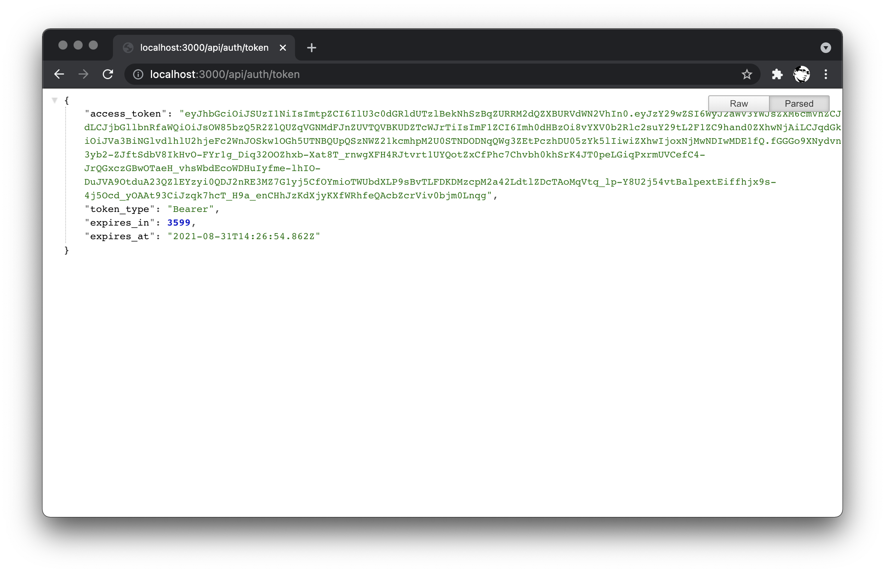

# Authentication

In this step we're going to extend the server implementation so that it can authenticate itself
to the Forge platform, and generate access tokens for various needs.

> It is a good practice to generate an "internal" token with more capabilities (for example,
> allowing the owner to create or delete files in the Data Management service) that will only be used
> by the server, and a "public" token with fewer capabilities that can be safely shared with
> the client-side logic.

## Token management

Create a `forge.js` file under the `services` subfolder. That is where we will be implementing
all the Forge-specific logic that will be used in different areas of our server application. Let's
start by adding the following code to the file:

```js title="services/forge.js"
const { AuthClientTwoLegged } = require('forge-apis');

const { FORGE_CLIENT_ID, FORGE_CLIENT_SECRET } = process.env;
if (!FORGE_CLIENT_ID || !FORGE_CLIENT_SECRET) {
    console.warn('Missing some of the environment variables.');
    process.exit(1);
}
const INTERNAL_TOKEN_SCOPES = ['bucket:read', 'bucket:create', 'data:read', 'data:write', 'data:create'];
const PUBLIC_TOKEN_SCOPES = ['viewables:read'];

let internalAuthClient = new AuthClientTwoLegged(FORGE_CLIENT_ID, FORGE_CLIENT_SECRET, INTERNAL_TOKEN_SCOPES, true);
let publicAuthClient = new AuthClientTwoLegged(FORGE_CLIENT_ID, FORGE_CLIENT_SECRET, PUBLIC_TOKEN_SCOPES, true);

async function getInternalToken() {
    if (!internalAuthClient.isAuthorized()) {
        await internalAuthClient.authenticate();
    }
    return internalAuthClient.getCredentials();
}

async function getPublicToken() {
    if (!publicAuthClient.isAuthorized()) {
        await publicAuthClient.authenticate();
    }
    return publicAuthClient.getCredentials();
}

module.exports = {
    getPublicToken
};
```

The code expects the credentials of a Forge application to be provided as two environment variables,
`FORGE_CLIENT_ID` and `FORGE_CLIENT_SECRET`. These are the _Client ID_ and _Client Secret_ values you
can obtain after [creating a new Forge application](../../../intro#create-an-app). With the credentials,
the script then creates two authentication clients, one for internal use (giving us read/write access
to the Data Management buckets and objects), and one for public use (only allowing its owner to
access translation outputs from the Model Derivative service), and two helper methods to generate
the corresponding tokens for us. The `getPublicToken` is made available to other Node.js scripts.

## Authentication endpoint

Next, let's add a first endpoint to our server. Create an `auth.js` file under the `routes` subfolder
with the following content:

```js title="routes/auth.js"
const express = require('express');
const { getPublicToken } = require('../services/forge.js');

let router = express.Router();

router.get('/token', async function (req, res, next) {
    try {
        res.json(await getPublicToken());
    } catch (err) {
        next(err);
    }
});

module.exports = router;
```

Here we implement a new [Express Router](http://expressjs.com/en/4x/api.html#router) that can handle
endpoints ending with `/token` by generating a (public) access token and sending it back to the client
as a JSON response.

Let's "mount" the router to our server application by modifying the `server.js`:

```js {6} title="server.js"
const express = require('express');
const PORT = process.env.PORT || 3000;

let app = express();
app.use(express.static('public'));
app.use('/api/auth', require('./routes/auth.js'));
app.use(function (err, req, res, next) {
    console.error(err);
    res.status(500).send(err.message);
});
app.listen(PORT, function () { console.log(`Server listening on port ${PORT}...`); });
```

Since we've attached the router to the `/api/auth` prefix, the router will now handle all requests
coming to the endpoint `/api/auth/token`.

## Try it out

Let's see if our new server endpoint works. Try setting your own Forge client ID and client secret
as the `FORGE_CLIENT_ID` and `FORGE_CLIENT_SECRET` environment variables, and run the application:

```bash
export FORGE_CLIENT_ID=your-own-forge-client-id
export FORGE_CLIENT_SECRET=your-own-forge-client-secret
npm start
```

If the application start successfully and you navigate to http://localhost:3000/api/auth/token
in the browser, the server should respond with a JSON object containing the access token data.


