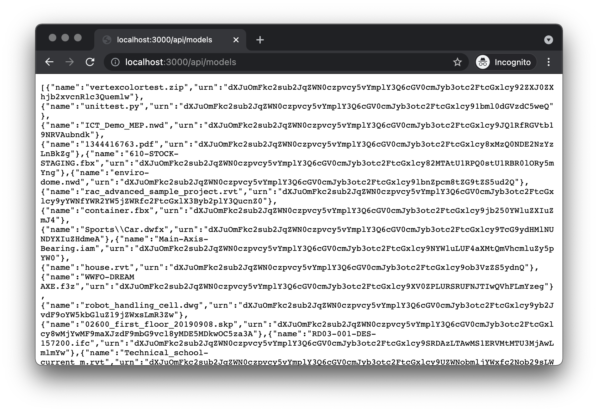

# Data Management

Next, let's extend our server so that we can list models, upload them, and also initiate
their translation for viewing.

## Preparing a bucket

First, let's make sure that our application has a bucket in the Data Management service
to store its files in. Typically the bucket would be created just once as part of a provisioning
step but in our sample we will implement a helper function that will make sure that the bucket
is available. Let's update the `services/forge.js` file:

```js title="services/forge.js"
// highlight-start
const { AuthClientTwoLegged, BucketsApi } = require('forge-apis');
// highlight-end

const { FORGE_CLIENT_ID, FORGE_CLIENT_SECRET, FORGE_BUCKET } = process.env;
if (!FORGE_CLIENT_ID || !FORGE_CLIENT_SECRET) {
    console.warn('Missing some of the environment variables.');
    process.exit(1);
}
// highlight-start
const BUCKET = FORGE_BUCKET || `${FORGE_CLIENT_ID.toLowerCase()}-basic-app`;
// highlight-end
const INTERNAL_TOKEN_SCOPES = ['bucket:read', 'bucket:create', 'data:read', 'data:write', 'data:create'];
const PUBLIC_TOKEN_SCOPES = ['viewables:read'];

let internalAuthClient = new AuthClientTwoLegged(FORGE_CLIENT_ID, FORGE_CLIENT_SECRET, INTERNAL_TOKEN_SCOPES, true);
let publicAuthClient = new AuthClientTwoLegged(FORGE_CLIENT_ID, FORGE_CLIENT_SECRET, PUBLIC_TOKEN_SCOPES, true);

async function getInternalToken() {
    if (!internalAuthClient.isAuthorized()) {
        await internalAuthClient.authenticate();
    }
    return internalAuthClient.getCredentials();
}

async function getPublicToken() {
    if (!publicAuthClient.isAuthorized()) {
        await publicAuthClient.authenticate();
    }
    return publicAuthClient.getCredentials();
}

// highlight-start
async function ensureBucketExists() {
    const token = await getInternalToken();
    try {
        await new BucketsApi().getBucketDetails(BUCKET, null, token);
    } catch (err) {
        if (err.statusCode === 404) {
            await new BucketsApi().createBucket({ bucketKey: BUCKET, policyKey: 'temporary' }, {}, null, token);
        } else {
            throw err;
        }
    }
}
// highlight-end

module.exports = {
    getPublicToken
};
```

The `ensureBucketExists` function will simply try and request additional information
about a specific bucket, and if the response from Forge is `404 Not Found`, it will
attempt to create a new bucket of that name.

## Listing models

Now we will update the `services/forge.js` script with a helper function that will
list all objects in the preconfigured bucket:

```js title="services/forge.js"
// highlight-start
const { AuthClientTwoLegged, BucketsApi, ObjectsApi } = require('forge-apis');
// highlight-end

const { FORGE_CLIENT_ID, FORGE_CLIENT_SECRET, FORGE_BUCKET } = process.env;
const { FORGE_CLIENT_ID, FORGE_CLIENT_SECRET } = process.env;
if (!FORGE_CLIENT_ID || !FORGE_CLIENT_SECRET) {
    console.warn('Missing some of the environment variables.');
    process.exit(1);
}
const INTERNAL_TOKEN_SCOPES = ['bucket:read', 'bucket:create', 'data:read', 'data:write', 'data:create'];
const PUBLIC_TOKEN_SCOPES = ['viewables:read'];

let internalAuthClient = new AuthClientTwoLegged(FORGE_CLIENT_ID, FORGE_CLIENT_SECRET, INTERNAL_TOKEN_SCOPES, true);
let publicAuthClient = new AuthClientTwoLegged(FORGE_CLIENT_ID, FORGE_CLIENT_SECRET, PUBLIC_TOKEN_SCOPES, true);

// highlight-start
const urnify = (id) => Buffer.from(id).toString('base64').replace(/=/g, '');
// highlight-end

async function getInternalToken() {
    if (!internalAuthClient.isAuthorized()) {
        await internalAuthClient.authenticate();
    }
    return internalAuthClient.getCredentials();
}

async function getPublicToken() {
    if (!publicAuthClient.isAuthorized()) {
        await publicAuthClient.authenticate();
    }
    return publicAuthClient.getCredentials();
}

async function ensureBucketExists() {
    const token = await getInternalToken();
    try {
        await new BucketsApi().getBucketDetails(BUCKET, null, token);
    } catch (err) {
        if (err.statusCode === 404) {
            await new BucketsApi().createBucket({ bucketKey: BUCKET, policyKey: 'temporary' }, {}, null, token);
        } else {
            throw err;
        }
    }
}

// highlight-start
async function listModels() {
    await ensureBucketExists(); // Remove this if we can assume the bucket to exist
    const token = await getInternalToken();
    let response = await new ObjectsApi().getObjects(BUCKET, { limit: 64 }, null, token);
    let objects = response.body.items;
    while (response.body.next) {
        const startAt = new URL(response.body.next).searchParams.get('startAt');
        response = await new ObjectsApi().getObjects(BUCKET, { limit: 64, startAt }, null, token);
        objects = objects.concat(response.body.items);
    }
    return objects.map(obj => ({
        name: obj.objectKey,
        urn: urnify(obj.objectId)
    }));
}
// highlight-end

module.exports = {
    getPublicToken,
    // highlight-start
    listModels,
    // highlight-end
};
```

The `listModels` function pages through all objects in the bucket, and returns their name and URN
(the base64-encoded ID that will later be used when communicating with the Model Derivative service).

## Uploading and translating models

The last helper function we add to `services/forge.js` will handle the uploading of files
to the Data Management service, and their translation into a format that can later be loaded into
Forge Viewer:

```js title="services/forge.js"
// highlight-start
const fs = require('fs');
const { AuthClientTwoLegged, BucketsApi, ObjectsApi, DerivativesApi } = require('forge-apis');
// highlight-end

const { FORGE_CLIENT_ID, FORGE_CLIENT_SECRET, FORGE_BUCKET } = process.env;
if (!FORGE_CLIENT_ID || !FORGE_CLIENT_SECRET) {
    console.warn('Missing some of the environment variables.');
    process.exit(1);
}
const BUCKET = FORGE_BUCKET || `${FORGE_CLIENT_ID.toLowerCase()}-basic-app`;
const INTERNAL_TOKEN_SCOPES = ['bucket:read', 'bucket:create', 'data:read', 'data:write', 'data:create'];
const PUBLIC_TOKEN_SCOPES = ['viewables:read'];

let internalAuthClient = new AuthClientTwoLegged(FORGE_CLIENT_ID, FORGE_CLIENT_SECRET, INTERNAL_TOKEN_SCOPES, true);
let publicAuthClient = new AuthClientTwoLegged(FORGE_CLIENT_ID, FORGE_CLIENT_SECRET, PUBLIC_TOKEN_SCOPES, true);

const urnify = (id) => Buffer.from(id).toString('base64').replace(/=/g, '');

async function getInternalToken() {
    if (!internalAuthClient.isAuthorized()) {
        await internalAuthClient.authenticate();
    }
    return internalAuthClient.getCredentials();
}

async function getPublicToken() {
    if (!publicAuthClient.isAuthorized()) {
        await publicAuthClient.authenticate();
    }
    return publicAuthClient.getCredentials();
}

async function ensureBucketExists() {
    const token = await getInternalToken();
    try {
        await new BucketsApi().getBucketDetails(BUCKET, null, token);
    } catch (err) {
        if (err.statusCode === 404) {
            await new BucketsApi().createBucket({ bucketKey: BUCKET, policyKey: 'temporary' }, {}, null, token);
        } else {
            throw err;
        }
    }
}

async function listModels() {
    await ensureBucketExists(); // Remove this if we can assume the bucket to exist
    const token = await getInternalToken();
    let response = await new ObjectsApi().getObjects(BUCKET, { limit: 64 }, null, token);
    let objects = response.body.items;
    while (response.body.next) {
        const startAt = new URL(response.body.next).searchParams.get('startAt');
        response = await new ObjectsApi().getObjects(BUCKET, { limit: 64, startAt }, null, token);
        objects = objects.concat(response.body.items);
    }
    return objects.map(obj => ({
        name: obj.objectKey,
        urn: urnify(obj.objectId)
    }));
}

// highlight-start
async function uploadModel(objectName, filePath, rootFilename) {
    await ensureBucketExists(); // Remove this if we can assume the bucket to exist
    const token = await getInternalToken();
    const buffer = fs.readFileSync(filePath);
    const response = await new ObjectsApi().uploadObject(BUCKET, objectName, buffer.byteLength, buffer, {}, null, token);
    const job = {
        input: {
            urn: urnify(response.body.objectId)
        },
        output: {
            formats: [{ type: 'svf', views: ['2d', '3d'] }]
        }
    };
    if (rootFilename) {
        job.input.compressedUrn = true;
        job.input.rootFilename = rootFilename;
    }
    await new DerivativesApi().translate(job, {}, null, token);
}
// highlight-end

module.exports = {
    getPublicToken,
    listModels,
    // highlight-start
    uploadModel
    // highlight-end
};
```

## Server endpoints

Finally, let's make the functionality available to the client-side code through another
Express router. Create a `models.js` file under the `routes` subfolder with the following
content:

```js title="routes/models.js"
const express = require('express');
const formidable = require('express-formidable');
const { listModels, uploadModel } = require('../services/forge.js');

let router = express.Router();

router.get('/', async function (req, res, next) {
    try {
        res.json(await listModels());
    } catch (err) {
        next(err);
    }
});

router.post('/', formidable(), async function (req, res, next) {
    const file = req.files['model-file'];
    if (!file) {
        res.status(400).send('The required field ("model-file") is missing.');
        return;
    }
    try {
        await uploadModel(file.name, file.path, req.fields['model-zip-entrypoint']);
        res.status(200).end();
    } catch (err) {
        next(err);
    }
});

module.exports = router;
```

The router will handle two types of requests - a `GET` request when the client wants
to get the list of all available models for viewing, and a `POST` request when the client
wants to upload a new model and translate it for viewing. The `formidable()` middleware
used in the `POST` request handler will make sure that any `multipart/form-data` content
coming with the request is parsed and available in the `req.files` and `req.fields` properties.

Next, let's mount the router to our server application by modifying the `server.js`:

```js title="server.js"
const express = require('express');
const PORT = process.env.PORT || 3000;

let app = express();
app.use(express.static('public'));
app.use('/api/auth', require('./routes/auth.js'));
// highlight-start
app.use('/api/models', require('./routes/models.js'));
// highlight-end
app.use(function (err, req, res, next) {
    console.error(err);
    res.status(500).send(err.message);
});
app.listen(PORT, function () { console.log(`Server listening on port ${PORT}...`); });
```

As you can see, the new router will handle `GET` and `POST` requests coming to the endpoint
`/api/models`.

## Try it out

Time to try our improved server application. This time, apart from setting the Forge application
credentials, you can also include the name of the Data Management bucket you want to use via
the optional `FORGE_BUCKET` environment variable:

```bash
export FORGE_CLIENT_ID=your-own-forge-client-id
export FORGE_CLIENT_SECRET=your-own-forge-client-secret
export FORGE_BUCKET=your-custom-bucket-name
npm start
```

:::info
If the bucket name is _not_ provided, the code in `services/forge.js` will generate one by appending `-basic-app`
to your Forge client ID.
:::

:::caution
Note that the Data Management service requires bucket names to be **globally unique**,
and attempts to create a bucket with an already used name will fail with `409 Conflict`.
See the [documentation](https://forge.autodesk.com/en/docs/data/v2/reference/http/buckets-POST)
for more details.
:::

When you navigate to [http://localhost:3000/api/models](http://localhost:3000/api/models)
in the browser, the server should respond with a JSON list with names and URNs of all objects
available in your configured bucket.


