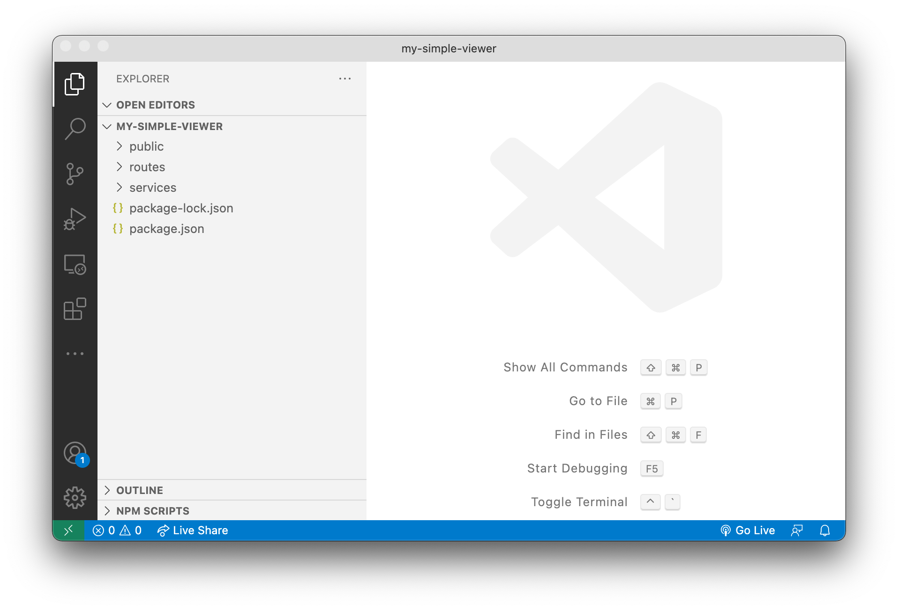

# Základní server

V tomto kroku založíme nový Node.js projekt, nainstalujeme potřebné moduly, a vytvoříme
základní Node.js server.

## Projekt & moduly

Vytvořte nový adresář pro Váš projekt, otevřete jej v příkazové řádce a založtet nový Node.js projekt:

```bash
npm init -y
```

Dále, nainstalujte Node.js moduly, které budeme potřebovat. V tomto případě to bude
[Express.js](https://expressjs.com) framework, "middleware" pro zpracování dotazů s obsahem
`multipart/form-data` a nakonec oficiální [Forge SDK](https://www.npmjs.com/package/forge-apis):

```bash
npm install --save express express-formidable forge-apis
```

Obsah `"dependencies"` v souboru `package.json` by nyní měl vypadat nějak takto (čísla verzí se mohou
mírně lišit):

```json
// ...
"dependencies": {
    "express": "^4.17.1",
    "express-formidable": "^1.2.0",
    "forge-apis": "^0.8.6"
}
// ...
```

A nakonec vytvoříme několik dalších adresářů, které budeme později potřebovat:

- `public` - zde budeme ukládat soubory pro prohlížeč (HTML, CSS, JavaScript, obrázky, atd.)
- `routes` - tady budeme implementovat jednotlivé endpointy našeho serveru
- `services` - zde bude definována veškerá serverová logika, kterou pak budeme využívat
v různých částech našeho serveru



## Vytvoření základního serveru

Vytvořte soubor `server.js` v hlavním adresáři projektu a vložte do něj následující kód:

```js title="server.js"
const express = require('express');
const PORT = process.env.PORT || 3000;

let app = express();
app.use(express.static('public'));
app.use(function (err, req, res, next) {
    console.error(err);
    res.status(500).send(err.message);
});
app.listen(PORT, function () { console.log(`Server listening on port ${PORT}...`); });
```

Server toho prozatím moc nedělá, pouze posílá soubory z podadresáře `public` a informuje
o chybách v kódu zasláním informací do konzole a zpět do prohlížeče.

Dále přidáme `"start": "node server.js"` skript do souboru `package.json`, abychom tak
mohli naší aplikaci jednoduše spustit:

```json
// ...
"scripts": {
    "start": "node server.js"
}
// ...
```

## Zkouška

Zkuste pustit aplikaci z příkazové řádky:

```bash
npm start
```

Pak otevřete prohlížeč a přejděte na adresu http://localhost:3000. Server by měl odpovědět
se zprávou `Cannot GET /` protože jsme zatím ještě nedefinovali žádnou jeho logiku.


To bude náplní dalšího kroku, [autentikace](./auth).
