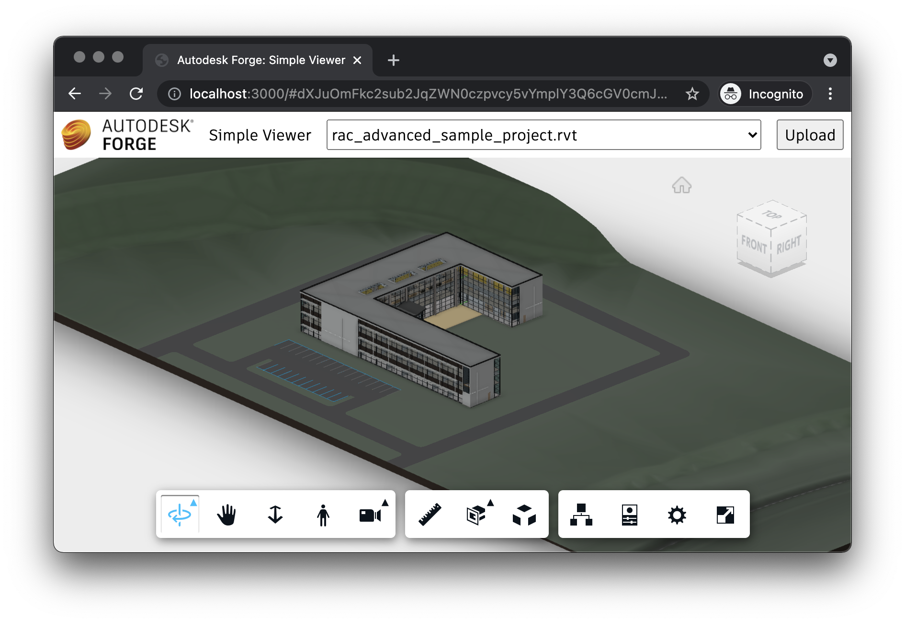

# Prohlížeč & uživatelské rozhraní

Nyní můžeme přejít ke klientské části naší aplikace.

## Funkce prohlížeče

Začněme implementací funkcí prohlížeče Forge Viewer. Vytvořte soubor `viewer.js` v adresáři `public`,
a vložte do něj následující kód:

```js title="public/viewer.js"
export async function initViewer(container) {
    async function getAccessToken(callback) {
        const resp = await fetch('/api/auth/token');
        if (resp.ok) {
            const { access_token, expires_in } = await resp.json();
            callback(access_token, expires_in);
        } else {
            alert('Could not obtain access token. See the console for more details.');
            console.error(await resp.text());
        }
    }
    return new Promise(function (resolve, reject) {
        Autodesk.Viewing.Initializer({ getAccessToken }, async function () {
            const viewer = new Autodesk.Viewing.GuiViewer3D(container);
            viewer.start();
            viewer.setTheme('light-theme');
            resolve(viewer);
        });
    });
}

export function loadModel(viewer, urn) {
    function onDocumentLoadSuccess(doc) {
        viewer.loadDocumentNode(doc, doc.getRoot().getDefaultGeometry());
    }
    function onDocumentLoadFailure(code, message) {
        alert('Could not load model. See the console for more details.');
        console.error(message);
    }
    Autodesk.Viewing.Document.load('urn:' + urn, onDocumentLoadSuccess, onDocumentLoadFailure);
}
```

Tento skript je [ES6 modul](https://developer.mozilla.org/en-US/docs/Web/JavaScript/Guide/Modules)
který poskytuje dvě funkce, `initViewer`, která vytvoří novou instanci prohlížeče, v konkrétním elementu DOM,
a `loadModel`, která do tohoto prohlížeče načte konkrétní model.

## Funkce aplikace

Dále můžeme definovat funkcionalitu samotné aplikace. Potřebujeme naplnit uživatelské
rozhraní modely, které jsou přiravené k prohlížení, a také připravit prvky UI
pro nahrávání nových modelů. Vytvoře soubor `main.js` v adresáři `public` a vložte
do něj následující kód:

```js title="public/main.js"
import { initViewer, loadModel } from './viewer.js';

initViewer(document.getElementById('preview')).then(viewer => {
    const urn = window.location.hash ? window.location.hash.substr(1) : null;
    setupModelSelection(viewer, urn);
    setupModelUpload(viewer);
});

async function setupModelSelection(viewer, selectedUrn) {
    const models = document.getElementById('models');
    models.innerHTML = '';
    const resp = await fetch('/api/models');
    if (resp.ok) {
        for (const model of await resp.json()) {
            const option = document.createElement('option');
            option.innerText = model.name;
            option.setAttribute('value', model.urn);
            if (model.urn === selectedUrn) {
                option.setAttribute('selected', 'true');
            }
            models.appendChild(option);
        }
    } else {
        alert('Could not list models. See the console for more details.');
        console.error(await resp.text());
    }
    models.onchange = () => {
        window.location.hash = models.value;
        loadModel(viewer, models.value);
    }
    if (!viewer.model && models.value) {
        models.onchange();
    }
}

async function setupModelUpload(viewer) {
    const button = document.getElementById('upload');
    const input = document.getElementById('input');
    button.addEventListener('click', async function () {
        input.click();
    });
    input.addEventListener('change', async function () {
        if (input.files.length !== 1) {
            return;
        }
        const file = input.files[0];
        let data = new FormData();
        data.append('model-file', file);
        // When uploading a zip file, ask for the main design file in the archive
        if (file.name.endsWith('.zip')) {
            const entrypoint = window.prompt('Please enter the filename of the main design inside the archive.');
            data.append('model-zip-entrypoint', entrypoint);
        }
        const resp = await fetch('/api/models', { method: 'POST', body: data });
        if (resp.ok) {
            input.value = '';
            setupModelSelection(viewer);
        } else {
            alert('Could not upload model. See the console for more details.');
            console.error(await resp.text());
        }
    });
}
```

Tento skript inicializuje prohlížeč Forge Viewer, naplní rozbalovací nabídku s modely k prohlížení,
a připraví uživatelské rozhraní pro nahrávání nových modelů. V případě, že je přípona nahrávaného
souboru .zip, tento JavaScript kód se také dotáže na název souboru uvnitř tohoto archivu, který
by měl být zkonvertován.

## Uživatelské rozhraní

Nyní už můžeme začít definovat uživatelské rozhraní naší webové aplikace.

Vytvořte soubor `main.css` v adresáři `public` a vložte do něj následující kód:

```css title="public/main.css"
body, html {
    margin: 0;
    padding: 0;
    height: 100vh;
}

#header, #preview {
    position: absolute;
    width: 100%;
}

#header {
    height: 3em;
    display: flex;
    flex-flow: row nowrap;
    justify-content: space-between;
    align-items: center;
}

#preview {
    top: 3em;
    bottom: 0;
}

#header > * {
    height: 2em;
    margin: 0 0.5em;
    font-family: ArtifaktElement; /* Will be added by Forge Viewer */
    font-size: 1em;
}

#header .title {
    flex: 1 0 auto;
    height: auto;
}

#models {
    flex: 0 1 auto;
    min-width: 2em;
}
```

Dále vytvořte soubor `index.html` v adresáři `public` s následujícím obsahem:

```html title="public/index.html"
<!DOCTYPE html>
<html lang="en">

<head>
    <meta charset="UTF-8">
    <meta name="viewport" content="width=device-width, initial-scale=1.0">
    <meta http-equiv="X-UA-Compatible" content="ie=edge">
    <link rel="stylesheet" href="https://developer.api.autodesk.com/modelderivative/v2/viewers/7.*/style.css">
    <link rel="stylesheet" href="/main.css">
    <title>Autodesk Forge: Simple Viewer</title>
</head>

<body>
    <div id="header">
        
        <span class="title">Simple Viewer</span>
        <select name="models" id="models"></select>
        <button id="upload" title="Upload New Model">Upload</button>
        <input style="display: none" type="file" id="input">
    </div>
    <div id="preview"></div>
    <script src="https://developer.api.autodesk.com/modelderivative/v2/viewers/7.*/viewer3D.js"></script>
    <script src="/main.js" type="module"></script>
</body>

</html>
```

HTML v podstatě používá `<select>` element pro výčet modelů, které jsou k dispozici k prohlížení,
a `<input type="file">` element s `<button>` tlačítkem pro nahrávání nových modelů.

> Jelikož je soubor `public/main.js` taktéž ES6 modulem, musíme v jeho skriptu použít `type="module"`.

Naše aplikace bude také hledat soubory `favicon.ico` a `logo.png` v adresáři `public` pro použití
jako ikonu a logo webové stránky. Pokud nemáte vlastní obrázky, můžete použít tyto:

- https://github.com/petrbroz/forge-simple-viewer-nodejs/blob/develop/public/favicon.ico
- https://github.com/petrbroz/forge-simple-viewer-nodejs/blob/develop/public/logo.png

## Zkouška

A to je vše! Vaše aplikace je nyní připravena k akci. Spusťte ji z příkazové řádky jako obvykle:

```bash
export FORGE_CLIENT_ID=your-own-forge-client-id
export FORGE_CLIENT_SECRET=your-own-forge-client-secret
export FORGE_BUCKET=your-custom-bucket-name
npm start
```

A poté otevřete http://localhost:3000 ve Vašem prohlížeči. Měli byste vidět jednoduché uživatelské
rozhraní s rozbalovací nabídkou v pravém horním rohu, která bude zanedlouho naplněna seznamem modelů.
A jakmile z této nabídky jeden model vyberete, měl by se hned načíst v prohlížeči, který zabírá
zbytek plochy webové stránky.


